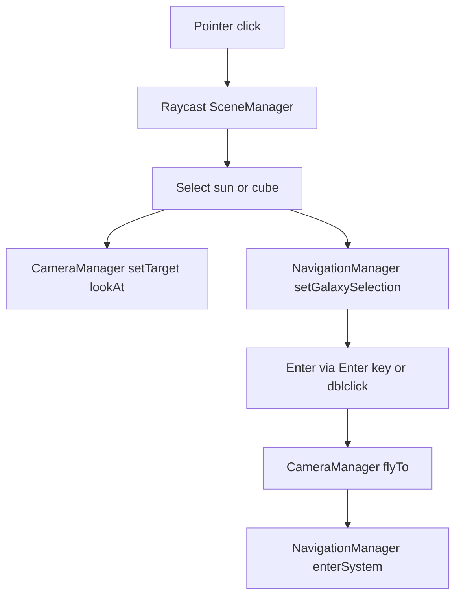

# PEEJS — Architecture

## Vue d’ensemble (runtime)
- Point d’entrée : [`src/main.ts`](src/main.ts:1) instancie [`SceneManager`](src/core/SceneManager.ts:17) puis lance la boucle [`SceneManager.animate()`](src/core/SceneManager.ts:416).
- Boucle frame :
  - Mise à jour caméra : [`CameraManager.update()`](src/core/CameraManager.ts:120)
  - Mise à jour des objets “updatables” : interface [`IUpdatable`](src/core/IUpdatable.ts:7) (ex: [`StarField`](src/entities/StarField.ts:6), [`ClusterGrid`](src/entities/ClusterGrid.ts:31), [`CoordinateSystem`](src/entities/CoordinateSystem.ts:6), [`UnitManager`](src/entities/UnitManager.ts:8)).
  - Transitions automatiques (si aucune transition caméra en cours) : [`SceneManager.checkAutoTransitions()`](src/core/SceneManager.ts:479) basé sur [`NavigationState.currentOptimalDistance`](src/types/NavigationState.ts:78) et [`CameraManager.distance`](src/core/CameraManager.ts:77).

## États de navigation (source de vérité)
- État central : [`NavigationState`](src/types/NavigationState.ts:57)
  - `currentView`: `GALAXY | SYSTEM | ORBIT | SURFACE` (voir [`ViewMode`](src/types/NavigationState.ts:7))
  - `currentSystem`: [`SystemReference`](src/types/NavigationState.ts:13)
  - `currentOptimalDistance`: seuil utilisé pour auto-transitions.
- Gestionnaire d'état : [`NavigationManager`](src/core/NavigationManager.ts:6)
  - Sélection galaxie (sans changer de vue) : [`setGalaxySelection()`](src/core/NavigationManager.ts:40)
  - Entrée/sortie système : [`enterSystem()`](src/core/NavigationManager.ts:87) / [`exitSystem()`](src/core/NavigationManager.ts:136)
  - Transitions entre vues orbitales et de surface gérées par [`TransitionManager`](src/core/TransitionManager.ts:1)
- Invariant important (robustesse) :
  - Les données stables sont dans `SystemReference.metadata` (voir commentaires de [`SystemReference`](src/types/NavigationState.ts:13)).
  - Les références runtime `sunMesh/pickMesh` sont optionnelles et peuvent devenir invalides (ex: changement de référentiel/scene graph swap).

## Caméra, lookAt et transitions
- Caméra + contrôles : [`CameraManager`](src/core/CameraManager.ts:9)
  - OrbitControls (zoom molette) + mouvements clavier (W/A/S/D) : [`handleKeyboardMovement()`](src/core/CameraManager.ts:195)
  - Cible “lookAt” : [`setTarget()`](src/core/CameraManager.ts:236)
  - Transition fluide : [`flyTo(target, distance)`](src/core/CameraManager.ts:266) (désactive temporairement les contrôles, lerp position+target).
  - Garde-fous : [`isTransitioning()`](src/core/CameraManager.ts:179) empêche conflits auto-transitions / interactions.
- Contrôles navigation (actuels) câblés dans [`SceneManager`](src/core/SceneManager.ts:122) :
  - **Enter** : déclenche [`SceneManager.handleEnterSystem()`](src/core/SceneManager.ts:364) (vue GALAXY → SYSTEM via `flyTo` + `NavigationManager.enterSystem`)
  - **Escape** : déclenche [`SceneManager.handleExitSystem()`](src/core/SceneManager.ts:448) (vue SYSTEM → GALAXY + repositionnement stable depuis metadata)

## Sélection (GALAXY) : raycast → sélection → lookAt → cible de navigation
- Raycaster géré dans [`SceneManager`](src/core/SceneManager.ts:30) :
  - Survol : [`updateHover()`](src/core/SceneManager.ts:157) utilise les pick meshes de [`ClusterGrid.getPickObjects()`](src/entities/ClusterGrid.ts:120)
  - Clic : [`onClick()`](src/core/SceneManager.ts:177) raycast sur pick meshes (cubes) + meshes de soleils (étoiles)
- Règle métier de sélection (GALAXY) :
  - Priorité au soleil si touché, sauf si un cluster est déjà sélectionné et la distance en clusters dépasse 1 (Chebyshev) : logique dans [`SceneManager.onClick()`](src/core/SceneManager.ts:202).
- Effets visuels sélection :
  - Cube : opacité/couleurs dans [`ClusterGrid.selectCubeByName()`](src/entities/ClusterGrid.ts:350)
  - Soleil : anneau via [`ClusterGrid.selectSun()`](src/entities/ClusterGrid.ts:271) utilisant [`SelectionRing`](src/entities/SelectionRing.ts:3)
- Propagation :
  - LookAt : [`CameraManager.setTarget(clickedSun.position)`](src/core/SceneManager.ts:228)
  - Cible de navigation : [`NavigationManager.setGalaxySelection(systemRef)`](src/core/SceneManager.ts:237) où `systemRef` est construit via [`ClusterGrid.getSystemReference()`](src/entities/ClusterGrid.ts:173) (fallback possible si `sunMesh` absent).

## GALAXY : entités et responsabilités
- Fond étoilé : [`StarField`](src/entities/StarField.ts:6) (Points, rotation lente).
- Galaxie = grille de clusters : [`ClusterGrid`](src/entities/ClusterGrid.ts:31)
  - Crée une grille de `GRID_CONFIG.cubesX × GRID_CONFIG.cubesZ` (actuellement cluster central unique) : [`src/config.ts`](src/config.ts:14)
  - Crée des **pick meshes** invisibles pour raycast précis : [`ClusterGrid`](src/entities/ClusterGrid.ts:95)
  - Génère des **soleils** (Mesh Sphere) + métadonnées [`SunMetadata`](src/entities/ClusterGrid.ts:9)
  - Construit une [`SystemReference`](src/types/NavigationState.ts:13) complète via [`getSystemReference()`](src/entities/ClusterGrid.ts:173)

## SYSTEM : système solaire (modèle rendu)
- Système solaire : [`SolarSystem`](src/entities/SolarSystem.ts:16)
  - Groupe `THREE.Group` avec soleil + planètes orbitant (update dt).
  - Les planètes portent un identifiant dans `mesh.userData.planetId` pour raycast : [`SolarSystem.generatePlanets()`](src/entities/SolarSystem.ts:103)
  - Sélection visuelle : anneaux via [`SelectionRing`](src/entities/SelectionRing.ts:3) (soleil et planète).
- Note : le câblage “vue SYSTEM affichant SolarSystem” n’apparaît pas dans [`SceneManager`](src/core/SceneManager.ts:1) actuellement ; l’état SYSTEM existe côté [`NavigationManager`](src/core/NavigationManager.ts:1).

## ORBIT : vue construction orbitale
- Vue orbitale autour d'une planète pour construction de stations spatiales et combat orbital local.
- Gérée par [`ViewEntitiesManager`](src/core/ViewEntitiesManager.ts:1) qui orchestre l'affichage des entités selon la vue.
- Transitions fluides gérées par [`TransitionManager`](src/core/TransitionManager.ts:1) avec callbacks pour synchronisation état.

## SURFACE : surface planétaire + LOD + procédural
- Surface planétaire : [`PlanetSurface`](src/entities/PlanetSurface.ts:27)
  - Géométrie sphérique stricte (aucune projection plane).
  - LOD multi-niveaux via `THREE.LOD` : création dans [`PlanetSurface`](src/entities/PlanetSurface.ts:149) + `updateLOD(camera)` : [`PlanetSurface.updateLOD()`](src/entities/PlanetSurface.ts:242)
  - Matériau procédural `ShaderMaterial` (noise + biomes) : [`PlanetSurface.createProceduralMaterial()`](src/entities/PlanetSurface.ts:51)
  - **Cohérence Physique** : [`NoiseGenerator.getSurfaceHeight()`](src/utils/NoiseGenerator.ts:1) fournit la hauteur exacte (CPU) correspondant au vertex shader pour le placement d'unités et le raycast.
- Auto-transitions ORBIT ↔ SURFACE basées sur distance caméra gérées par [`SceneOrchestrator`](src/core/SceneOrchestrator.ts:1).

## Transitions automatiques par distance (zoom)
- Paramètres : [`NAVIGATION_CONFIG`](src/config.ts:69)
  - Entrée système : `distance < optimalDistance * systemEnterDistanceFactor` (cf. [`SceneManager.checkAutoTransitions()`](src/core/SceneManager.ts:483))
  - Sortie système : `distance > optimalDistance * systemExitDistanceFactor` (cf. [`SceneManager.checkAutoTransitions()`](src/core/SceneManager.ts:496))
  - Cooldown anti-oscillation : `transitionCooldown` (config présent, usage à vérifier lors du câblage complet).

## Simulation “MMO” : worker + mémoire partagée + rendu instancié
- Mémoire partagée SoA : [`MemoryManager`](src/core/MemoryManager.ts:11) + mapping [`SharedMemory.createViews()`](src/core/workers/SharedMemory.ts:52)
  - `SharedArrayBuffer` + zone de contrôle Int32 (Atomics) : [`CONTROL_INT32_LENGTH`](src/core/workers/SharedMemory.ts:18), [`SYNC_FLAGS`](src/core/workers/SharedMemory.ts:24)
- Worker simulation : [`SimulationWorker`](src/core/workers/SimulationWorker.ts:1)
  - Reçoit `INIT` (buffer + maxUnits), crée les vues, puis boucle `setInterval`.
  - Utilise Atomics pour marquer phases READY/WRITING : [`SimulationWorker.simulate()`](src/core/workers/SimulationWorker.ts:61)
- Rendu des unités : [`UnitManager`](src/entities/UnitManager.ts:8)
  - Lit `posX/posY/posZ/active` depuis le SAB et met à jour un `THREE.InstancedMesh`.

## Diagramme (flux principal sélection → caméra → navigation)


## Modules de Gameplay Implémentés (MVP)

Les axes de gameplay (unités, économie, combat, interaction) ont été implémentés en suivant les principes KISS/DRY.

### Système d'Unités — `src/game/units/`
- [`UnitFactory.ts`](src/game/units/UnitFactory.ts:1) : Factory pattern pour création d'unités
  - Configurations pour 8 types de vaisseaux (FIGHTER, CORVETTE, FRIGATE, DESTROYER, CRUISER, BATTLESHIP, HARVESTER, MOTHERSHIP)
  - Coûts de production par type
  - Stats complètes : health, speed, turnRate, weapons, shields, armor
- [`UnitBehavior.ts`](src/game/units/UnitBehavior.ts:1) : Machine à états pour comportements
  - États : IDLE, MOVING, ATTACKING, MINING, PATROLLING, FOLLOWING
  - Logique de déplacement 3D avec interpolation
  - Gestion des ordres et transitions
- [`UnitController.ts`](src/game/units/UnitController.ts:1) : Orchestrateur existant adapté
  - Dispatching des commandes vers UnitBehavior
  - Gestion des groupes d'unités

### Système Économique — `src/game/economy/`
- [`EconomySystem.ts`](src/game/economy/EconomySystem.ts:1) : Gestion ressources et production
  - Ressources : credits, metal, crystal, fuel
  - Files de production avec progression temporelle
  - Income passif et bonus
  - Vérification des coûts avant production

### Système de Combat — `src/game/combat/`
- [`CombatSystem.ts`](src/game/combat/CombatSystem.ts:1) : Combat spatial complet
  - Types d'armes : BEAM (instant hit), PROJECTILE (trajectoire), MISSILE (tracking)
  - Calcul de dégâts avec distance, précision, boucliers, armure
  - Auto-ciblage intelligent (priorité par menace)
  - Régénération des boucliers
  - Gestion de la destruction et des événements

### Interface Utilisateur — `src/ui/`
- [`HUD.ts`](src/ui/HUD.ts:1) : HUD complet
  - Panneau ressources (credits, metal, crystal, fuel)
  - Panneau de sélection (unités sélectionnées)
  - Minimap (représentation 2D de la zone)
  - Notifications temporisées
  - Panneau d'ordres (boutons Move, Attack, Patrol, Stop, Formation)
- [`SelectionBox.ts`](src/ui/SelectionBox.ts:1) : Système de box selection
  - Drag & drop pour sélection multiple
  - Support shift+clic pour ajout à la sélection
  - Projection 3D → 2D pour les unités

### IA et Formations — `src/ai/`
- [`TacticalAI.ts`](src/ai/TacticalAI.ts:1) : IA tactique pour flottes ennemies
  - Comportements : AGGRESSIVE, DEFENSIVE, HIT_AND_RUN, SUPPORT
  - Évaluation de la situation tactique
  - Ciblage prioritaire
  - Gestion des retraites
- [`FormationManager.ts`](src/ai/FormationManager.ts:1) : Formations de flotte
  - Types : WEDGE, SPHERE, WALL, CLAW
  - Calcul des positions relatives
  - Mise à jour dynamique des positions

### Réseau P2P — `src/net/`
- [`P2PManager.ts`](src/net/P2PManager.ts:1) : Gestionnaire PeerJS
  - Connexion/déconnexion de peers
  - Synchronisation lockstep (frame-based)
  - Broadcast des commandes
  - Gestion des timeouts et reconnexions
  - File de commandes par frame

### Génération Procédurale — `src/universe/`
- [`GalaxyGenerator.ts`](src/universe/GalaxyGenerator.ts:1) : Génération seedée de galaxies
  - PRNG déterministe (Mulberry32) pour reproductibilité
  - Génération de systèmes stellaires (nom, position, type d'étoile)
  - Génération de planètes (type, taille, ressources, habitabilité)
  - Génération de champs d'astéroïdes
- [`Persistence.ts`](src/universe/Persistence.ts:1) : Sauvegarde/chargement
  - Stockage IndexedDB pour persistance locale
  - Gestion des versions de sauvegarde
  - Sérialisation/désérialisation du GameState

### Rendu — `src/entities/`
- [`ships/ShipRenderer.ts`](src/entities/ships/ShipRenderer.ts:1) : Rendu instancié des vaisseaux
  - InstancedMesh par type de vaisseau
  - Mise à jour des matrices de transformation
  - Couleurs par faction
  - Optimisé pour 500+ unités
- [`effects/EffectsManager.ts`](src/entities/effects/EffectsManager.ts:1) : Object pooling pour effets visuels
  - Pools : explosions, lasers, trails
  - Recyclage automatique des effets terminés
  - Limite configurable par type

### Intégration — `src/game/`
- [`GameManager.ts`](src/game/GameManager.ts:1) : Orchestrateur principal
  - Boucle de jeu unifiée
  - Coordination entre systèmes (combat, économie, unités)
  - Gestion des événements
  - Interface avec le réseau P2P
- [`GameIntegration.ts`](src/game/GameIntegration.ts:1) : Point d'entrée unifié
  - Initialisation de tous les systèmes
  - Configuration par défaut
  - Façade pour l'intégration avec SceneManager

## Types et Structures de Données

### Types Enrichis — `src/types/`
- [`GameState.ts`](src/types/GameState.ts:1) : État du jeu complet
  - `Resources` : credits, metal, crystal, fuel
  - `Unit` : id, type, position, velocity, health, shields, state, ownerId, target, etc.
  - `Player` : id, name, color, resources, unitIds
  - `GameState` : units, players, localPlayerId, frame, timestamp
- [`commands.ts`](src/types/commands.ts:1) : Système de commandes RTS
  - Types : MOVE, ATTACK, PATROL, MINE, BUILD, STOP, FORMATION, CANCEL, WARP
  - Structure discriminée par type (type-safe)
  - Payloads spécifiques par commande

## Points d'attention
- Le câblage final de [`GameIntegration`](src/game/GameIntegration.ts:1) avec [`SceneManager`](src/core/SceneManager.ts:1) reste à effectuer dans [`src/main.ts`](src/main.ts:1).
- Le câblage d'affichage des vues SYSTEM/ORBIT/SURFACE selon [`NavigationState`](src/types/NavigationState.ts:57) est géré par [`ViewEntitiesManager`](src/core/ViewEntitiesManager.ts:1) et [`SceneOrchestrator`](src/core/SceneOrchestrator.ts:1).

## Architecture Décision Records (ADR)

### ADR-001: PeerJS pour Networking
**Contexte** : Besoin système multijoueur sans serveur dédié  
**Décision** : Utiliser PeerJS (WebRTC) en mesh topology  
**Conséquences** :
- ✅ Pas de serveur game lourd
- ✅ Latence minimale (P2P direct)
- ❌ Limité à ~8 joueurs simultanés
- ❌ Complexité synchronisation (lockstep nécessaire)

### ADR-002: Three.js pour Rendu 3D
**Contexte** : Besoin rendu spatial 3D performant  
**Décision** : Three.js + WebGL 2.0  
**Conséquences** :
- ✅ Maturité & communauté
- ✅ Performance excellente
- ✅ Abstraction WebGL complexité
- ✅ Compatible VR (future)

### ADR-003: Web Workers + SharedArrayBuffer pour Simulation
**Contexte** : Besoin simuler 500+ unités sans bloquer rendu  
**Décision** : Simulation hors main thread via Web Worker  
**Conséquences** :
- ✅ 60 FPS stable même avec nombreuses unités
- ✅ Scalabilité MMO
- ❌ Complexité synchronisation mémoire
- ❌ Nécessite COOP/COEP headers (déjà configuré)

### ADR-004: Lockstep Synchronization
**Contexte** : Synchronisation déterministe multi-joueurs  
**Décision** : Lockstep (attendre toutes commandes avant exécution frame)  
**Conséquences** :
- ✅ Déterminisme parfait (même état partout)
- ✅ Pas de snapshots continus (économie bandwidth)
- ❌ Sensible à la latence (timeout nécessaire)
- ❌ Limite à ~100ms latency max

### ADR-005: Navigation Multi-Échelle Sans Chargement
**Contexte** : Immersion spatiale nécessite transitions fluides
**Décision** : Navigation GALAXY → SYSTEM → ORBIT → SURFACE via caméra + LOD
**Conséquences** :
- ✅ Expérience immersive (pas de loading screens)
- ✅ Continuité visuelle entre 4 vues distinctes
- ❌ Complexité gestion états et transitions (4 niveaux)
- ❌ Optimisations LOD nécessaires (déjà implémenté pour SURFACE)

## Gameplay Loops

### Loop Principal (Local Player)
```
1. Input → Commandes joueur
2. Update Logic → Simulation locale
3. Network Sync → Broadcast état/commandes
4. Render → Affichage 3D
5. UI Update → HUD/Minimap
```

### Loop Multijoueur (Lockstep)
```
1. Collect Commands (frame N) → Tous les joueurs
2. Wait Synchronization → Timeout 100ms
3. Execute Commands → Ordre déterministe
4. Update World State → Identique partout
5. Render → Interpolation pour fluidité
```

### Cycle de Vie Entité (Vaisseau)
```
QUEUED (ajouté file de production)
  ↓ (ressources disponibles)
BUILDING (construction en cours)
  ↓ (construction terminée)
SPAWNING (apparition au chantier)
  ↓
IDLE (en attente d'ordres)
  ↓ (ordres reçus)
MOVING / ATTACKING / MINING / DOCKING
  ↓
DESTROYED (santé = 0) ou DOCKED (à la station)
```