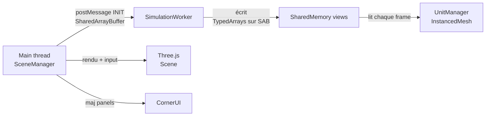

# Architecture

## Vue d'ensemble
Le projet est une application **browser** qui sépare strictement :
- **Main thread** : rendu Three.js + UI + gestion des entrées.
- **Worker(s)** : simulation et mise à jour des états, via mémoire partagée.

## Composants et responsabilités

### Entrée / orchestration
- [`src/main.ts`](src/main.ts:1) : point d'entrée, instancie et démarre la boucle.
- [`src/core/SceneManager.ts`](src/core/SceneManager.ts:1) : assemble la scène Three.js, initialise la mémoire, démarre le worker, gère la boucle d'update/rendu et la sélection (raycaster).

### Mémoire partagée (SoA)
- [`src/core/MemoryManager.ts`](src/core/MemoryManager.ts:1) : alloue un `SharedArrayBuffer` et expose des vues typées (Structure of Arrays) pour les unités.
- [`src/core/workers/SharedMemory.ts`](src/core/workers/SharedMemory.ts:1) : définit le layout (taille par unité) et la fonction `createViews` pour mapper le buffer en `TypedArray` de manière centralisée.

### Simulation (Worker)
- [`src/core/workers/SimulationWorker.ts`](src/core/workers/SimulationWorker.ts:1) : reçoit un `INIT` avec `buffer` + `maxUnits`, crée les vues via `createViews`, lance une boucle (via `setInterval`) et peut écrire directement dans la mémoire partagée via ces vues.

### Rendu des unités
- [`src/entities/UnitManager.ts`](src/entities/UnitManager.ts:1) : lit `active/pos*` depuis la mémoire partagée et met à jour un `THREE.InstancedMesh` (matrices) pour afficher uniquement les unités actives.

### Monde / entités
- [`src/entities/`](src/entities/:1) : entités et représentation du monde.
  - [`src/entities/ClusterGrid.ts`](src/entities/ClusterGrid.ts:1) : grille de clusters, pick meshes pour raycasting, soleils procéduraux + métadonnées de sélection.
  - [`src/entities/StarField.ts`](src/entities/StarField.ts:1) : champ d'étoiles (animation légère).

### UI
- [`src/ui/`](src/ui/:1) : overlays HTML.
  - [`src/ui/CornerUI.ts`](src/ui/CornerUI.ts:1) : panneaux d'infos, debug caméra, logs, détails de la sélection (cluster/soleil).

## Flux de données (main thread ↔ worker)

Notes factuelles :
- Le main thread envoie le buffer au worker une seule fois à l'initialisation (payload `INIT`).
- Le worker ne renvoie pas (encore) d'état détaillé : la synchronisation principale passe par la mémoire partagée.

## Contraintes d'exécution liées à SharedArrayBuffer
- `SharedArrayBuffer` nécessite l'isolation cross-origin : headers **COOP/COEP** configurés dans [`vite.config.ts`](vite.config.ts:1).
