```mermaid
stateDiagram-v2
    [*] --> GALAXY
    
    GALAXY --> SYSTEM : Zoom In / Enter / Double-Click
    SYSTEM --> GALAXY : Zoom Out / Escape
    
    SYSTEM --> PLANET : Zoom In / Select Planet
    PLANET --> SYSTEM : Zoom Out / Escape
    
    PLANET --> SURFACE : Zoom In / Land
    SURFACE --> PLANET : Take Off / Escape
    
    note right of GALAXY
        Vue globale
        - Sélection étoiles
        - Navigation stratégique
        - Jump hyperspace
    end note
    
    note right of SYSTEM
        Vue système solaire
        - Orbites planètes
        - Combat spatial
        - Mining astéroïdes
    end note
    
    note right of PLANET
        Vue orbitale planète
        - Surface visible
        - Installations
        - Landing zones
    end note
    
    note right of SURFACE
        Vue surface planète
        - Terrain 3D
        - Bâtiments
        - Unités au sol
    end note
```

```mermaid
sequenceDiagram
    participant User
    participant Camera
    participant TransitionMgr
    participant NavMgr
    participant Scene
    
    User->>Camera: Click on System A
    Camera->>Camera: lookAt(System A)
    
    User->>NavMgr: Enter System A (double-click)
    NavMgr->>TransitionMgr: saveExitContext(A)
    TransitionMgr->>TransitionMgr: Store: target=A.pos, distance=X
    
    TransitionMgr->>Camera: flyTo(inside System A)
    Camera-->>Camera: Smooth lerp (2s)
    TransitionMgr->>Scene: Show System A, Hide Galaxy
    NavMgr->>NavMgr: setState(SYSTEM)
    
    Note over User,Scene: User inside System A
    
    User->>Camera: Zoom Out (mousewheel)
    Camera->>TransitionMgr: distance > exitThreshold?
    TransitionMgr->>TransitionMgr: Retrieve exitContext
    TransitionMgr->>Camera: setTarget(A.pos) ← LOOK AT!
    TransitionMgr->>Camera: flyTo(outside position)
    Camera-->>Camera: Smooth lerp (1.5s)
    TransitionMgr->>Scene: Show Galaxy, Hide System
    NavMgr->>NavMgr: setState(GALAXY)
    
    Note over Camera: Camera still looks at System A!
    
    User->>Camera: Click on System B
    Camera->>Camera: transitionLookAt(A → B)
    Camera-->>Camera: Smooth rotation
```

# 🗺️ Diagrammes Architecture MMO RTS

## 1. Architecture Globale du Système


## 2. Système de Navigation Multi-Échelle



## 3. Flow Navigation Intelligent (Look-At Context)



## 4. Architecture Composants Détaillée


## 5. Cycle de Vie Entité (Vaisseau)


## 6. Réseau P2P Topology & Communication

```mermaid
graph TB
    subgraph "Mesh Network (4 Players)"
        P1[Player 1<br/>Host]
        P2[Player 2]
        P3[Player 3]
        P4[Player 4]
        
        P1 <--> P2
        P1 <--> P3
        P1 <--> P4
        P2 <--> P3
        P2 <--> P4
        P3 <--> P4
    end
    
    subgraph "Signaling Server"
        SIG[PeerJS Server<br/>WebSocket]
    end
    
    P1 -.Initial.-> SIG
    P2 -.Initial.-> SIG
    P3 -.Initial.-> SIG
    P4 -.Initial.-> SIG
    
    SIG -.Peer List.-> P1
    SIG -.Peer List.-> P2
    SIG -.Peer List.-> P3
    SIG -.Peer List.-> P4
    
    note right of P1
        WebRTC Data Channels
        Binary Protocol (MessagePack)
        Lockstep Synchronization
    end note
```

## 7. Lockstep Synchronization Flow


## 8. Système Combat Spatial


## 9. Galaxy Generation Procédurale


## 10. Performance Optimization Layers


---

## 📝 Légende

### Couleurs
- 🔴 **Rouge** (#e63946): Points d'entrée / Start
- 🔵 **Bleu foncé** (#0f3460): Networking
- 🟢 **Vert** (#06ffa5): Rendu / Output
- 🟣 **Violet** (#16213e): Serveurs / Backend

### Symboles
- **→** : Flow / Appel synchrone
- **⇢** : Communication asynchrone
- **- ->** : Dépendance optionnelle
- **[State]** : État du système
- **{Decision}** : Point de décision

---

Ces diagrammes couvrent l'architecture complète du projet MMO RTS ! 🚀

## 1. Architecture Globale du Système


## 2. Système de Navigation Multi-Échelle


## 3. Flow Navigation Intelligent (Look-At Context)


## 4. Architecture Composants Détaillée


## 5. Cycle de Vie Entité (Vaisseau)


## 6. Réseau P2P Topology & Communication

```mermaid
graph TB
    subgraph "Mesh Network (4 Players)"
        P1[Player 1<br/>Host]
        P2[Player 2]
        P3[Player 3]
        P4[Player 4]
        
        P1 <--> P2
        P1 <--> P3
        P1 <--> P4
        P2 <--> P3
        P2 <--> P4
        P3 <--> P4
    end
    
    subgraph "Signaling Server"
        SIG[PeerJS Server<br/>WebSocket]
    end
    
    P1 -.Initial.-> SIG
    P2 -.Initial.-> SIG
    P3 -.Initial.-> SIG
    P4 -.Initial.-> SIG
    
    SIG -.Peer List.-> P1
    SIG -.Peer List.-> P2
    SIG -.Peer List.-> P3
    SIG -.Peer List.-> P4
    
    note right of P1
        WebRTC Data Channels
        Binary Protocol (MessagePack)
        Lockstep Synchronization
    end note
```

## 7. Lockstep Synchronization Flow


## 8. Système Combat Spatial


## 9. Galaxy Generation Procédurale


## 10. Performance Optimization Layers


---

## 📝 Légende

### Couleurs
- 🔴 **Rouge** (#e63946): Points d'entrée / Start
- 🔵 **Bleu foncé** (#0f3460): Networking
- 🟢 **Vert** (#06ffa5): Rendu / Output
- 🟣 **Violet** (#16213e): Serveurs / Backend

### Symboles
- **→** : Flow / Appel synchrone
- **⇢** : Communication asynchrone
- **- ->** : Dépendance optionnelle
- **[State]** : État du système
- **{Decision}** : Point de décision

---

Ces diagrammes couvrent l'architecture complète du projet MMO RTS ! 🚀

    
    User->>Camera: Zoom Out (mousewheel)
    Camera->>TransitionMgr: distance > exitThreshold?
    TransitionMgr->>TransitionMgr: Retrieve exitContext
    TransitionMgr->>Camera: setTarget(A.pos) ← LOOK AT!
    TransitionMgr->>Camera: flyTo(outside position)
    Camera-->>Camera: Smooth lerp (1.5s)
    TransitionMgr->>Scene: Show Galaxy, Hide System
    NavMgr->>NavMgr: setState(GALAXY)
    
    Note over Camera: Camera still looks at System A!
    
    User->>Camera: Click on System B
    Camera->>Camera: transitionLookAt(A → B)
    Camera-->>Camera: Smooth rotation
```

## 4. Architecture Composants Détaillée

```mermaid
graph LR
    subgraph "Core Engine"
        SM[SceneManager]
        CM[CameraManager]
        NM[NavigationManager]
        TM[TransitionManager]
        IM[InputManager]
        SELM[SelectionManager]
    end
    
    subgraph "Entities"
        SHIPS[Ships<br/>Fighter, Corvette<br/>Frigate, Mothership]
        CELEST[Celestial<br/>Star, Planet<br/>Moon, Asteroid]
        STRUCT[Structures<br/>Station, Shipyard<br/>Defense Platform]
        FORM[Formations<br/>Wedge, Sphere<br/>Wall, Claw]
    end
    
    subgraph "Systems"
        COMBAT[Combat System<br/>Weapons, Damage<br/>Targeting, AI]
        PROD[Production<br/>Build Queue<br/>Resources]
        ECON[Economy<br/>Mining, Trade<br/>Research]
        PATH[Pathfinding<br/>A*, Flow Field<br/>Avoidance]
    end
    
    subgraph "Rendering"
        THREE[Three.js]
        EFFECTS[VFX<br/>Explosions<br/>Beams, Trails]
        LOD[LOD System]
        INST[Instancing]
    end
    
    subgraph "Networking"
        P2P[P2P Manager]
        SYNC[State Sync]
        CMD[Command Queue]
        INTERP[Interpolation]
    end
    
    subgraph "UI"
        HUD[HUD]
        MINI[Minimap]
        MENUS[Build/Research<br/>Menus]
    end
    
    SM --> CM
    SM --> NM
    NM --> TM
    CM --> TM
    SM --> IM
    IM --> SELM
    
    SM --> SHIPS
    SM --> CELEST
    SM --> STRUCT
    SHIPS --> FORM
    
    SHIPS --> COMBAT
    SHIPS --> PROD
    PROD --> ECON
    SHIPS --> PATH
    
    SM --> THREE
    THREE --> EFFECTS
    THREE --> LOD
    THREE --> INST
    
    COMBAT --> P2P
    PROD --> P2P
    P2P --> SYNC
    P2P --> CMD
    SYNC --> INTERP
    
    SM --> HUD
    SM --> MINI
    SM --> MENUS
    
    style SM fill:#e63946
    style P2P fill:#0f3460
    style THREE fill:#06ffa5
```

## 5. Cycle de Vie Entité (Vaisseau)

```mermaid
stateDiagram-v2
    [*] --> QUEUED : Add to Production Queue
    QUEUED --> BUILDING : Resources Available
    BUILDING --> SPAWNING : Construction Complete
    SPAWNING --> IDLE : Spawn at Shipyard
    
    IDLE --> MOVING : Move Command
    IDLE --> ATTACKING : Attack Command
    IDLE --> MINING : Mine Command
    IDLE --> DOCKING : Dock Command
    
    MOVING --> IDLE : Destination Reached
    MOVING --> ATTACKING : Enemy in Range
    
    ATTACKING --> IDLE : Enemy Destroyed
    ATTACKING --> MOVING : Enemy Out of Range
    ATTACKING --> DESTROYED : Health = 0
    
    MINING --> IDLE : Cargo Full
    MINING --> DESTROYED : Attacked
    
    DOCKING --> DOCKED : At Station
    DOCKED --> IDLE : Undock
    
    DESTROYED --> [*]
    
    note right of BUILDING
        Progress bar
        Resource consumption
        Can be canceled
    end note
    
    note right of ATTACKING
        Auto-targeting
        Formation maintained
        Evasive maneuvers
    end note
```

## 6. Réseau P2P Topology & Communication

```mermaid
graph TB
    subgraph "Mesh Network (4 Players)"
        P1[Player 1<br/>Host]
        P2[Player 2]
        P3[Player 3]
        P4[Player 4]
        
        P1 <--> P2
        P1 <--> P3
        P1 <--> P4
        P2 <--> P3
        P2 <--> P4
        P3 <--> P4
    end
    
    subgraph "Signaling Server"
        SIG[PeerJS Server<br/>WebSocket]
    end
    
    P1 -.Initial.-> SIG
    P2 -.Initial.-> SIG
    P3 -.Initial.-> SIG
    P4 -.Initial.-> SIG
    
    SIG -.Peer List.-> P1
    SIG -.Peer List.-> P2
    SIG -.Peer List.-> P3
    SIG -.Peer List.-> P4
    
    note right of P1
        WebRTC Data Channels
        Binary Protocol (MessagePack)
        Lockstep Synchronization
    end note
```

## 7. Lockstep Synchronization Flow

```mermaid
sequenceDiagram
    participant P1 as Player 1
    participant P2 as Player 2
    participant P3 as Player 3
    
    Note over P1,P3: Frame N begins
    
    P1->>P1: Collect local input
    P2->>P2: Collect local input
    P3->>P3: Collect local input
    
    P1->>P2: Send commands (frame N)
    P1->>P3: Send commands (frame N)
    P2->>P1: Send commands (frame N)
    P2->>P3: Send commands (frame N)
    P3->>P1: Send commands (frame N)
    P3->>P2: Send commands (frame N)
    
    Note over P1,P3: Wait for all commands<br/>(timeout 100ms)
    
    P1->>P1: Sort commands by playerID
    P2->>P2: Sort commands by playerID
    P3->>P3: Sort commands by playerID
    
    P1->>P1: Execute frame N
    P2->>P2: Execute frame N
    P3->>P3: Execute frame N
    
    Note over P1,P3: Game state identical!
    
    P1->>P1: Render frame N
    P2->>P2: Render frame N
    P3->>P3: Render frame N
    
    Note over P1,P3: Frame N+1 begins
```

## 8. Système Combat Spatial

```mermaid
graph TB
    subgraph "Weapon Systems"
        BEAM[Beam Weapons<br/>Instant hit<br/>High accuracy]
        PROJ[Projectiles<br/>Travel time<br/>Ballistic]
        MISS[Missiles<br/>Tracking<br/>AOE damage]
        PULSE[Pulse Cannons<br/>Energy bursts<br/>Shield damage]
    end
    
    subgraph "Defense Systems"
        SHIELD[Energy Shields<br/>Regenerating<br/>Absorb %]
        ARMOR[Armor Plating<br/>Damage reduction<br/>No regen]
        PD[Point Defense<br/>Intercept missiles<br/>Short range]
        ECM[ECM Suite<br/>Evade tracking<br/>Stealth]
    end
    
    subgraph "Targeting System"
        AUTO[Auto-Target<br/>Closest/Weakest<br/>Most dangerous]
        MANUAL[Manual Target<br/>Player selection<br/>Focus fire]
        PREDICT[Lead Prediction<br/>Intercept calc<br/>Hit probability]
    end
    
    subgraph "Formation AI"
        MAINTAIN[Maintain Position]
        EVADE[Evasive Maneuvers]
        FLANK[Flanking]
        CONCENTRATE[Concentrate Fire]
    end
    
    BEAM --> AUTO
    PROJ --> AUTO
    MISS --> AUTO
    PULSE --> AUTO
    
    AUTO --> PREDICT
    MANUAL --> PREDICT
    
    PREDICT --> SHIELD
    SHIELD --> ARMOR
    ARMOR --> PD
    
    MAINTAIN --> EVADE
    EVADE --> FLANK
    FLANK --> CONCENTRATE
    
    CONCENTRATE --> MANUAL
```

## 9. Galaxy Generation Procédurale

```mermaid
graph LR
    START[Galaxy Seed] --> SECTORS[Generate Sectors<br/>Voronoi / Grid]
    SECTORS --> STARS[Generate Stars<br/>Density maps]
    STARS --> SYSTEMS[Generate Systems<br/>Per star]
    
    SYSTEMS --> PLANETS[Generate Planets<br/>Orbital mechanics]
    PLANETS --> TERRAIN[Generate Terrain<br/>Heightmap, biomes]
    TERRAIN --> RESOURCES[Place Resources<br/>Mining spots]
    RESOURCES --> POI[Points of Interest<br/>Ruins, stations]
    
    POI --> SAVE[Save to IndexedDB]
    
    STARS -.Properties.-> STARPROPS[Type: O,B,A,F,G,K,M<br/>Mass, Luminosity<br/>Age]
    PLANETS -.Properties.-> PLANETPROPS[Type: Rocky,Gas,Ice<br/>Atmosphere<br/>Climate, Gravity]
    TERRAIN -.Properties.-> TERRAINPROPS[Heightmap<br/>Textures<br/>Vegetation]
    
    style START fill:#e63946
    style SAVE fill:#06ffa5
```

## 10. Performance Optimization Layers

```mermaid
graph TB
    subgraph "Culling"
        FRUSTUM[Frustum Culling<br/>Only visible objects]
        OCCLUSION[Occlusion Culling<br/>Hidden by planets]
        DISTANCE[Distance Culling<br/>Too far to see]
    end
    
    subgraph "LOD Level of Detail"
        LOD0[LOD 0 High<br/>< 10 units]
        LOD1[LOD 1 Medium<br/>10-50 units]
        LOD2[LOD 2 Low<br/>50-200 units]
        LOD3[LOD 3 Impostor<br/>> 200 units]
    end
    
    subgraph "Rendering"
        INST[Instancing<br/>Same mesh batching]
        MERGE[Geometry Merging<br/>Static objects]
        ATLAS[Texture Atlasing<br/>Reduce draw calls]
    end
    
    subgraph "Compute"
        WORKER[Web Workers<br/>Physics offload]
        OCTREE[Spatial Octree<br/>Fast queries]
        POOL[Object Pooling<br/>Reuse objects]
    end
    
    FRUSTUM --> LOD0
    FRUSTUM --> LOD1
    FRUSTUM --> LOD2
    FRUSTUM --> LOD3
    
    OCCLUSION --> FRUSTUM
    DISTANCE --> FRUSTUM
    
    LOD0 --> INST
    LOD1 --> INST
    LOD2 --> MERGE
    LOD3 --> ATLAS
    
    WORKER --> OCTREE
    OCTREE --> POOL
```

---

## 📝 Légende

### Couleurs
- 🔴 **Rouge** (#e63946): Points d'entrée / Start
- 🔵 **Bleu foncé** (#0f3460): Networking
- 🟢 **Vert** (#06ffa5): Rendu / Output
- 🟣 **Violet** (#16213e): Serveurs / Backend

### Symboles
- **→** : Flow / Appel synchrone
- **⇢** : Communication asynchrone
- **- ->** : Dépendance optionnelle
- **[State]** : État du système
- **{Decision}** : Point de décision

---

Ces diagrammes couvrent l'architecture complète du projet MMO RTS ! 🚀
