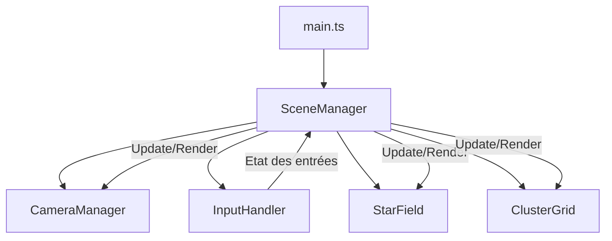
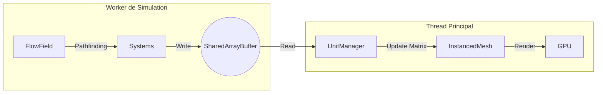

# Architecture Technique : MMORTS (Restructuration TypeScript)

Cette architecture définit une application 3D modulaire utilisant Three.js et TypeScript, organisée pour favoriser la maintenabilité et l'évolution vers un MMORTS.

## 1. Choix Technologiques
- **Langage :** [TypeScript](https://www.typescriptlang.org/) pour un typage fort et une meilleure robustesse.
- **Bibliothèque 3D :** [Three.js](https://threejs.org/) installée via npm.
- **Outil de Build :** [Vite](https://vitejs.dev/) pour un développement rapide (HMR) et un bundling optimisé.
- **Gestionnaire de paquets :** npm.

## 2. Structure des Dossiers

```text
/
├── public/                # Assets statiques (textures, modèles, index.html)
├── src/
│   ├── core/              # Logique centrale du moteur
│   │   ├── SceneManager.ts    # Gestion de la scène, du rendu et de la boucle
│   │   ├── CameraManager.ts   # Configuration et contrôle de la caméra
│   │   └── InputHandler.ts    # Gestion des entrées (clavier, souris)
│   ├── entities/          # Objets de la scène
│   │   ├── StarField.ts       # Système de particules pour les étoiles
│   │   └── ClusterGrid.ts        # Grille de cubes (représentation du monde)
│   └── main.ts            # Point d'entrée de l'application
├── package.json           # Dépendances et scripts
├── tsconfig.json          # Configuration TypeScript
└── vite.config.ts         # Configuration Vite
```

## 3. Modules et Responsabilités

### Core
- **[`SceneManager.ts`](src/core/SceneManager.ts)** : Initialise `THREE.Scene`, `THREE.WebGLRenderer`. Gère la boucle d'animation (`requestAnimationFrame`) et délègue les mises à jour aux autres modules.
- **[`CameraManager.ts`](src/core/CameraManager.ts)** : Gère la `THREE.PerspectiveCamera` et les `OrbitControls`. Fournit des méthodes pour déplacer la caméra programmatiquement.
- **[`InputHandler.ts`](src/core/InputHandler.ts)** : Centralise l'écoute des événements clavier et souris. Expose l'état des touches et la position de la souris.

### Entities
- **[`StarField.ts`](src/entities/StarField.ts)** : Encapsule la création du `THREE.Points` pour le fond étoilé.
- **[`ClusterGrid.ts`](src/entities/ClusterGrid.ts)** : Gère la génération et l'affichage de la grille de cubes.

## 4. Flux de Données



## 5. Cycle de Vie
1. **Initialisation** : `main.ts` instancie `SceneManager`.
2. **Setup** : `SceneManager` crée les instances de `CameraManager`, `InputHandler`, et les entités.
3. **Boucle** : `SceneManager.animate()` est appelé à chaque frame.
   - Lecture des entrées via `InputHandler`.
   - Mise à jour de la position caméra via `CameraManager`.
   - Rendu de la scène via `renderer.render()`.

## 6. Système de Coordonnées et Nomenclature

Pour gérer un monde vaste, le système utilise une hiérarchie de coordonnées basée sur des **Clusters**.

### 6.1 Hiérarchie
1. **Cluster** : Une zone de la grille (par défaut 10x10 unités).
2. **Cellule** : Une unité individuelle à l'intérieur d'un cluster.

### 6.2 Nomenclature
Le format d'identification unique d'une cellule est : `C[CX:CZ]-L[LX]-C[LZ]`
- **CX, CZ** : Coordonnées du Cluster (ex: 0:0, 1:-2).
- **LX, LZ** : Coordonnées Locales de la cellule au sein du cluster (de 0 à 9 pour un cluster de taille 10).

*Exemple : `C[0:0]-L[5]-C[2]` désigne la cellule à la colonne 5, ligne 2 du cluster central.*

### 6.3 Conversion 3D (Three.js)
Le projet utilise le plan **XZ** pour la grille (`Y=0`).

**Variables :**
- `S` : Taille du cluster (ex: 10).
- `G` : Espacement (`spacing`) entre les cellules (ex: 1.0).

**De Coordonnées vers Position 3D (World) :**
- `WorldX = (CX * S + LX - (S / 2)) * G`
- `WorldY = 0`
- `WorldZ = (CZ * S + LZ - (S / 2)) * G`

**De Position 3D vers Coordonnées :**
- `TotalX = floor(WorldX / G + (S / 2))`
- `TotalZ = floor(WorldZ / G + (S / 2))`
- `CX = floor(TotalX / S)`
- `CZ = floor(TotalZ / S)`
- `LX = ((TotalX mod S) + S) mod S` (Gestion des nombres négatifs)
- `LZ = ((TotalZ mod S) + S) mod S` (Gestion des nombres négatifs)

### 6.4 Notes sur l'implémentation
- **Nombres négatifs** : En JavaScript, l'opérateur `%` est un opérateur de reste et non de modulo. Pour obtenir un modulo positif (nécessaire pour `LX` et `LZ`), la formule `((n % m) + m) % m` est utilisée.
- **Centrage** : Le décalage `S / 2` dans les formules permet de centrer le cluster `0:0` sur l'origine du monde 3D.

## 7. Identité des Clusters (Labels)

Pour faciliter la navigation, chaque cluster affiche son identifiant `C[CX:CZ]`.

### 7.1 Solution Technique : Text Sprites (Canvas 2D)
Le choix se porte sur des **Sprites avec textures Canvas 2D** pour les raisons suivantes :
- **Performance** : Un seul draw call par label, géré nativement par le pipeline WebGL.
- **Simplicité** : Pas de dépendance à un renderer CSS2D externe ou à des géométries complexes.
- **Lisibilité** : Le texte fait toujours face à la caméra (billboarding automatique).

### 7.2 Positionnement
Les labels sont placés aux **quatre coins** de chaque cluster, légèrement surélevés sur l'axe Y (`Y = 0.5`) pour éviter le z-fighting avec la grille.
- **Coins** : Permet d'identifier le cluster peu importe la direction d'approche.
- **Format** : Texte blanc sur fond transparent ou semi-opaque pour le contraste.

### 7.3 Stratégie de Visibilité (LOD)
Pour éviter la surcharge visuelle (cluttering) :
- **Distance de rendu** : Les labels ne sont instanciés/affichés que si la caméra est à une distance `D < MaxDistance`.
- **Atténuation** : L'opacité du sprite diminue proportionnellement à la distance pour une transition fluide.
- **Frustum Culling** : Three.js gère nativement l'exclusion des labels hors du champ de vision.

### 7.4 Flux de Mise à Jour
```mermaid
graph LR
    Cam[CameraManager] -- Position --> CG[ClusterGrid]
    CG -- Calcul Distance --> LOD{Proche ?}
    LOD -- Oui --> Show[Afficher Labels]
    LOD -- Non --> Hide[Masquer Labels]

## 8. Haute Performance et Mise à l'Échelle

Pour supporter des milliers d'unités actives, le projet adopte une architecture orientée données (DOD).

### 8.1 SharedArrayBuffer et WebWorkers
La simulation est déportée dans un **Worker de Simulation**. La communication se fait via un `SharedArrayBuffer` (SAB), permettant un accès sans copie aux données des unités.

**Structure de la Mémoire (SoA - Structure of Arrays) :**
Au lieu d'un tableau d'objets, nous utilisons des TypedArrays plats pour maximiser la localité du cache :
- `positions`: `Float32Array` [x1, y1, z1, x2, y2, z2, ...]
- `velocities`: `Float32Array` [vx1, vy1, vz1, vx2, vy2, vz2, ...]
- `states`: `Uint8Array` [state1, state2, ...]

### 8.2 Intégration de la Nomenclature Spatiale
La nomenclature `C[CX:CZ]-L[LX]-C[LZ]` est utilisée pour indexer les **Flow Fields** et les grilles d'occupation.
- **Indexation Mémoire** : Une cellule est mappée à un index unique dans le SAB pour les calculs de pathfinding de masse.
- **Flow Fields** : Chaque cellule de la grille stocke un vecteur de direction (2D ou 3D) vers lequel les unités présentes dans cette cellule doivent se diriger.

### 8.3 Rendu par InstancedMesh
Le thread principal utilise `THREE.InstancedMesh` pour le rendu des unités.
1. Le **Worker** met à jour les positions dans le SAB.
2. Le **Thread Principal** lit le SAB et met à jour la `instanceMatrix` de l'InstancedMesh.
3. Un seul Draw Call est envoyé au GPU pour toutes les instances d'un même type d'unité.

### 8.4 Structure de Fichiers Proposée
```text
src/
├── core/
│   └── workers/
│       ├── simulation.worker.ts    # Point d'entrée du worker
│       ├── systems/                # Logique (Movement, FlowField, Collision)
│       └── state/
│           ├── SharedMemory.ts     # Initialisation du SharedArrayBuffer
│           └── BufferViews.ts      # Mappage des TypedArrays sur le SAB
├── entities/
│   └── UnitManager.ts              # Gestionnaire des InstancedMesh (Côté Main)
```

### 8.5 Flux de Simulation

```
