# Projet MMORTS - Export Consolidé

> Généré le 01/01/2026 20:49:04

## Structure du projet

Nombre total de fichiers : **41**

---

## 📄 .kilocode\rules\memory-bank-instructions.md

```markdown
# Memory Bank

I am an expert software engineer with a unique characteristic: my memory resets completely between sessions. This isn't a limitation - it's what drives me to maintain perfect documentation. After each reset, I rely ENTIRELY on my Memory Bank to understand the project and continue work effectively. I MUST read ALL memory bank files at the start of EVERY task - this is not optional. The memory bank files are located in `.kilocode/rules/memory-bank` folder.

When I start a task, I will include `[Memory Bank: Active]` at the beginning of my response if I successfully read the memory bank files, or `[Memory Bank: Missing]` if the folder doesn't exist or is empty. If memory bank is missing, I will warn the user about potential issues and suggest initialization.

## Memory Bank Structure

The Memory Bank consists of core files and optional context files, all in Markdown format.

### Core Files (Required)
1. `brief.md`
   This file is created and maintained manually by the developer. Don't edit this file directly but suggest to user to update it if it can be improved.
   - Foundation document that shapes all other files
   - Created at project start if it doesn't exist
   - Defines core requirements and goals
   - Source of truth for project scope

2. `product.md`
   - Why this project exists
   - Problems it solves
   - How it should work
   - User experience goals

3. `context.md`
   This file should be short and factual, not creative or speculative.
   - Current work focus
   - Recent changes
   - Next steps

4. `architecture.md`
   - System architecture
   - Source Code paths
   - Key technical decisions
   - Design patterns in use
   - Component relationships
   - Critical implementation paths

5. `tech.md`
   - Technologies used
   - Development setup
   - Technical constraints
   - Dependencies
   - Tool usage patterns

### Additional Files
Create additional files/folders within memory-bank/ when they help organize:
- `tasks.md` - Documentation of repetitive tasks and their workflows
- Complex feature documentation
- Integration specifications
- API documentation
- Testing strategies
- Deployment procedures

## Core workflows

### Memory Bank Initialization

The initialization step is CRITICALLY IMPORTANT and must be done with extreme thoroughness as it defines all future effectiveness of the Memory Bank. This is the foundation upon which all future interactions will be built.

When user requests initialization of the memory bank (command `initialize memory bank`), I'll perform an exhaustive analysis of the project, including:
- All source code files and their relationships
- Configuration files and build system setup
- Project structure and organization patterns
- Documentation and comments
- Dependencies and external integrations
- Testing frameworks and patterns

I must be extremely thorough during initialization, spending extra time and effort to build a comprehensive understanding of the project. A high-quality initialization will dramatically improve all future interactions, while a rushed or incomplete initialization will permanently limit my effectiveness.

After initialization, I will ask the user to read through the memory bank files and verify product description, used technologies and other information. I should provide a summary of what I've understood about the project to help the user verify the accuracy of the memory bank files. I should encourage the user to correct any misunderstandings or add missing information, as this will significantly improve future interactions.

### Memory Bank Update

Memory Bank updates occur when:
1. Discovering new project patterns
2. After implementing significant changes
3. When user explicitly requests with the phrase **update memory bank** (MUST review ALL files)
4. When context needs clarification

If I notice significant changes that should be preserved but the user hasn't explicitly requested an update, I should suggest: "Would you like me to update the memory bank to reflect these changes?"

To execute Memory Bank update, I will:

1. Review ALL project files
2. Document current state
3. Document Insights & Patterns
4. If requested with additional context (e.g., "update memory bank using information from @/Makefile"), focus special attention on that source

Note: When triggered by **update memory bank**, I MUST review every memory bank file, even if some don't require updates. Focus particularly on context.md as it tracks current state.

### Add Task

When user completes a repetitive task (like adding support for a new model version) and wants to document it for future reference, they can request: **add task** or **store this as a task**.

This workflow is designed for repetitive tasks that follow similar patterns and require editing the same files. Examples include:
- Adding support for new AI model versions
- Implementing new API endpoints following established patterns
- Adding new features that follow existing architecture

Tasks are stored in the file `tasks.md` in the memory bank folder. The file is optional and can be empty. The file can store many tasks. 

To execute Add Task workflow:

1. Create or update `tasks.md` in the memory bank folder
2. Document the task with:
   - Task name and description
   - Files that need to be modified
   - Step-by-step workflow followed
   - Important considerations or gotchas
   - Example of the completed implementation
3. Include any context that was discovered during task execution but wasn't previously documented

Example task entry:
```markdown
## Add New Model Support
**Last performed:** [date]
**Files to modify:**
- `/providers/gemini.md` - Add model to documentation
- `/src/providers/gemini-config.ts` - Add model configuration
- `/src/constants/models.ts` - Add to model list
- `/tests/providers/gemini.test.ts` - Add test cases

**Steps:**
1. Add model configuration with proper token limits
2. Update documentation with model capabilities
3. Add to constants file for UI display
4. Write tests for new model configuration

**Important notes:**
- Check Google's documentation for exact token limits
- Ensure backward compatibility with existing configurations
- Test with actual API calls before committing
```

### Regular Task Execution

In the beginning of EVERY task I MUST read ALL memory bank files - this is not optional. 

The memory bank files are located in `.kilocode/rules/memory-bank` folder. If the folder doesn't exist or is empty, I will warn user about potential issues with the memory bank. I will include `[Memory Bank: Active]` at the beginning of my response if I successfully read the memory bank files, or `[Memory Bank: Missing]` if the folder doesn't exist or is empty. If memory bank is missing, I will warn the user about potential issues and suggest initialization. I should briefly summarize my understanding of the project to confirm alignment with the user's expectations, like:

"[Memory Bank: Active] I understand we're building a React inventory system with barcode scanning. Currently implementing the scanner component that needs to work with the backend API."

When starting a task that matches a documented task in `tasks.md`, I should mention this and follow the documented workflow to ensure no steps are missed.

If the task was repetitive and might be needed again, I should suggest: "Would you like me to add this task to the memory bank for future reference?"

In the end of the task, when it seems to be completed, I will update `context.md` accordingly. If the change seems significant, I will suggest to the user: "Would you like me to update memory bank to reflect these changes?" I will not suggest updates for minor changes.

## Context Window Management

When the context window fills up during an extended session:
1. I should suggest updating the memory bank to preserve the current state
2. Recommend starting a fresh conversation/task
3. In the new conversation, I will automatically load the memory bank files to maintain continuity

## Technical Implementation

Memory Bank is built on Kilo Code's Custom Rules feature, with files stored as standard markdown documents that both the user and I can access.

## Important Notes

REMEMBER: After every memory reset, I begin completely fresh. The Memory Bank is my only link to previous work. It must be maintained with precision and clarity, as my effectiveness depends entirely on its accuracy.

If I detect inconsistencies between memory bank files, I should prioritize brief.md and note any discrepancies to the user.

IMPORTANT: I MUST read ALL memory bank files at the start of EVERY task - this is not optional. The memory bank files are located in `.kilocode/rules/memory-bank` folder.
```

---

## 📄 .kilocode\rules\memory-bank\architecture.md

```markdown
# PEEJS — Architecture

## Vue d’ensemble (runtime)
- Point d’entrée : [`src/main.ts`](src/main.ts:1) instancie [`SceneManager`](src/core/SceneManager.ts:17) puis lance la boucle [`SceneManager.animate()`](src/core/SceneManager.ts:416).
- Boucle frame :
  - Mise à jour caméra : [`CameraManager.update()`](src/core/CameraManager.ts:120)
  - Mise à jour des objets “updatables” : interface [`IUpdatable`](src/core/IUpdatable.ts:7) (ex: [`StarField`](src/entities/StarField.ts:6), [`ClusterGrid`](src/entities/ClusterGrid.ts:31), [`CoordinateSystem`](src/entities/CoordinateSystem.ts:6), [`UnitManager`](src/entities/UnitManager.ts:8)).
  - Transitions automatiques (si aucune transition caméra en cours) : [`SceneManager.checkAutoTransitions()`](src/core/SceneManager.ts:479) basé sur [`NavigationState.currentOptimalDistance`](src/types/NavigationState.ts:78) et [`CameraManager.distance`](src/core/CameraManager.ts:77).

## États de navigation (source de vérité)
- État central : [`NavigationState`](src/types/NavigationState.ts:57)
  - `currentView`: `GALAXY | SYSTEM | PLANET` (voir [`ViewMode`](src/types/NavigationState.ts:7))
  - `currentSystem`: [`SystemReference`](src/types/NavigationState.ts:13)
  - `currentPlanet`: [`PlanetReference`](src/types/NavigationState.ts:33)
  - `currentOptimalDistance`: seuil utilisé pour auto-transitions.
- Gestionnaire d’état : [`NavigationManager`](src/core/NavigationManager.ts:6)
  - Sélection galaxie (sans changer de vue) : [`setGalaxySelection()`](src/core/NavigationManager.ts:40)
  - Entrée/sortie système : [`enterSystem()`](src/core/NavigationManager.ts:87) / [`exitSystem()`](src/core/NavigationManager.ts:136)
  - Entrée/sortie planète : [`enterPlanet()`](src/core/NavigationManager.ts:163) / [`exitPlanet()`](src/core/NavigationManager.ts:191)
- Invariant important (robustesse) :
  - Les données stables sont dans `SystemReference.metadata` (voir commentaires de [`SystemReference`](src/types/NavigationState.ts:13)).
  - Les références runtime `sunMesh/pickMesh` sont optionnelles et peuvent devenir invalides (ex: changement de référentiel/scene graph swap).

## Caméra, lookAt et transitions
- Caméra + contrôles : [`CameraManager`](src/core/CameraManager.ts:9)
  - OrbitControls (zoom molette) + mouvements clavier (W/A/S/D) : [`handleKeyboardMovement()`](src/core/CameraManager.ts:195)
  - Cible “lookAt” : [`setTarget()`](src/core/CameraManager.ts:236)
  - Transition fluide : [`flyTo(target, distance)`](src/core/CameraManager.ts:266) (désactive temporairement les contrôles, lerp position+target).
  - Garde-fous : [`isTransitioning()`](src/core/CameraManager.ts:179) empêche conflits auto-transitions / interactions.
- Contrôles navigation (actuels) câblés dans [`SceneManager`](src/core/SceneManager.ts:122) :
  - **Enter** : déclenche [`SceneManager.handleEnterSystem()`](src/core/SceneManager.ts:364) (vue GALAXY → SYSTEM via `flyTo` + `NavigationManager.enterSystem`)
  - **Escape** : déclenche [`SceneManager.handleExitSystem()`](src/core/SceneManager.ts:448) (vue SYSTEM → GALAXY + repositionnement stable depuis metadata)

## Sélection (GALAXY) : raycast → sélection → lookAt → cible de navigation
- Raycaster géré dans [`SceneManager`](src/core/SceneManager.ts:30) :
  - Survol : [`updateHover()`](src/core/SceneManager.ts:157) utilise les pick meshes de [`ClusterGrid.getPickObjects()`](src/entities/ClusterGrid.ts:120)
  - Clic : [`onClick()`](src/core/SceneManager.ts:177) raycast sur pick meshes (cubes) + meshes de soleils (étoiles)
- Règle métier de sélection (GALAXY) :
  - Priorité au soleil si touché, sauf si un cluster est déjà sélectionné et la distance en clusters dépasse 1 (Chebyshev) : logique dans [`SceneManager.onClick()`](src/core/SceneManager.ts:202).
- Effets visuels sélection :
  - Cube : opacité/couleurs dans [`ClusterGrid.selectCubeByName()`](src/entities/ClusterGrid.ts:350)
  - Soleil : anneau via [`ClusterGrid.selectSun()`](src/entities/ClusterGrid.ts:271) utilisant [`SelectionRing`](src/entities/SelectionRing.ts:3)
- Propagation :
  - LookAt : [`CameraManager.setTarget(clickedSun.position)`](src/core/SceneManager.ts:228)
  - Cible de navigation : [`NavigationManager.setGalaxySelection(systemRef)`](src/core/SceneManager.ts:237) où `systemRef` est construit via [`ClusterGrid.getSystemReference()`](src/entities/ClusterGrid.ts:173) (fallback possible si `sunMesh` absent).

## GALAXY : entités et responsabilités
- Fond étoilé : [`StarField`](src/entities/StarField.ts:6) (Points, rotation lente).
- Galaxie = grille de clusters : [`ClusterGrid`](src/entities/ClusterGrid.ts:31)
  - Crée une grille de `GRID_CONFIG.cubesX × GRID_CONFIG.cubesZ` (actuellement cluster central unique) : [`src/config.ts`](src/config.ts:14)
  - Crée des **pick meshes** invisibles pour raycast précis : [`ClusterGrid`](src/entities/ClusterGrid.ts:95)
  - Génère des **soleils** (Mesh Sphere) + métadonnées [`SunMetadata`](src/entities/ClusterGrid.ts:9)
  - Construit une [`SystemReference`](src/types/NavigationState.ts:13) complète via [`getSystemReference()`](src/entities/ClusterGrid.ts:173)

## SYSTEM : système solaire (modèle rendu)
- Système solaire : [`SolarSystem`](src/entities/SolarSystem.ts:16)
  - Groupe `THREE.Group` avec soleil + planètes orbitant (update dt).
  - Les planètes portent un identifiant dans `mesh.userData.planetId` pour raycast : [`SolarSystem.generatePlanets()`](src/entities/SolarSystem.ts:103)
  - Sélection visuelle : anneaux via [`SelectionRing`](src/entities/SelectionRing.ts:3) (soleil et planète).
- Note : le câblage “vue SYSTEM affichant SolarSystem” n’apparaît pas dans [`SceneManager`](src/core/SceneManager.ts:1) actuellement ; l’état SYSTEM existe côté [`NavigationManager`](src/core/NavigationManager.ts:1).

## PLANET : surface sphérique + LOD + procédural
- Surface planétaire : [`PlanetSurface`](src/entities/PlanetSurface.ts:27)
  - Géométrie sphérique stricte (aucune projection plane).
  - LOD multi-niveaux via `THREE.LOD` : création dans [`PlanetSurface`](src/entities/PlanetSurface.ts:149) + `updateLOD(camera)` : [`PlanetSurface.updateLOD()`](src/entities/PlanetSurface.ts:242)
  - Matériau procédural `ShaderMaterial` (noise + biomes) : [`PlanetSurface.createProceduralMaterial()`](src/entities/PlanetSurface.ts:51)

## Transitions automatiques par distance (zoom)
- Paramètres : [`NAVIGATION_CONFIG`](src/config.ts:69)
  - Entrée système : `distance < optimalDistance * systemEnterDistanceFactor` (cf. [`SceneManager.checkAutoTransitions()`](src/core/SceneManager.ts:483))
  - Sortie système : `distance > optimalDistance * systemExitDistanceFactor` (cf. [`SceneManager.checkAutoTransitions()`](src/core/SceneManager.ts:496))
  - Cooldown anti-oscillation : `transitionCooldown` (config présent, usage à vérifier lors du câblage complet).

## Simulation “MMO” : worker + mémoire partagée + rendu instancié
- Mémoire partagée SoA : [`MemoryManager`](src/core/MemoryManager.ts:11) + mapping [`SharedMemory.createViews()`](src/core/workers/SharedMemory.ts:52)
  - `SharedArrayBuffer` + zone de contrôle Int32 (Atomics) : [`CONTROL_INT32_LENGTH`](src/core/workers/SharedMemory.ts:18), [`SYNC_FLAGS`](src/core/workers/SharedMemory.ts:24)
- Worker simulation : [`SimulationWorker`](src/core/workers/SimulationWorker.ts:1)
  - Reçoit `INIT` (buffer + maxUnits), crée les vues, puis boucle `setInterval`.
  - Utilise Atomics pour marquer phases READY/WRITING : [`SimulationWorker.simulate()`](src/core/workers/SimulationWorker.ts:61)
- Rendu des unités : [`UnitManager`](src/entities/UnitManager.ts:8)
  - Lit `posX/posY/posZ/active` depuis le SAB et met à jour un `THREE.InstancedMesh`.

## Diagramme (flux principal sélection → caméra → navigation)


---

## 📄 .kilocode\rules\memory-bank\context.md

```markdown
# PEEJS — Context

## Focus actuel
- Navigation fluide **GALAXY → SYSTEM → PLANET** sans écran de chargement.
- Sélection (étoile/cluster) et propagation vers la caméra (lookAt) et l’état de navigation.
- Contrôles : **Enter** (entrer), **Escape** (sortir), **zoom in/out** via molette OrbitControls (cf. [`src/ui/CornerUI.ts`](src/ui/CornerUI.ts:105)).

## Changements récents
- Initialisation des fichiers Memory Bank (création de [`product.md`](.kilocode/rules/memory-bank/product.md:1), [`architecture.md`](.kilocode/rules/memory-bank/architecture.md:1), [`tech.md`](.kilocode/rules/memory-bank/tech.md:1), et ce fichier).

## Prochaines étapes (concrètes)
- Vérifier/compléter le câblage SYSTEM et PLANET dans [`src/core/SceneManager.ts`](src/core/SceneManager.ts:1) (affichage réel de [`src/entities/SolarSystem.ts`](src/entities/SolarSystem.ts:1) et de [`src/entities/PlanetSurface.ts`](src/entities/PlanetSurface.ts:1) selon [`src/types/NavigationState.ts`](src/types/NavigationState.ts:1)).
- Standardiser la sélection en SYSTEM (sélection planète via `mesh.userData.planetId`) et connecter la cible lookAt via [`CameraManager.setTarget()`](src/core/CameraManager.ts:236).
- Finaliser la boucle Enter/Escape : GALAXY↔SYSTEM (déjà présent) puis SYSTEM↔PLANET via [`NavigationManager.enterPlanet()`](src/core/NavigationManager.ts:163) / [`NavigationManager.exitPlanet()`](src/core/NavigationManager.ts:191).
- Stabiliser les transitions zoom automatiques via [`SceneManager.checkAutoTransitions()`](src/core/SceneManager.ts:479) et [`NAVIGATION_CONFIG`](src/config.ts:69).
```

---

## 📄 .kilocode\rules\memory-bank\product.md

```markdown
# PEEJS — Product

## Pourquoi ce projet existe
PEEJS est un prototype de MMO RTS centré sur une expérience de **navigation spatiale fluide** (galaxie → système solaire → planète), sans écrans de chargement, et conçu pour rester compatible avec des contraintes MMO (grand nombre de joueurs et d’unités).

Objectifs principaux :
- Permettre d’explorer une **galaxie** structurée (grille/regions) et de sélectionner un **système solaire** (étoile).
- Entrer dans un système solaire puis viser une planète, et **entrer/sortir** de manière instantanée et cohérente (navigation multi-niveaux).
- Maintenir une continuité visuelle (pas de “loading screen”) via transitions caméra + niveaux de détail (LOD) et/ou changement de référentiel.

## Expérience joueur (boucle principale)
1. **Vue GALAXY**
   - Le joueur voit une galaxie sous forme de grille de clusters (cubes) et des étoiles sélectionnables.
   - Le joueur sélectionne une étoile (système cible).
2. **Entrée SYSTEM**
   - Le joueur “zoom”/entre dans le système solaire sélectionné (transition caméra), pour voir soleil + planètes.
3. **Entrée PLANET**
   - Depuis le système, le joueur peut sélectionner une planète et entrer en vue planète (surface sphérique).
4. **Sortie**
   - Retour PLANET → SYSTEM → GALAXY, en conservant une cible caméra cohérente (lookAt).

## Contrôles (cibles de design)
- **Zoom in/out** : molette (OrbitControls).
- **Sélection** : clic sur l’entité (étoile/planète) ; la sélection alimente la cible de caméra (lookAt).
- **Entrer** : touche **Enter**
  - GALAXY → SYSTEM (sur le système sélectionné)
  - SYSTEM → PLANET (si une planète est sélectionnée)
- **Sortir** : touche **Escape**
  - PLANET → SYSTEM
  - SYSTEM → GALAXY

## Objectif “sans temps de chargement”
Principe : la navigation ne doit pas bloquer le rendu.
- Transitions réalisées par mouvement caméra (fly/zoom) et bascule d’état de navigation.
- Réduction de coût visuel par niveaux de détail (ex: LOD planète) pour rester fluide pendant les transitions.

## Scalabilité (contraintes MMO visées)
- Simulation d’un grand nombre d’unités via calcul asynchrone (worker) et partage mémoire (SharedArrayBuffer), afin de conserver un main thread principalement orienté rendu.
- Rendu efficace des unités via instancing (InstancedMesh) pour afficher de grandes quantités d’objets.

## Ce qui est “dans le scope strict” actuel
- Navigation et états : GALAXY / SYSTEM / PLANET.
- Sélection + caméra “look at”.
- Entrée/sortie (Enter/Escape) + zoom in/out.
- Transitions fluides et robustes (pas de chargement bloquant).
```

---

## 📄 .kilocode\rules\memory-bank\tasks.md

```markdown
# PEEJS — Tasks

## Ajouter un niveau de navigation (GALAXY / SYSTEM / PLANET)
**But :** ajouter ou compléter un niveau de navigation en restant DRY, en s’appuyant sur l’état central [`NavigationState`](src/types/NavigationState.ts:57) et en reliant sélection → caméra lookAt → transitions.

### Fichiers à modifier (selon niveau)
- État et types :
  - [`src/types/NavigationState.ts`](src/types/NavigationState.ts:1)
- Gestionnaire d’état :
  - [`src/core/NavigationManager.ts`](src/core/NavigationManager.ts:1)
- Câblage runtime (entrée/sortie, auto-transitions, raycast) :
  - [`src/core/SceneManager.ts`](src/core/SceneManager.ts:1)
- Caméra / transitions / lookAt :
  - [`src/core/CameraManager.ts`](src/core/CameraManager.ts:1)
- Sélection (si logique dédiée) :
  - [`src/core/SelectionManager.ts`](src/core/SelectionManager.ts:1)
- Entités rendues selon vue :
  - GALAXY : [`src/entities/ClusterGrid.ts`](src/entities/ClusterGrid.ts:1), [`src/entities/StarField.ts`](src/entities/StarField.ts:1)
  - SYSTEM : [`src/entities/SolarSystem.ts`](src/entities/SolarSystem.ts:1)
  - PLANET : [`src/entities/PlanetSurface.ts`](src/entities/PlanetSurface.ts:1)
- Seuils/paramètres :
  - [`src/config.ts`](src/config.ts:1) (notamment [`NAVIGATION_CONFIG`](src/config.ts:69))
- UI (aide/indications) :
  - [`src/ui/CornerUI.ts`](src/ui/CornerUI.ts:1)

### Invariants à respecter
- **Source de vérité** : vue et sélection courantes dans [`NavigationState`](src/types/NavigationState.ts:57), mutées via [`NavigationManager`](src/core/NavigationManager.ts:6).
- **Références stables** : privilégier `SystemReference.metadata` (voir commentaires de [`SystemReference`](src/types/NavigationState.ts:13)) ; `sunMesh/pickMesh` sont runtime et peuvent devenir invalides.
- **Contrôles** :
  - **Enter** : entrer (GALAXY→SYSTEM, puis SYSTEM→PLANET si planète sélectionnée).
  - **Escape** : sortir (PLANET→SYSTEM, puis SYSTEM→GALAXY).
  - **Zoom in/out** : molette OrbitControls (cf. [`src/ui/CornerUI.ts`](src/ui/CornerUI.ts:105)).
- **Caméra** :
  - La sélection doit alimenter `lookAt` via [`CameraManager.setTarget()`](src/core/CameraManager.ts:236).
  - Les transitions doivent passer par [`CameraManager.flyTo()`](src/core/CameraManager.ts:266) (avec garde-fou [`CameraManager.isTransitioning()`](src/core/CameraManager.ts:179)).

### Workflow (pas à pas)
1. **Définir le nouvel état minimal**
   - Ajouter/valider la vue cible dans [`ViewMode`](src/types/NavigationState.ts:7) et le sous-état requis (ex: `currentPlanet`) dans [`NavigationState`](src/types/NavigationState.ts:57).

2. **Ajouter les transitions d’état**
   - Implémenter (ou compléter) `enterX/exitX` dans [`NavigationManager`](src/core/NavigationManager.ts:6) sur le modèle existant :
     - [`enterSystem()`](src/core/NavigationManager.ts:87) / [`exitSystem()`](src/core/NavigationManager.ts:136)
     - [`enterPlanet()`](src/core/NavigationManager.ts:163) / [`exitPlanet()`](src/core/NavigationManager.ts:191)

3. **Brancher la sélection pour produire une cible de navigation**
   - GALAXY : construire une `SystemReference` via [`ClusterGrid.getSystemReference()`](src/entities/ClusterGrid.ts:173), puis pousser via [`NavigationManager.setGalaxySelection()`](src/core/NavigationManager.ts:40).
   - SYSTEM : utiliser l’identifiant `mesh.userData.planetId` (créé dans [`SolarSystem.generatePlanets()`](src/entities/SolarSystem.ts:103)) pour constituer une `PlanetReference` (structure dans [`src/types/NavigationState.ts`](src/types/NavigationState.ts:33)).

4. **Relier sélection → caméra lookAt**
   - À la sélection, appeler [`CameraManager.setTarget()`](src/core/CameraManager.ts:236) sur la position de l’objet sélectionné (étoile/planète).
   - Conserver l’affichage de sélection existant (anneau) :
     - Soleil galaxie : [`ClusterGrid.selectSun()`](src/entities/ClusterGrid.ts:271) → [`SelectionRing`](src/entities/SelectionRing.ts:3)
     - Système : anneaux dans [`SolarSystem`](src/entities/SolarSystem.ts:16) (même primitive [`SelectionRing`](src/entities/SelectionRing.ts:3))

5. **Rendre la bonne entité selon la vue**
   - Dans [`SceneManager`](src/core/SceneManager.ts:1), afficher/masquer les entités (ou switcher scene graph) en fonction de `NavigationState.currentView`.
   - Éviter la duplication : une seule source de rendu par vue, pas de copies de logique de sélection.

6. **Câbler Enter/Escape**
   - Dans [`SceneManager`](src/core/SceneManager.ts:1), faire pointer Enter/Escape vers les handlers de transition existants (ex: [`SceneManager.handleEnterSystem()`](src/core/SceneManager.ts:364), [`SceneManager.handleExitSystem()`](src/core/SceneManager.ts:448)) et ajouter l’équivalent SYSTEM↔PLANET quand prêt.

7. **Auto-transitions (zoom)**
   - Utiliser [`SceneManager.checkAutoTransitions()`](src/core/SceneManager.ts:479) et les seuils dans [`NAVIGATION_CONFIG`](src/config.ts:69) :
     - entrée système : distance < optimalDistance * factor
     - sortie système : distance > optimalDistance * factor
   - Garder le garde-fou `CameraManager.isTransitioning()` pour éviter les oscillations durant un `flyTo`.

8. **Mettre à jour l’aide UI (si nécessaire)**
   - Ajuster la section navigation dans [`src/ui/CornerUI.ts`](src/ui/CornerUI.ts:105) si un nouveau raccourci ou comportement est ajouté.

### “Done” (critères de fin)
- La sélection met à jour à la fois :
  - la cible de navigation (via [`NavigationManager`](src/core/NavigationManager.ts:6))
  - le lookAt caméra (via [`CameraManager.setTarget()`](src/core/CameraManager.ts:236))
- Enter/Escape déclenchent des transitions cohérentes sans écran de chargement.
- Les auto-transitions par zoom respectent [`NAVIGATION_CONFIG`](src/config.ts:69) et ne s’activent pas pendant un `flyTo`.
```

---

## 📄 .kilocode\rules\memory-bank\tech.md

```markdown
# PEEJS — Tech

## Stack
- Langage : TypeScript (strict) — [`tsconfig.json`](tsconfig.json:1)
- Bundler/dev server : Vite — [`package.json`](package.json:1), [`vite.config.ts`](vite.config.ts:1)
- Rendu 3D : Three.js — dépendance [`three`](package.json:13)

## Commandes (dev)
Définies dans [`package.json`](package.json:6) :
- Dev server : `npm run dev` (Vite port 5173)
- Build : `npm run build`
- Preview : `npm run preview`
- Lint : `npm run lint`
- Format : `npm run format`

## Contraintes Web Workers + SharedArrayBuffer (COOP/COEP)
- Le projet configure les en-têtes nécessaires à l’isolation cross-origin pour activer `SharedArrayBuffer` :
  - `Cross-Origin-Opener-Policy: same-origin`
  - `Cross-Origin-Embedder-Policy: require-corp`
  Voir [`vite.config.ts`](vite.config.ts:16) (section `server.headers`).

## Patterns perfs : simulation vs rendu
- Simulation hors main thread :
  - Worker : [`src/core/workers/SimulationWorker.ts`](src/core/workers/SimulationWorker.ts:1)
  - Protocol minimal : messages `INIT/INIT_ACK/ERROR/...` — [`src/types/worker-protocol.ts`](src/types/worker-protocol.ts:14)
- Mémoire partagée (SoA) :
  - Allocation et exposition des vues typées : [`src/core/MemoryManager.ts`](src/core/MemoryManager.ts:11)
  - Mapping centralisé des vues dans le `SharedArrayBuffer` : [`createViews()`](src/core/workers/SharedMemory.ts:52)
  - Synchronisation minimale via `Atomics` sur une zone `Int32Array` (`SYNC_FLAGS.PHASE`) : [`SYNC_FLAGS`](src/core/workers/SharedMemory.ts:24), usage dans [`SimulationWorker.simulate()`](src/core/workers/SimulationWorker.ts:61)
- Rendu instancié (scalable unités) :
  - Lecture `posX/posY/posZ/active` et mise à jour `THREE.InstancedMesh` : [`src/entities/UnitManager.ts`](src/entities/UnitManager.ts:8)

## Patterns navigation/caméra (runtime)
- Contrôles caméra : `OrbitControls` + déplacements clavier — [`src/core/CameraManager.ts`](src/core/CameraManager.ts:1)
- Transitions caméra (sans chargement) : [`CameraManager.flyTo()`](src/core/CameraManager.ts:266)
- Auto-transitions basées sur la distance (zoom) : [`SceneManager.checkAutoTransitions()`](src/core/SceneManager.ts:479) et config [`NAVIGATION_CONFIG`](src/config.ts:69)

## Géométrie planète : LOD + shader procédural
- LOD `THREE.LOD` + matériau `ShaderMaterial` procédural : [`src/entities/PlanetSurface.ts`](src/entities/PlanetSurface.ts:27)
```

---

## 📄 ARCHITECTURE_DIAGRAMS.md

```markdown
# 🗺️ Diagrammes Architecture MMO RTS

## 1. Architecture Globale du Système


## 2. Système de Navigation Multi-Échelle

```mermaid
stateDiagram-v2
    [*] --> GALAXY
    
    GALAXY --> SYSTEM : Zoom In / Enter / Double-Click
    SYSTEM --> GALAXY : Zoom Out / Escape
    
    SYSTEM --> PLANET : Zoom In / Select Planet
    PLANET --> SYSTEM : Zoom Out / Escape
    
    PLANET --> SURFACE : Zoom In / Land
    SURFACE --> PLANET : Take Off / Escape
    
    note right of GALAXY
        Vue globale
        - Sélection étoiles
        - Navigation stratégique
        - Jump hyperspace
    end note
    
    note right of SYSTEM
        Vue système solaire
        - Orbites planètes
        - Combat spatial
        - Mining astéroïdes
    end note
    
    note right of PLANET
        Vue orbitale planète
        - Surface visible
        - Installations
        - Landing zones
    end note
    
    note right of SURFACE
        Vue surface planète
        - Terrain 3D
        - Bâtiments
        - Unités au sol
    end note
```



## 3. Flow Navigation Intelligent (Look-At Context)


## 4. Architecture Composants Détaillée


## 5. Cycle de Vie Entité (Vaisseau)


## 6. Réseau P2P Topology & Communication

```mermaid
graph TB
    subgraph "Mesh Network (4 Players)"
        P1[Player 1<br/>Host]
        P2[Player 2]
        P3[Player 3]
        P4[Player 4]
        
        P1 <--> P2
        P1 <--> P3
        P1 <--> P4
        P2 <--> P3
        P2 <--> P4
        P3 <--> P4
    end
    
    subgraph "Signaling Server"
        SIG[PeerJS Server<br/>WebSocket]
    end
    
    P1 -.Initial.-> SIG
    P2 -.Initial.-> SIG
    P3 -.Initial.-> SIG
    P4 -.Initial.-> SIG
    
    SIG -.Peer List.-> P1
    SIG -.Peer List.-> P2
    SIG -.Peer List.-> P3
    SIG -.Peer List.-> P4
    
    note right of P1
        WebRTC Data Channels
        Binary Protocol (MessagePack)
        Lockstep Synchronization
    end note
```

## 7. Lockstep Synchronization Flow


## 8. Système Combat Spatial


## 9. Galaxy Generation Procédurale


## 10. Performance Optimization Layers


---

## 📝 Légende

### Couleurs
- 🔴 **Rouge** (#e63946): Points d'entrée / Start
- 🔵 **Bleu foncé** (#0f3460): Networking
- 🟢 **Vert** (#06ffa5): Rendu / Output
- 🟣 **Violet** (#16213e): Serveurs / Backend

### Symboles
- **→** : Flow / Appel synchrone
- **⇢** : Communication asynchrone
- **- ->** : Dépendance optionnelle
- **[State]** : État du système
- **{Decision}** : Point de décision

---

Ces diagrammes couvrent l'architecture complète du projet MMO RTS ! 🚀

```

---

## 📄 ARCHITECTURE_PLAN.md

```markdown
# Architecture Complète - MMO RTS Spatial (Style Homeworld + Mankind)

## 📋 Vue d'Ensemble du Projet

**Genre**: MMO RTS 3D Spatial
**Technologies**: Three.js, TypeScript, PeerJS (P2P), WebRTC
**Inspiration**: Homeworld (combat spatial 3D) + Mankind (univers persistant MMO)

---

## 🎯 Caractéristiques Clés

### Système de Navigation Multi-Échelle
- **Vue Galaxie** → **Vue Système Solaire** → **Vue Planétaire** → **Vue Surface**
- Transitions fluides basées sur zoom/distance caméra
- Mémoire contextuelle (look-at intelligent sur système source)

### Gameplay Core
- **RTS en 3D complète** (axes X/Y/Z)
- **Formations de flotte** (wedge, sphere, wall, etc.)
- **Ressources**: minage d'astéroïdes, planètes colonisables
- **Mothership mobile** + construction/production de vaisseaux
- **Combat spatial** avec armes variées (beam, projectiles, missiles)
- **Persistance** (MMO): l'univers continue même hors connexion

---

## 🏗️ Architecture Globale

```
┌────────────────────────────────────────────────────────────────┐
│                      CLIENT (Browser)                          │
├────────────────────────────────────────────────────────────────┤
│                                                                 │
│  ┌──────────────────────────────────────────────────────┐     │
│  │              RENDERING LAYER (Three.js)              │     │
│  │  ┌──────────────┐  ┌──────────────┐  ┌───────────┐ │     │
│  │  │ SceneManager │  │ CameraManager│  │ Renderer  │ │     │
│  │  └──────────────┘  └──────────────┘  └───────────┘ │     │
│  │  ┌──────────────┐  ┌──────────────┐  ┌───────────┐ │     │
│  │  │  Entities    │  │  Effects     │  │ Particles │ │     │
│  │  │  (Ships/     │  │  (Explosions,│  │ (Engines, │ │     │
│  │  │   Planets)   │  │   Beams)     │  │  Trails)  │ │     │
│  │  └──────────────┘  └──────────────┘  └───────────┘ │     │
│  └──────────────────────────────────────────────────────┘     │
│                                                                 │
│  ┌──────────────────────────────────────────────────────┐     │
│  │          NAVIGATION & CAMERA SYSTEM                   │     │
│  │  ┌──────────────┐  ┌──────────────┐  ┌───────────┐ │     │
│  │  │ Navigation   │  │Camera        │  │ Transition│ │     │
│  │  │ Manager      │  │Controller    │  │ Manager   │ │     │
│  │  │              │  │              │  │           │ │     │
│  │  │ - States     │  │ - Tracking   │  │ - Smooth  │ │     │
│  │  │ - Transitions│  │ - Look-at    │  │ - Lerp    │ │     │
│  │  │ - History    │  │ - Follow     │  │ - Zoom    │ │     │
│  │  └──────────────┘  └──────────────┘  └───────────┘ │     │
│  └──────────────────────────────────────────────────────┘     │
│                                                                 │
│  ┌──────────────────────────────────────────────────────┐     │
│  │               GAME LOGIC LAYER                        │     │
│  │  ┌──────────────┐  ┌──────────────┐  ┌───────────┐ │     │
│  │  │ FleetManager │  │ Formation    │  │ AI/       │ │     │
│  │  │              │  │ Manager      │  │ Pathfinding│ │     │
│  │  │ - Units      │  │              │  │           │ │     │
│  │  │ - Selection  │  │ - Wedge      │  │ - A*      │ │     │
│  │  │ - Commands   │  │ - Sphere     │  │ - Flow    │ │     │
│  │  └──────────────┘  └──────────────┘  └───────────┘ │     │
│  │  ┌──────────────┐  ┌──────────────┐  ┌───────────┐ │     │
│  │  │ Combat       │  │ Production   │  │ Resource  │ │     │
│  │  │ System       │  │ System       │  │ Manager   │ │     │
│  │  └──────────────┘  └──────────────┘  └───────────┘ │     │
│  └──────────────────────────────────────────────────────┘     │
│                                                                 │
│  ┌──────────────────────────────────────────────────────┐     │
│  │              NETWORKING LAYER (PeerJS)                │     │
│  │  ┌──────────────┐  ┌──────────────┐  ┌───────────┐ │     │
│  │  │ P2P Manager  │  │ State Sync   │  │ Command   │ │     │
│  │  │              │  │              │  │ Replication│ │     │
│  │  │ - WebRTC     │  │ - Snapshots  │  │           │ │     │
│  │  │ - Discovery  │  │ - Delta      │  │ - Lockstep│ │     │
│  │  │ - Topology   │  │ - Interpolate│  │ - Rollback│ │     │
│  │  └──────────────┘  └──────────────┘  └───────────┘ │     │
│  └──────────────────────────────────────────────────────┘     │
│                                                                 │
│  ┌──────────────────────────────────────────────────────┐     │
│  │                    UI LAYER                           │     │
│  │  ┌──────────────┐  ┌──────────────┐  ┌───────────┐ │     │
│  │  │ HUD          │  │ Minimap      │  │ Menus     │ │     │
│  │  │              │  │              │  │           │ │     │
│  │  │ - Resources  │  │ - Tactical   │  │ - Build   │ │     │
│  │  │ - Selection  │  │ - Fog of War │  │ - Research│ │     │
│  │  │ - Alerts     │  │ - Radar      │  │ - Diplomat│ │     │
│  │  └──────────────┘  └──────────────┘  └───────────┘ │     │
│  └──────────────────────────────────────────────────────┘     │
│                                                                 │
└────────────────────────────────────────────────────────────────┘
                              ▼ ▲
                        WebRTC / PeerJS
                              ▼ ▲
┌────────────────────────────────────────────────────────────────┐
│                  SIGNALING SERVER (Node.js)                     │
│  ┌──────────────┐  ┌──────────────┐  ┌──────────────────┐    │
│  │ Peer         │  │ Room         │  │ Initial State    │    │
│  │ Discovery    │  │ Management   │  │ Distribution     │    │
│  └──────────────┘  └──────────────┘  └──────────────────┘    │
└────────────────────────────────────────────────────────────────┘
                              ▼ ▲
                        (Optional) Database
                              ▼ ▲
┌────────────────────────────────────────────────────────────────┐
│              PERSISTENCE LAYER (IndexedDB + Cloud)              │
│  ┌──────────────┐  ┌──────────────┐  ┌──────────────────┐    │
│  │ Player       │  │ Galaxy       │  │ Fleet            │    │
│  │ Profile      │  │ State        │  │ Configurations   │    │
│  └──────────────┘  └──────────────┘  └──────────────────┘    │
└────────────────────────────────────────────────────────────────┘
```

---

## 🗂️ Structure des Composants Détaillée

### 1. **Core / Engine**

```
src/core/
├── SceneManager.ts          # Gestion scène 3D principale
├── CameraManager.ts         # Contrôle caméra (orbit, tracking, cinematic)
├── NavigationManager.ts     # États navigation (Galaxy/System/Planet/Surface)
├── TransitionManager.ts     # Transitions fluides entre vues
├── InputManager.ts          # Input clavier/souris
├── SelectionManager.ts      # Sélection unités/bâtiments
├── TimeManager.ts           # Gestion temps (pause, accélération, sync)
└── MemoryManager.ts         # Optimisation mémoire/performances
```

### 2. **Navigation System (Architecture Robuste)**

```typescript
// Système de navigation intelligent multi-niveaux

interface NavigationState {
  currentView: 'GALAXY' | 'SYSTEM' | 'PLANET' | 'SURFACE';
  previousView: NavigationState | null;  // Pour back navigation
  
  // Contexte actuel
  selectedGalaxyObject: GalaxyObject | null;  // Étoile sélectionnée
  currentSystem: SolarSystem | null;          // Système actuel
  currentPlanet: Planet | null;               // Planète actuelle
  
  // Pour look-at intelligent
  exitContext: {
    fromView: ViewMode;
    targetPosition: THREE.Vector3;  // Où regarder au retour
    targetObject: Object3D;          // Objet à tracker
  } | null;
  
  // Historique navigation (pour breadcrumb UI)
  navigationHistory: Array<{
    view: ViewMode;
    object: any;
    cameraState: CameraSnapshot;
  }>;
}

class TransitionManager {
  // Transitions automatiques basées sur distance
  checkAutoTransitions(cameraDistance: number, target: Object3D): void {
    // Entrée dans système si zoom proche
    if (view === 'GALAXY' && distance < SYSTEM_ENTER_THRESHOLD) {
      this.enterSystem(target as Star);
    }
    
    // Sortie système si zoom loin
    if (view === 'SYSTEM' && distance > SYSTEM_EXIT_THRESHOLD) {
      this.exitSystem(/* keep look-at sur système */);
    }
    
    // Similaire pour planètes
  }
  
  // Transitions manuelles (double-clic, Enter)
  enterSystem(star: Star): void {
    // 1. Sauvegarder contexte actuel
    this.saveExitContext();
    
    // 2. Animation caméra smooth
    this.cameraManager.flyTo(star.position, duration);
    
    // 3. Changement de scène (masquer galaxie, afficher système)
    this.sceneManager.transitionToSystemView(star);
    
    // 4. Mise à jour état
    this.navigationState.currentView = 'SYSTEM';
    this.navigationState.currentSystem = star.system;
  }
  
  exitSystem(): void {
    // 1. Récupérer contexte sauvegardé
    const exitCtx = this.navigationState.exitContext;
    
    // 2. Camera look-at sur système qu'on quitte
    this.cameraManager.setTarget(exitCtx.targetPosition);
    
    // 3. Animation sortie smooth
    this.cameraManager.zoomOut(SYSTEM_EXIT_DISTANCE);
    
    // 4. Changement scène
    this.sceneManager.transitionToGalaxyView();
  }
}
```

### 3. **Entities (Objets du jeu)**

```
src/entities/
├── ships/
│   ├── Ship.ts              # Classe de base vaisseau
│   ├── Fighter.ts           # Chasseur léger
│   ├── Corvette.ts          # Corvette
│   ├── Frigate.ts           # Frégate
│   ├── Destroyer.ts         # Destroyer
│   ├── Cruiser.ts           # Croiseur
│   ├── Mothership.ts        # Vaisseau-mère
│   └── specialized/
│       ├── Harvester.ts     # Collecteur de ressources
│       ├── Repair.ts        # Vaisseau de réparation
│       └── Research.ts      # Vaisseau de recherche
├── celestial/
│   ├── Star.ts              # Étoile (soleil)
│   ├── Planet.ts            # Planète
│   ├── Moon.ts              # Lune
│   ├── Asteroid.ts          # Astéroïde
│   └── Nebula.ts            # Nébuleuse
├── structures/
│   ├── SpaceStation.ts      # Station spatiale
│   ├── Shipyard.ts          # Chantier naval
│   ├── ResearchLab.ts       # Labo de recherche
│   └── DefensePlatform.ts   # Plateforme défensive
├── formations/
│   ├── Formation.ts         # Classe de base formation
│   ├── WedgeFormation.ts    # Formation en coin
│   ├── SphereFormation.ts   # Formation sphérique
│   └── WallFormation.ts     # Mur défensif
└── effects/
    ├── Explosion.ts         # Effets d'explosion
    ├── BeamWeapon.ts        # Armes à faisceau
    ├── EngineTrail.ts       # Traînées moteurs
    └── Shield.ts            # Boucliers énergétiques
```

### 4. **Système de Combat**

```typescript
interface WeaponSystem {
  type: 'BEAM' | 'PROJECTILE' | 'MISSILE' | 'PULSE';
  damage: number;
  range: number;
  fireRate: number;  // coups/seconde
  accuracy: number;  // 0-1
  tracking: number;  // capacité à suivre cibles mobiles
  
  fire(target: Ship): void;
}

class CombatManager {
  // Calcul dégâts avec facteurs physique réalistes
  calculateDamage(weapon: Weapon, attacker: Ship, defender: Ship): number {
    // Distance, angle d'attaque, boucliers, armure
    const distanceFactor = weapon.range / attacker.distanceTo(defender);
    const angleFactor = this.calculateAngleFactor(attacker, defender);
    const shieldAbsorb = defender.shields.absorb(weapon.damage);
    const armorReduction = defender.armor.reduce(shieldAbsorb);
    
    return weapon.damage * distanceFactor * angleFactor - armorReduction;
  }
  
  // Système de ciblage intelligent
  autoTarget(unit: Ship, hostiles: Ship[]): Ship | null {
    return hostiles
      .filter(h => unit.canTarget(h))
      .sort((a, b) => this.threatLevel(b) - this.threatLevel(a))[0];
  }
}
```

### 5. **Système de Production & Économie**

```
src/economy/
├── ResourceManager.ts       # Gestion ressources globales
├── ProductionQueue.ts       # File de construction
├── TechnologyTree.ts        # Arbre technologique
├── ResearchManager.ts       # Recherches
└── TradeSystem.ts           # Commerce entre joueurs
```

```typescript
interface Resources {
  credits: number;         // Monnaie
  metal: number;           // Métal (mining)
  crystal: number;         // Cristaux (rare)
  fuel: number;            // Carburant
  population: number;      // Population (planètes)
}

class ProductionQueue {
  queue: Array<ProductionOrder>;
  
  addToQueue(item: BuildableItem, count: number): void {
    // Vérifier ressources disponibles
    // Ajouter à la file
    // Démarrer production si slot disponible
  }
  
  update(deltaTime: number): void {
    // Progression construction
    // Consommation ressources progressive
    // Spawn unité quand terminé
  }
}
```

### 6. **Système de Networking P2P**

```
src/network/
├── P2PManager.ts            # Gestion connexions PeerJS
├── StateSync.ts             # Synchronisation état
├── CommandQueue.ts          # Commandes réseau (lockstep)
├── InterpolationEngine.ts   # Interpolation positions
└── ConflictResolver.ts      # Résolution conflits
```

```typescript
class P2PManager {
  peers: Map<string, PeerConnection>;
  localPlayer: Player;
  
  // Architecture mesh (chaque joueur connecté aux autres)
  connectToRoom(roomId: string): void {
    // 1. Connexion au signaling server
    // 2. Récupération liste peers dans room
    // 3. Établissement connexions WebRTC
    // 4. Synchronisation état initial
  }
  
  broadcastCommand(cmd: GameCommand): void {
    // Envoi commande à tous les peers
    // Timestamping pour synchronisation
    this.peers.forEach(peer => peer.send({
      type: 'COMMAND',
      timestamp: this.timeManager.now(),
      playerId: this.localPlayer.id,
      command: cmd
    }));
  }
  
  // Lockstep pour déterminisme
  processFrame(frameNumber: number): void {
    // Attendre que tous les joueurs aient envoyé commandes
    if (!this.allCommandsReceived(frameNumber)) return;
    
    // Exécuter toutes les commandes dans ordre déterministe
    const commands = this.getCommandsForFrame(frameNumber);
    commands.sort((a, b) => a.playerId.localeCompare(b.playerId));
    commands.forEach(cmd => this.gameLogic.execute(cmd));
  }
}
```

### 7. **UI Système**

```
src/ui/
├── HUD.ts                   # Affichage tête haute
├── Minimap.ts               # Carte tactique
├── SelectionPanel.ts        # Panneau unités sélectionnées
├── BuildMenu.ts             # Menu construction
├── ResearchMenu.ts          # Menu recherche
├── FleetCommander.ts        # Gestion flottes
├── DiplomacyPanel.ts        # Relations diplomatiques
└── GalaxyMap.ts             # Carte galaxie (navigation stratégique)
```

### 8. **Pathfinding & AI**

```
src/ai/
├── Pathfinding3D.ts         # A* en 3D
├── FlowField.ts             # Flow field pour groupes
├── ObstacleAvoidance.ts     # Évitement obstacles
├── FormationAI.ts           # Maintien formations
└── TacticalAI.ts            # IA combat (ennemi)
```

### 9. **Galaxy Generation**

```
src/universe/
├── GalaxyGenerator.ts       # Génération procédurale galaxie
├── StarSystemGenerator.ts   # Génération systèmes solaires
├── PlanetGenerator.ts       # Génération planètes (terrain, climat)
├── AsteroidFieldGenerator.ts# Génération champs d'astéroïdes
└── UniversePersistence.ts   # Sauvegarde/chargement univers
```

---

## 🎮 Gameplay Loops

### Loop Principal (Local Player)
```
1. Input → Commandes joueur
2. Update Logic → Simulation locale
3. Network Sync → Broadcast état/commandes
4. Render → Affichage 3D
5. UI Update → HUD/Minimap
```

### Loop Multijoueur (Lockstep)
```
1. Collect Commands (frame N) → Tous les joueurs
2. Wait Synchronization → Timeout 100ms
3. Execute Commands → Ordre déterministe
4. Update World State → Identique partout
5. Render → Interpolation pour fluidité
```

---

## 📊 Optimisations Techniques

### Performance Rendering
- **Level of Detail (LOD)** : Meshes simplifiés à distance
- **Instancing** : Vaisseaux identiques → un seul draw call
- **Frustum Culling** : Ne render que visible
- **Octree** : Spatial partitioning pour collisions

### Performance Networking
- **Delta Compression** : Envoyer que les changements
- **Interest Management** : Sync seulement objets proches
- **Prediction + Reconciliation** : Lag compensation
- **Binary Protocol** : Compact vs JSON

### Memory Management
- **Object Pooling** : Réutiliser projectiles/effets
- **Web Workers** : Simulation physique hors main thread
- **Lazy Loading** : Charger systèmes solaires à la demande

---

## 🚀 Roadmap Implémentation

### Phase 1: Foundation (4-6 semaines)
- ✅ Système de navigation multi-échelle (Galaxy/System/Planet)
- ✅ Caméra intelligente avec look-at contextuel
- ✅ Sélection et contrôle basique unités
- ✅ Rendering optimisé (instancing, LOD)

### Phase 2: Combat & Economy (6-8 semaines)
- Combat spatial 3D
- Production vaisseaux
- Récolte ressources (mining)
- Arbre technologique basique

### Phase 3: Multiplayer P2P (8-10 semaines)
- PeerJS integration
- Lockstep synchronization
- Lobby system
- Chat & diplomacy

### Phase 4: Advanced Features (10+ semaines)
- Formations avancées
- AI ennemie
- Campagne solo
- Galaxy persistente (cloud save)

### Phase 5: Polish & Balance (ongoing)
- VFX polish (explosions, weapons)
- Sound design
- UI/UX améliorations
- Balance gameplay

---

## 🔧 Stack Technique Détaillée

### Frontend
- **Three.js** (r167+) - Rendu 3D
- **TypeScript** 5.0+ - Typage fort
- **Vite** - Bundler ultra-rapide
- **WebGL 2.0** - Graphics API
- **Web Workers** - Threading

### Networking
- **PeerJS** 1.5+ - WebRTC wrapper
- **Socket.io** (signaling) - Initial connection
- **MessagePack** - Binary serialization
- **WebRTC Data Channels** - P2P communication

### Persistence
- **IndexedDB** - Local storage
- **Firebase** (optionnel) - Cloud sync
- **Protobuf** - Schema serialization

### Tools
- **ESLint** + **Prettier** - Code quality
- **Vitest** - Unit tests
- **Playwright** - E2E tests
- **Docker** - Signaling server deployment

---

## 📈 Métriques Performance Cibles

- **FPS**: 60 constant (desktop), 30+ (mobile)
- **Network Latency**: <100ms P2P
- **Max Units**: 500+ simultaneous
- **Max Players**: 8-16 per match
- **Galaxy Size**: 1000+ star systems
- **Load Time**: <5s initial, <1s transitions

---

## 🎨 Style Visuel

### Inspirations
- **Homeworld**: Aesthetic épuré, sci-fi réaliste
- **Starcraft 2**: UI claire, feedback visuel fort
- **Elite Dangerous**: Sens de l'échelle spatiale

### Direction Art
- **Palette**: Bleus profonds, oranges chauds (étoiles), gris métalliques
- **VFX**: Trails moteurs, explosions volumétriques, shields énergétiques
- **UI**: HUD holographique, transparence, animations fluides

---

## ✅ Next Steps Immédiats

1. **Corriger le bug actuel** (variables clock/transitions manquantes)
2. **Implémenter système look-at intelligent** (garder contexte sortie système)
3. **Smooth transitions** caméra (lerp position + target)
4. **Tester transitions** Galaxy ↔ System avec zoom in/out
5. **Documenter comportements** (tests E2E)

---

Cette architecture est **modulaire**, **scalable** et prête pour un **vrai MMO RTS spatial** à la Homeworld/Mankind !

```

---

## 📄 BUG_ANALYSIS_AND_FIXES.md

```markdown
# 🐛 Analyse des Bugs & Plan de Correction

## ❌ Bug Actuel: Variables Manquantes

### Erreur Console
```
Uncaught TypeError: Cannot read properties of undefined (reading 'getElapsedTime')
at SceneManager.checkAutomaticTransitions (SceneManager.ts:625:40)
```

### Cause Racine
Le code tente d'utiliser `this.clock`, `this.lastAutoTransitionCheck`, `this.AUTO_TRANSITION_CHECK_INTERVAL` et `this.isAutoTransitioning` qui ne sont **pas initialisés** dans le constructeur.

### Variables Manquantes
1. `this.clock: THREE.Clock` - Pour mesurer le temps écoulé
2. `this.lastAutoTransitionCheck: number` - Dernière vérification auto-transition
3. `this.AUTO_TRANSITION_CHECK_INTERVAL: number` - Intervalle entre checks (0.1s)
4. `this.isAutoTransitioning: boolean` - Flag transition en cours

---

## 🔧 Correctifs Immédiats Nécessaires

###  1. Ajout des Variables Manquantes dans Constructor

```typescript
// Dans SceneManager constructor, après les autres initialisations:

// Horloge pour transitions automatiques
private clock: THREE.Clock = new THREE.Clock();
private lastAutoTransitionCheck: number = 0;
private readonly AUTO_TRANSITION_CHECK_INTERVAL: number = 0.1; // 10x/sec
private isAutoTransitioning: boolean = false;
```

### 2. Problème Architecture: Système de Navigation Incomplet

Le système actuel a des **lacunes architecturales** :

#### ❌ Problèmes Identifiés

1. **Pas de Contexte de Sortie**
   - Quand on sort d'un système, la caméra ne sait pas où regarder
   - Pas de mémoire du système depuis lequel on vient
   
2. **Sélection Non Persistante**
   - `this.selectedSolarSystem` est null après transition
   - On perd le contexte de navigation
   
3. **Look-At Non Intelligent**
   - Pas de tracking du système après sortie
   - Pas de "breadcrumb" de navigation

4. **Transitions Rigides**
   - Pas de smooth lerp entre vues
   - Changements brusques désagréables

---

## ✅ Solution Architecture: Système de Navigation Robuste

### Structure NavigationState Améliorée

```typescript
interface NavigationContext {
  // État actuel
  currentView: ViewMode;
  currentSystem: SystemReference | null;
  currentPlanet: PlanetReference | null;
  
  // Contexte de sortie (CLEF pour look-at intelligent)
  exitContext: {
    fromView: ViewMode;
    exitedSystem: SystemReference | null;
    exitedPlanet: PlanetReference | null;
    cameraTarget: THREE.Vector3;  // Où regarder au retour
    cameraDistance: number;        // Distance à maintenir
  } | null;
  
  // Historique (pour UI breadcrumb & back button)
  history: Array<{
    view: ViewMode;
    timestamp: number;
    object: SystemReference | PlanetReference;
  }>;
}
```

### Workflow de Navigation Intelligent

#### Scénario 1: Sélectionner + Entrer dans Système A
```
1. Clic sur système A
   → selectedSolarSystem = A
   → camera.lookAt(A.position)
   
2. Double-clic OU Entrée OU Zoom proche
   → SAVE exitContext:
      - fromView: 'GALAXY'
      - exitedSystem: A
      - cameraTarget: A.absolutePosition
      - cameraDistance: optimalDistance * 2.0
   
   → Transition smooth vers SYSTEM view
   → camera.flyTo(A, insideDistance)
   
3. Dans système A, je zoom out
   → Distance > exitThreshold
   → Retour GALAXY view
   → camera.setTarget(exitContext.cameraTarget)  ← LOOK AT système A !
   → camera.setDistance(exitContext.cameraDistance)
```

#### Scénario 2: Changer de Système (A → B)
```
1. Dans galaxie, système A en exitContext (je viens d'en sortir)
   → camera regarde A
   
2. Clic sur système B
   → selectedSolarSystem = B
   → camera.transitionLookAt(A.pos → B.pos)  ← Smooth rotation
   
3. Entrer dans B (double-clic)
   → SAVE nouveau exitContext pour B
   → Entrée dans système B
```

#### Scénario 3: Navigation Vaisseau (Futur)
```
1. Vaisseau sort de planète
   → camera.track(ship)
   → camera.lookAt(planet) tant que proche
   
2. Vaisseau s'éloigne de planète
   → camera.lookAt(ship.direction)  // Regarde où il va
   
3. Vaisseau atteint bord système
   → Auto-exit vers GALAXY
   → camera.lookAt(ship.destination)  // Étoile cible
```

---

## 🛠️ Implémentation Détaillée

### Fichier: `src/core/TransitionManager.ts` (NOUVEAU)

```typescript
import * as THREE from 'three';
import { CameraManager } from './CameraManager';
import { NavigationManager } from './NavigationManager';
import { NAVIGATION_CONFIG } from '../config';

interface ExitContext {
  fromView: 'GALAXY' | 'SYSTEM' | 'PLANET';
  exitedObject: any;
  targetPosition: THREE.Vector3;
  targetDistance: number;
  timestamp: number;
}

export class TransitionManager {
  private exitContext: ExitContext | null = null;
  private isTransitioning: boolean = false;
  private transitionStartTime: number = 0;
  
  constructor(
    private cameraManager: CameraManager,
    private navigationManager: NavigationManager
  ) {}
  
  /**
   * Sauvegarde contexte avant entrée dans un niveau inférieur
   */
  private saveExitContext(
    fromView: 'GALAXY' | 'SYSTEM',
    object: any
  ): void {
    const camPos = this.cameraManager.getCamera().position;
    const target = this.cameraManager.getTarget();
    
    this.exitContext = {
      fromView,
      exitedObject: object,
      targetPosition: target.clone(),
      targetDistance: camPos.distanceTo(target),
      timestamp: performance.now()
    };
    
    console.log('[TransitionManager] Exit context saved:', this.exitContext);
  }
  
  /**
   * Entrée smooth dans un système solaire
   */
  enterSystem(systemRef: SystemReference): Promise<void> {
    return new Promise((resolve) => {
      this.isTransitioning = true;
      this.transitionStartTime = performance.now();
      
      // 1. Sauvegarder contexte pour retour
      this.saveExitContext('GALAXY', systemRef);
      
      // 2. Calculer position cible (intérieur système)
      const sunPos = systemRef.metadata.absolutePosition;
      const insideDistance = systemRef.metadata.optimalDistance * 0.3;
      const targetPos = new THREE.Vector3(
        sunPos.x,
        sunPos.y + insideDistance * 0.7,
        sunPos.z + insideDistance * 0.7
      );
      
      // 3. Animation smooth caméra
      this.cameraManager.flyTo(targetPos, sunPos, 2000, () => {
        this.isTransitioning = false;
        resolve();
      });
      
      // 4. Changement état navigation
      this.navigationManager.enterSystem(systemRef);
    });
  }
  
  /**
   * Sortie smooth d'un système → retour galaxie
   */
  exitSystem(): Promise<void> {
    return new Promise((resolve) => {
      if (!this.exitContext || this.exitContext.fromView !== 'GALAXY') {
        console.warn('[TransitionManager] No valid exit context');
        resolve();
        return;
      }
      
      this.isTransitioning = true;
      
      // 1. Position de sortie (regarde le système quitté)
      const exitPos = this.exitContext.targetPosition;
      const exitDist = this.exitContext.targetDistance;
      
      // 2. Calculer position caméra externe
      const currentTarget = this.cameraManager.getTarget();
      const direction = new THREE.Vector3()
        .subVectors(this.cameraManager.getCamera().position, currentTarget)
        .normalize();
      
      const newCamPos = exitPos.clone().add(direction.multiplyScalar(exitDist));
      
      // 3. Animation smooth
      this.cameraManager.flyTo(newCamPos, exitPos, 1500, () => {
        this.isTransitioning = false;
        resolve();
      });
      
      // 4. Changement état navigation
      this.navigationManager.exitSystem();
    });
  }
  
  /**
   * Vérification automatique transitions basées distance
   */
  checkAutoTransitions(
    currentDistance: number,
    selectedObject: any,
    currentView: string
  ): void {
    // Throttle checks
    const now = performance.now();
    if (now - this.transitionStartTime < NAVIGATION_CONFIG.transitionCooldown) {
      return;
    }
    
    // Pas pendant transition manuelle
    if (this.isTransitioning) return;
    
    // === GALAXY → SYSTEM ===
    if (currentView === 'GALAXY' && selectedObject) {
      const enterThreshold = selectedObject.optimalDistance * 
                            NAVIGATION_CONFIG.systemEnterDistanceFactor;
      
      if (currentDistance < enterThreshold) {
        console.log('[TransitionManager] Auto enter system (zoom in)');
        this.enterSystem(selectedObject);
      }
    }
    
    // === SYSTEM → GALAXY ===
    if (currentView === 'SYSTEM' && this.exitContext) {
      const exitThreshold = this.exitContext.exitedObject.metadata.optimalDistance *
                           NAVIGATION_CONFIG.systemExitDistanceFactor;
      
      if (currentDistance > exitThreshold) {
        console.log('[TransitionManager] Auto exit system (zoom out)');
        this.exitSystem();
      }
    }
  }
  
  getExitContext(): ExitContext | null {
    return this.exitContext;
  }
  
  isCurrentlyTransitioning(): boolean {
    return this.isTransitioning;
  }
}
```

### Fichier: `src/core/CameraManager.ts` (Ajouts)

```typescript
// Ajouter méthode flyTo pour transitions smooth

/**
 * Transition animée vers une position et target
 */
flyTo(
  targetPosition: THREE.Vector3,
  targetLookAt: THREE.Vector3 | number, // Vec3 ou juste position
  duration: number = 2000,
  onComplete?: () => void
): void {
  const startPos = this.camera.position.clone();
  const startTarget = this.controls.target.clone();
  
  const endPos = targetPosition;
  const endTarget = targetLookAt instanceof THREE.Vector3
    ? targetLookAt
    : new THREE.Vector3(targetLookAt, 0, 0); // fallback
  
  const startTime = performance.now();
  
  const animate = () => {
    const elapsed = performance.now() - startTime;
    const t = Math.min(elapsed / duration, 1.0);
    
    // Easing (ease-in-out cubic)
    const eased = t < 0.5
      ? 4 * t * t * t
      : 1 - Math.pow(-2 * t + 2, 3) / 2;
    
    // Lerp position et target
    this.camera.position.lerpVectors(startPos, endPos, eased);
    this.controls.target.lerpVectors(startTarget, endTarget, eased);
    this.controls.update();
    
    if (t < 1.0) {
      requestAnimationFrame(animate);
    } else {
      if (onComplete) onComplete();
    }
  };
  
  animate();
}
```

---

## 📝 TODO List pour Corrections

### Priorité 1: Bugs Critiques
- [ ] Ajouter variables manquantes dans SceneManager (clock, etc.)
- [ ] Initialiser `this.clock = new THREE.Clock()` dans constructor
- [ ] Initialiser `this.lastAutoTransitionCheck = 0`
- [ ] Définir `this.AUTO_TRANSITION_CHECK_INTERVAL = 0.1`
- [ ] Initialiser `this.isAutoTransitioning = false`

### Priorité 2: Architecture Navigation
- [ ] Créer `TransitionManager.ts`
- [ ] Implémenter `saveExitContext()`
- [ ] Implémenter `enterSystem()` avec smooth transition
- [ ] Implémenter `exitSystem()` avec look-at intelligent
- [ ] Ajouter `flyTo()` dans CameraManager

### Priorité 3: Tests & Polish
- [ ] Tester: sélection système A → entrée → sortie → regarder A ✓
- [ ] Tester: sortie de A → sélection système B → entrée dans B ✓
- [ ] Tester: zoom in/out automatique
- [ ] Tester: double-clic, Enter, bouton UI (3 méthodes)
- [ ] Ajouter transitions pour planètes (futur)

### Priorité 4: UX Améliorations
- [ ] Breadcrumb UI (Galaxy > System A > Planet 3)
- [ ] Bouton "Back" (remonte historique)
- [ ] Minimap avec position actuelle
- [ ] Indicateurs visuels transitions (fade, particles)

---

## 🎯 Résultat Attendu

### Avant (❌ Bug)
- Crash au démarrage (`clock undefined`)
- Pas de mémoire contexte navigation
- Look-at aléatoire après sortie système
- Transitions brusques

### Après (✅ Fonctionnel)
- Système démar
```

---

## 📄 NEXT_STEPS.md

```markdown
# 🚀 Prochaines Étapes - Guide d'Implémentation

## ✅ État Actuel

### Corrigé
- [x] Bug `clock undefined` - Variables initialisées
- [x] Plan architectural complet documenté
- [x] Diagrammes système créés
- [x] Analyse bugs & solutions rédigée

### Fonctionnel
- [x] Rendu galaxie 3D (cubes + soleils)
- [x] Sélection système solaire
- [x] Entrée système (Enter, double-clic, bouton)
- [x] Sortie système (Échap)

### À Implémenter
- [ ] Système look-at intelligent
- [ ] Transitions smooth (lerp caméra)
- [ ] Mémoire contexte navigation
- [ ] Niveau planétaire

---

## 📋 TODO Immédiat (Cette Semaine)

### Jour 1: TransitionManager (Priorité 1)

#### Fichier: `src/core/TransitionManager.ts`

```typescript
import * as THREE from 'three';
import { CameraManager } from './CameraManager';
import { NavigationManager } from './NavigationManager';
import { NAVIGATION_CONFIG } from '../config';
import { SystemReference } from '../types/NavigationState';

interface ExitContext {
  fromView: 'GALAXY' | 'SYSTEM' | 'PLANET';
  exitedObject: SystemReference | any;
  targetPosition: THREE.Vector3;
  targetDistance: number;
  timestamp: number;
}

export class TransitionManager {
  private exitContext: ExitContext | null = null;
  private isTransitioning: boolean = false;
  private transitionStartTime: number = 0;
  
  constructor(
    private cameraManager: CameraManager,
    private navigationManager: NavigationManager
  ) {}
  
  /**
   * Sauvegarde du contexte avant descente de niveau
   */
  private saveExitContext(fromView: 'GALAXY' | 'SYSTEM', object: any): void {
    const camPos = this.cameraManager.getCamera().position;
    const target = this.cameraManager.getTarget();
    
    this.exitContext = {
      fromView,
      exitedObject: object,
      targetPosition: target.clone(),
      targetDistance: camPos.distanceTo(target),
      timestamp: performance.now()
    };
    
    console.log('[TransitionManager] Exit context saved:', {
      fromView,
      targetPos: this.exitContext.targetPosition,
      distance: this.exitContext.targetDistance
    });
  }
  
  /**
   * Entrée smooth dans un système solaire
   */
  enterSystem(systemRef: SystemReference): Promise<void> {
    return new Promise((resolve) => {
      if (this.isTransitioning) {
        console.warn('[TransitionManager] Transition already in progress');
        resolve();
        return;
      }
      
      this.isTransitioning = true;
      this.transitionStartTime = performance.now();
      
      // 1. Sauvegarder contexte actuel
      this.saveExitContext('GALAXY', systemRef);
      
      // 2. Position cible (intérieur du système)
      const sunPos = new THREE.Vector3(
        systemRef.metadata.absolutePosition.x,
        systemRef.metadata.absolutePosition.y,
        systemRef.metadata.absolutePosition.z
      );
      const insideDistance = systemRef.metadata.optimalDistance * 0.3;
      const targetPos = sunPos.clone().add(new THREE.Vector3(
        insideDistance * 0.5,
        insideDistance * 0.7,
        insideDistance * 0.5
      ));
      
      // 3. Animation caméra smooth (2 secondes)
      this.cameraManager.flyTo(targetPos, sunPos, 2000, () => {
        this.isTransitioning = false;
        console.log('[TransitionManager] Enter system complete');
        resolve();
      });
      
      // 4. Mise à jour état navigation
      this.navigationManager.enterSystem(systemRef);
    });
  }
  
  /**
   * Sortie smooth vers galaxie avec look-at intelligent
   */
  exitSystem(): Promise<void> {
    return new Promise((resolve) => {
      if (!this.exitContext || this.exitContext.fromView !== 'GALAXY') {
        console.warn('[TransitionManager] No valid exit context');
        resolve();
        return;
      }
      
      if (this.isTransitioning) {
        console.warn('[TransitionManager] Transition already in progress');
        resolve();
        return;
      }
      
      this.isTransitioning = true;
      
      // 1. Récupérer position/target sauvegardés
      const exitTarget = this.exitContext.targetPosition;
      const exitDist = this.exitContext.targetDistance;
      
      // 2. Calculer position caméra sortie
      const direction = new THREE.Vector3()
        .subVectors(this.cameraManager.getCamera().position, this.cameraManager.getTarget())
        .normalize();
      const newCamPos = exitTarget.clone().add(direction.multiplyScalar(exitDist));
      
      // 3. Animation smooth (1.5 secondes)
      this.cameraManager.flyTo(newCamPos, exitTarget, 1500, () => {
        this.isTransitioning = false;
        console.log('[TransitionManager] Exit system complete, looking at:', exitTarget);
        resolve();
      });
      
      // 4. Mise à jour navigation
      this.navigationManager.exitSystem();
    });
  }
  
  /**
   * Vérification transitions automatiques (appelé dans animate loop)
   */
  checkAutoTransitions(
    currentDistance: number,
    selectedObject: SystemReference | null,
    currentView: string
  ): void {
    // Cooldown entre transitions
    const now = performance.now();
    if (now - this.transitionStartTime < NAVIGATION_CONFIG.transitionCooldown) {
      return;
    }
    
    // Pas pendant transition manuelle
    if (this.isTransitioning) return;
    
    // === GALAXY → SYSTEM (zoom in) ===
    if (currentView === 'GALAXY' && selectedObject) {
      const enterThreshold = selectedObject.metadata.optimalDistance * 
                            NAVIGATION_CONFIG.systemEnterDistanceFactor;
      
      if (currentDistance < enterThreshold) {
        console.log(`[TransitionManager] Auto enter system (distance: ${currentDistance.toFixed(1)} < ${enterThreshold.toFixed(1)})`);
        this.enterSystem(selectedObject);
      }
    }
    
    // === SYSTEM → GALAXY (zoom out) ===
    if (currentView === 'SYSTEM' && this.exitContext) {
      const metadata = this.exitContext.exitedObject.metadata;
      const exitThreshold = metadata.optimalDistance * 
                           NAVIGATION_CONFIG.systemExitDistanceFactor;
      
      if (currentDistance > exitThreshold) {
        console.log(`[TransitionManager] Auto exit system (distance: ${currentDistance.toFixed(1)} > ${exitThreshold.toFixed(1)})`);
        this.exitSystem();
      }
    }
  }
  
  /**
   * Getters
   */
  getExitContext(): ExitContext | null {
    return this.exitContext;
  }
  
  isCurrentlyTransitioning(): boolean {
    return this.isTransitioning;
  }
}
```

**Actions:**
1. Créer le fichier `src/core/TransitionManager.ts`
2. Copier le code ci-dessus
3. Tester la compilation

---

### Jour 2: CameraManager.flyTo() (Priorité 1)

#### Ajouter dans `src/core/CameraManager.ts`:

```typescript
/**
 * Transition animée smooth vers position + target
 * @param targetPosition Position finale caméra
 * @param targetLookAt Point à regarder
 * @param duration Durée animation (ms)
 * @param onComplete Callback fin animation
 */
public flyTo(
  targetPosition: THREE.Vector3,
  targetLookAt: THREE.Vector3 | { x: number; y: number; z: number },
  duration: number = 2000,
  onComplete?: () => void
): void {
  // Désactiver contrôles pendant transition
  this.controls.enabled = false;
  this.transitioning = true;
  
  const startPos = this.camera.position.clone();
  const startTarget = this.controls.target.clone();
  
  const endPos = targetPosition;
  const endTarget = targetLookAt instanceof THREE.Vector3
    ? targetLookAt
    : new THREE.Vector3(targetLookAt.x, targetLookAt.y, targetLookAt.z);
  
  const startTime = performance.now();
  
  const animate = () => {
    const elapsed = performance.now() - startTime;
    const t = Math.min(elapsed / duration, 1.0);
    
    // Easing curve (ease-in-out cubic pour smooth natural)
    const eased = t < 0.5
      ? 4 * t * t * t
      : 1 - Math.pow(-2 * t + 2, 3) / 2;
    
    // Lerp position et target
    this.camera.position.lerpVectors(startPos, endPos, eased);
    this.controls.target.lerpVectors(startTarget, endTarget, eased);
    this.controls.update();
    
    if (t < 1.0) {
      requestAnimationFrame(animate);
    } else {
      // Fin transition
      this.controls.enabled = true;
      this.transitioning = false;
      if (onComplete) onComplete();
    }
  };
  
  animate();
}

/**
 * Getter état transition
 */
public isTransitioning(): boolean {
  return this.transitioning;
}
```

**Actions:**
1. Ajouter la méthode dans CameraManager
2. S'assurer que `this.transitioning` existe (déjà fait)
3. Tester avec `flyTo(new THREE.Vector3(0, 10, 10), new THREE.Vector3(0, 0, 0), 2000)`

---

### Jour 3: Intégration dans SceneManager (Priorité 1)

#### Modifier `src/core/SceneManager.ts`:

```typescript
// Dans constructor, après navigationManager
private transitionManager: TransitionManager;

constructor() {
  // ... code existant ...
  
  this.navigationManager = new NavigationManager();
  this.transitionManager = new TransitionManager(
    this.cameraManager,
    this.navigationManager
  );
  
  // ... reste du code ...
}

// Remplacer les appels directs par TransitionManager
// Dans onEnterSystem callback:
this.cornerUI.onEnterSystem(() => {
  if (this.selectedSolarSystem) {
    const systemRef = this.clusterGrid.getSystemReference(this.selectedSolarSystem.id);
    if (systemRef) {
      this.transitionManager.enterSystem(systemRef);  // ← Utiliser TransitionManager
      this.cornerUI.logMessage(`🚀 Entrée dans ${this.selectedSolarSystem.name} (bouton UI)`);
    }
  }
});

// Dans double-click handler:
this.renderer.domElement.addEventListener('dblclick', () => {
  if (this.selectedSolarSystem && this.navigationManager.getCurrentView() === 'GALAXY') {
    const systemRef = this.clusterGrid.getSystemReference(this.selectedSolarSystem.id);
    if (systemRef) {
      this.transitionManager.enterSystem(systemRef);  // ← Utiliser TransitionManager
      this.cornerUI.logMessage(`🚀 Entrée dans ${this.selectedSolarSystem.name} (double-clic)`);
    }
  }
});

// Dans keydown Enter:
if (event.key === 'Enter' && this.selectedSolarSystem && this.navigationManager.getCurrentView() === 'GALAXY') {
  const systemRef = this.clusterGrid.getSystemReference(this.selectedSolarSystem.id);
  if (systemRef) {
    this.transitionManager.enterSystem(systemRef);  // ← Utiliser TransitionManager
    this.cornerUI.logMessage(`🚀 Entrée dans ${this.selectedSolarSystem.name} (touche Entrée)`);
  }
}

// Dans animate loop, remplacer checkAutomaticTransitions:
public animate(): void {
  requestAnimationFrame(() => this.animate());
  
  const now = performance.now();
  const dt = (now - this.lastTime) / 1000;
  this.lastTime = now;
  
  this.cameraManager.update();
  
  // Vérification transitions automatiques
  const camPos = this.cameraManager.getCamera().position;
  const camTarget = this.cameraManager.getTarget();
  const distance = camPos.distanceTo(camTarget);
  const currentView = this.navigationManager.getCurrentView();
  
  this.transitionManager.checkAutoTransitions(
    distance,
    this.selectedSolarSystem ? 
      this.clusterGrid.getSystemReference(this.selectedSolarSystem.id) : null,
    currentView
  );
  
  // ... reste du code render ...
}
```

**Actions:**
1. Importer TransitionManager
2. Instancier dans constructor
3. Remplacer tous les appels directs
4. Tester le flow complet

---

## 🧪 Tests à Effectuer

### Test 1: Entrée Système
```
1. Lancer le jeu
2. Cliquer sur un système solaire (doit être surligné)
3. Appuyer sur Entrée
   ✓ Animation smooth 2s
   ✓ Caméra entre dans le système
   ✓ Vue système solaire affichée
   ✓ Console log "Enter system complete"
```

### Test 2: Sortie Système avec Look-At
```
1. Dans un système solaire
2. Zoomer out (molette)
   ✓ Quand distance > seuil, sortie auto
   ✓ Animation smooth 1.5s
   ✓ Retour vue galaxie
   ✓ Caméra regarde le système quitté ! ← IMPORTANT
   ✓ Console log "looking at: Vector3(...)"
```

### Test 3: Changement de Système
```
1. Sortir du système A (caméra regarde A)
2. Cliquer sur système B
   ✓ Caméra tourne progressivement de A vers B
   ✓ Pas de saut brusque
3. Double-cliquer sur B
   ✓ Entrée dans système B
   ✓ Exit context sauvegardé pour B
```

### Test 4: Transitions Automatiques
```
1. Sélectionner un système
2. Zoomer progressivement vers lui (molette)
   ✓ Quand distance < 50% optimalDistance → entrée auto
3. Dans système, zoomer out progressivement
   ✓ Quand distance > 250% optimalDistance → sortie auto
```

---

## 📊 Checklist Complète

### Phase 1: Navigation Robuste
- [ ] TransitionManager créé et fonctionnel
- [ ] CameraManager.flyTo() implémenté
- [ ] Intégration dans SceneManager
- [ ] Exit context sauvegarde/restauration
- [ ] Look-at intelligent après sortie
- [ ] Transitions smooth (lerp + easing)
- [ ] Transitions auto zoom in/out
- [ ] Tests passés (4/4)

### Phase 2: UI & Feedback
- [ ] Breadcrumb navigation (Galaxy > System A)
- [ ] Bouton "Back" (remonte niveau)
- [ ] Indicateurs visuels transitions (fade, particles)
- [ ] Messages transitoires ("Entering Sol System...")
- [ ] Sound effects (whoosh, hyperspace)

### Phase 3: Niveau Planétaire
- [ ] Créer PlanetReference type
- [ ] Étendre NavigationState (PLANET view)
- [ ] Implémenter enterPlanet() / exitPlanet()
- [ ] Génération terrain procédural
- [ ] Textures planètes
- [ ] Atmosphère shader

### Phase 4: Suivi Vaisseau
- [ ] CameraManager.trackEntity()
- [ ] Modes: FOLLOW, CHASE, ORBIT
- [ ] Comportement contextuel (proche planète → regarde planète)
- [ ] Hyperspace jump (effet visuel)
- [ ] Cinematic camera paths

---

## 🎯 Objectifs Semaine

**Lundi-Mardi**: TransitionManager + CameraManager.flyTo()  
**Mercredi**: Intégration SceneManager  
**Jeudi**: Tests & debug  
**Vendredi**: Polish & UX feedback

**Résultat attendu**: Navigation galaxie ↔ système 100% fonctionnelle avec look-at intelligent !

---

## 💡 Conseils Implémentation

### Debug Console
```javascript
// Dans browser console pour debug
window.sceneManager = sceneManager; // Exposer dans main.ts

// Puis tester:
sceneManager.transitionManager.getExitContext()
sceneManager.cameraManager.getCamera().position
sceneManager.cameraManager.getTarget()
sceneManager.navigationManager.getCurrentView()
```

### Performance Monitoring
```typescript
// Ajouter dans animate():
if (performance.now() % 1000 < 16) {  // Chaque seconde
  console.log('FPS:', Math.round(1000 / dt));
  console.log('Draw calls:', renderer.info.render.calls);
  console.log('Triangles:', renderer.info.render.triangles);
}
```

### Easing Curves Alternatives
```typescript
// ease-in-out quad (plus doux)
const eased = t < 0.5 ? 2 * t * t : 1 - Math.pow(-2 * t + 2, 2) / 2;

// ease-out expo (rapide au début, lent à la fin)
const eased = t === 1 ? 1 : 1 - Math.pow(2, -10 * t);

// ease-in-out back (léger overshoot, effet "rebond")
const c1 = 1.70158;
const c2 = c1 * 1.525;
const eased = t < 0.5
  ? (Math.pow(2 * t, 2) * ((c2 + 1) * 2 * t - c2)) / 2
  : (Math.pow(2 * t - 2, 2) * ((c2 + 1) * (t * 2 - 2) + c2) + 2) / 2;
```

---

Bon courage pour l'implémentation ! N'hésite pas à commiter régulièrement et à tester à chaque étape. 🚀

**Next milestone**: Navigation complète galaxie ↔ système avec look-at intelligent ! 🎯

```

---

## 📄 SUMMARY.md

```markdown
# ✅ Résumé des Corrections & Plan d'Action

## 🐛 Bug Corrigé
✅ **Erreur "Cannot read properties of undefined (reading 'getElapsedTime')"**
- Variables ajoutées dans SceneManager:
  - `clock: THREE.Clock`
  - `lastAutoTransitionCheck: number`
  - `AUTO_TRANSITION_CHECK_INTERVAL: number`
  - `isAutoTransitioning: boolean`

## 📋 État Actuel du Projet

### ✅ Fonctionnalités Opérationnelles
- Rendu 3D galaxie (cubes + soleils)
- Sélection système solaire (clic)
- Entrée système (Enter, double-clic, bouton UI)
- Sortie système (Échap)
- Transitions automatiques basées zoom (en cours d'implémentation)

### ⚠️ Limitations Actuelles
- **Pas de mémoire contexte navigation** : Quand on sort d'un système, la caméra ne sait pas où regarder
- **Look-at non intelligent** : Pas de tracking du système quitté
- **Transitions abruptes** : Pas de lerp smooth entre positions
- **Pas de gestion planètes** : Système ne descend pas au niveau planétaire

## 🎯 Plan d'Action Immédiat

### Phase 1: Système de Navigation Robuste (2-3 jours)

#### Jour 1: TransitionManager
```bash
# Fichiers à créer/modifier
- src/core/TransitionManager.ts  (NOUVEAU)
- src/core/CameraManager.ts      (ajouter flyTo())
- src/core/NavigationManager.ts  (ajouter getState(), exitContext)
```

**Objectif**: Transitions smooth avec mémoire contextuelle

#### Jour 2: Tests & Integration
- Tester scénario complet: sélection A → entrée → sortie → look-at sur A
- Tester changement: sortie de A → sélection B → entrée dans B
- Tester 3 méthodes entrée: Enter, double-clic, bouton UI
- Tester transitions auto (zoom in/out)

#### Jour 3: Polish & UX
- Ajuster durées transitions (2s entrée, 1.5s sortie)
- Ajouter easing curves (ease-in-out)
- Feedback visuel (fade, particles au portail)
- Messages UI ("Entering Sol System...")

### Phase 2: Niveau Planétaire (3-5 jours)

```typescript
// Extension NavigationState
interface NavigationState {
  currentView: 'GALAXY' | 'SYSTEM' | 'PLANET' | 'SURFACE';
  currentPlanet: PlanetReference | null;
  // ...
}

// Nouveau fichier
src/entities/Planet.ts  // Classe complète planète
src/entities/PlanetSurface.ts  // Vue surface (terrain)
```

**Objectif**: Pouvoir zoomer sur planète et voir sa surface

### Phase 3: Suivi Vaisseau Intelligent (1 semaine)

```typescript
// CameraManager extensions
class CameraManager {
  trackEntity(entity: Ship, mode: 'FOLLOW' | 'CHASE' | 'ORBIT'): void;
  
  // Comportements contextuels
  // - Proche planète → regarde planète
  // - Loin planète → regarde direction vaisseau
  // - Hyperspace → regarde destination
}
```

**Objectif**: Caméra suit vaisseau intelligemment selon contexte

## 🏗️ Architecture Complète (Plan Long Terme)

Voir [ARCHITECTURE_PLAN.md](./ARCHITECTURE_PLAN.md) pour:
- Graphe complet des composants
- Système de combat spatial 3D
- Networking P2P (PeerJS/WebRTC)
- Economy & Production
- Fleet Management & Formations
- Galaxy persistente (MMO)

## 📊 Inspirations & Références

### Homeworld
- **Combat spatial 3D complet** (full 6 degrés de liberté)
- **Formations tactiques** (wedge, sphere, wall, claw)
- **Mothership + construction** dynamique
- **Persistance flotte** entre missions
- **Caméra cinématique** (zoom sur batailles)

### Mankind
- **Univers persistant** (900M+ planètes annoncées)
- **Mining & Economy** (ressources, commerce)
- **2D maps** (planets, space) avec téléportation
- **Notifications SMS** si attaque (innovant pour l'époque!)

### Notre Vision
**Combinaison des deux**:
- Univers MMO persistant (Mankind)
- Combat RTS 3D spatial (Homeworld)
- Technologie moderne (WebRTC P2P)
- Accessible (browser-based)

## 🔧 Outils & Commandes Utiles

### Développement
```bash
npm run dev          # Lancer dev server
npm run build        # Build production
npm run preview      # Tester build
```

### Debug
```bash
# Activer debug Three.js
localStorage.setItem('DEBUG', 'three:*')

# Performance monitoring
stats.showPanel(0)  // FPS
stats.showPanel(1)  // MS
stats.showPanel(2)  // MB
```

### Tests Navigation
```bash
# Console browser
window.sceneManager.navigationManager.getCurrentView()
window.sceneManager.cameraManager.getCamera().position
window.sceneManager.cameraManager.getTarget()
```

## 📈 Métriques Qualité

### Performance Cibles
- **FPS**: 60 constant (desktop)
- **Load Time**: <3s initial
- **Transition Time**: <2s smooth
- **Memory**: <500MB

### Code Quality
- **TypeScript strict**: ✅
- **ESLint**: ✅ 0 errors
- **Code Coverage**: Target 70%+
- **Bundle Size**: <2MB

## 🚀 Prochaines Étapes

### Cette Semaine
1. ✅ Corriger bug clock (FAIT)
2. ⏳ Créer TransitionManager.ts
3. ⏳ Implémenter flyTo() dans CameraManager
4. ⏳ Tester navigation complète

### Semaine Prochaine
1. Implémenter niveau planétaire
2. Ajouter smooth transitions planètes
3. Créer système terrain procédural
4. Tests utilisateur feedback

### Ce Mois
1. Combat spatial basique
2. Production vaisseaux
3. Mining ressources
4. UI complète (HUD, minimap)

### Ce Trimestre
1. Networking P2P (PeerJS)
2. Multiplayer 2-4 joueurs
3. Formations flottes
4. Galaxy persistente

---

## 💡 Notes Importantes

### Architecture Decision Records (ADR)

#### ADR-001: PeerJS pour Networking
**Contexte**: Besoin système multijoueur sans serveur dédié  
**Décision**: Utiliser PeerJS (WebRTC) en mesh topology  
**Conséquences**:
- ✅ Pas de serveur game lourd
- ✅ Latence minimale (P2P direct)
- ❌ Limité à ~8 joueurs simultanés
- ❌ Complexité synchronisation (lockstep nécessaire)

#### ADR-002: Three.js pour Rendu 3D
**Contexte**: Besoin rendu spatial 3D performant  
**Décision**: Three.js + WebGL 2.0  
**Conséquences**:
- ✅ Maturité & communauté
- ✅ Performance excellente
- ✅ Abstraction WebGL complexité
- ✅ Compatible VR (future)

#### ADR-003: TypeScript Strict Mode
**Contexte**: Projet complexe, besoin fiabilité  
**Décision**: TypeScript strict + ESLint strict rules  
**Conséquences**:
- ✅ Moins de bugs runtime
- ✅ Refactoring safe
- ✅ Auto-documentation
- ❌ Courbe apprentissage plus raide

### Best Practices

#### Navigation
- Toujours sauvegarder `exitContext` avant transition
- Utiliser lerp/slerp pour rotations caméra (évite gimbal lock)
- Throttler checks auto-transition (10 Hz max)
- Cooldown 500ms entre transitions (évite spam)

#### Performance
- Object pooling pour projectiles/effets
- LOD meshes selon distance caméra
- Frustum culling automatique (Three.js)
- Instancing pour vaisseaux identiques

#### Networking
- Lockstep pour déterminisme
- Delta compression pour bandwidth
- Prediction + reconciliation pour lag
- Binary protocol (MessagePack > JSON)

---

**🎮 Objectif Final**: MMO RTS spatial inspiré Homeworld/Mankind, jouable dans le browser, avec networking P2P, combat 3D full-freedom, et univers persistant !

**📅 Target Release Alpha**: 3 mois  
**📅 Target Release Beta**: 6 mois

Bon développement ! 🚀

```

---

## 📄 dev.sh

```bash
#!/bin/bash
# Script de lancement du serveur de développement Vite
# Vérifie et libère le port 5173 avant de lancer le serveur

PORT=5173

# Vérifier si un processus utilise le port 5173
echo "Vérification du port $PORT..."

# Essayer avec fuser (plus fiable sur Linux)
if command -v fuser &> /dev/null; then
    PID=$(fuser $PORT/tcp 2>/dev/null | tr -s ' ' '\n' | tail -1)
    if [ -n "$PID" ]; then
        echo "Processus trouvé sur le port $PORT (PID: $PID). Arrêt en cours..."
        kill $PID 2>/dev/null
        sleep 1
        # Vérifier si le processus est vraiment arrêté
        if fuser $PORT/tcp &> /dev/null; then
            echo "Forçage de l'arrêt..."
            kill -9 $PID 2>/dev/null
            sleep 1
        fi
    fi
# Fallback sur lsof si fuser n'est pas disponible
elif command -v lsof &> /dev/null; then
    PID=$(lsof -ti:$PORT 2>/dev/null)
    if [ -n "$PID" ]; then
        echo "Processus trouvé sur le port $PORT (PID: $PID). Arrêt en cours..."
        kill $PID 2>/dev/null
        sleep 1
        # Vérifier si le processus est vraiment arrêté
        if lsof -ti:$PORT &> /dev/null; then
            echo "Forçage de l'arrêt..."
            kill -9 $PID 2>/dev/null
            sleep 1
        fi
    fi
else
    echo "Avertissement: ni fuser ni lsof n'est disponible. Le port ne sera pas être nettoyé automatiquement."
fi

echo "Lancement du serveur de développement sur le port $PORT..."
exec node ./node_modules/vite/bin/vite.js --port $PORT

```

---

## 📄 index.html

```html
<!DOCTYPE html>
<html lang="fr">
<head>
    <meta charset="UTF-8">
    <meta name="viewport" content="width=device-width, initial-scale=1.0">
    <title>MMORTS - Three.js & Vite</title>
    <style>
        body {
            margin: 0;
            overflow: hidden;
        }
        canvas {
            display: block;
        }
    </style>
</head>
<body>
    <script type="module" src="/src/main.ts"></script>
</body>
</html>
```

---

## 📄 package.json

```json
{
  "name": "test_mmorts",
  "version": "1.0.0",
  "description": "A TypeScript/Vite project for Three.js",
  "main": "index.html",
  "scripts": {
    "dev": "vite --port 5173",
    "build": "vite build",
    "preview": "vite preview",
    "lint": "eslint \"src/**/*.{ts,tsx}\" --ext .ts --max-warnings 0",
    "format": "prettier --write \"src/**/*.{ts,tsx,js,json,md}\""
  },
  "dependencies": {
    "three": "^0.162.0"
  },
  "devDependencies": {
    "@types/three": "^0.182.0",
    "typescript": "^5.4.5",
    "vite": "^5.2.0"
  },
  "type": "module"
}
```

---

## 📄 src\config.ts

```typescript
/**
 * Configuration générale de l'application MMORTS
 */

// Test hot reload - nouvelle constante
export const APP_VERSION = '1.0.0-hot-reload-test';

export const CONFIG = {
    debug: true,
    maxUnits: 1000,
    enableWorkers: true
};

// Configuration de la grille de cubes
export const GRID_CONFIG = {
    /** Nombre de cubes sur l'axe X */
    cubesX: 10,
    /** Nombre de cubes sur l'axe Y (hauteur) */
    cubesY: 1,
    /** Nombre de cubes sur l'axe Z */
    cubesZ: 10,
};

// Configuration du mode debug
export const DEBUG_CONFIG = {
    /** Afficher les pick meshes (cubes de sélection invisibles) */
    showPickMeshes: false,
};

// Configuration du style visuel
export const VISUAL_CONFIG = {
    /** Opacité des cubes non-actifs (0.0 = invisible, 1.0 = opaque) */
    inactiveCubeOpacity: 0.3,
    /** Opacité des cubes actifs (hover ou sélection) */
    activeCubeOpacity: 1.0,
};

// Configuration de la caméra
export const CAMERA_CONFIG = {
    /** Position initiale de la caméra (X, Y, Z) */
    initialPosition: {
        x: -12,
        y: 12,
        z: 0,
    },
    /** Point ciblé par la caméra (X, Y, Z) */
    lookAt: {
        x: 0,
        y: 0,
        z: 0,
    },
    /** Field of view */
    fov: 60,
    /** Distance minimale de zoom */
    minDistance: 0.5,
    /** Distance maximale de zoom */
    maxDistance: 20,
    /** Vitesse de déplacement avec WASD */
    moveSpeed: 0.5,
};

// Configuration de la simulation
export const SIMULATION_CONFIG = {
    /** Nombre maximum d'unités dans la simulation */
    maxUnits: 10000,
};

// Configuration de la navigation par zoom
export const NAVIGATION_CONFIG = {
    /** 
     * Distance d'entrée dans un système solaire (facteur de optimalDistance)
     * Ex: 0.5 = on entre quand distance < 50% de optimalDistance
     */
    systemEnterDistanceFactor: 0.5,
    
    /** 
     * Distance de sortie d'un système solaire (facteur de optimalDistance)
     * Ex: 2.5 = on sort quand distance > 250% de optimalDistance
     */
    systemExitDistanceFactor: 2.5,
    
    /** 
     * Distance d'entrée dans une planète (basée sur le rayon de la planète)
     * Ex: 3.0 = on entre quand distance < 3 * rayon de la planète
     */
    planetEnterDistanceFactor: 3.0,
    
    /** 
     * Distance de sortie d'une planète (basée sur le rayon de la planète)
     * Ex: 8.0 = on sort quand distance > 8 * rayon de la planète
     */
    planetExitDistanceFactor: 8.0,
    
    /**
     * Délai minimum entre deux transitions automatiques (ms)
     * Évite les oscillations rapides entre états
     */
    transitionCooldown: 500,
};

```

---

## 📄 src\core\CameraManager.ts

```typescript
import * as THREE from 'three';
import { OrbitControls } from 'three/examples/jsm/controls/OrbitControls.js';
import { CAMERA_CONFIG } from '../config';
import { TrackableEntity } from '../types/trackable-entity';

/**
 * Gère la caméra et les contrôles.
 */
export class CameraManager {
    private camera: THREE.PerspectiveCamera;
    private controls: OrbitControls;
    private moveSpeed: number;
    private keys: { [key: string]: boolean } = {};
    private initialPosition: THREE.Vector3;
    private initialTarget: THREE.Vector3;
    private targetToLerp: THREE.Vector3 | null = null;
    private positionToLerp: THREE.Vector3 | null = null;
    private dynamicTarget: THREE.Object3D | null = null;
    private trackedEntity: TrackableEntity | null = null;
    private transitioning: boolean = false;
    private onTransitionComplete: (() => void) | null = null;

    constructor(domElement: HTMLElement) {
        this.moveSpeed = CAMERA_CONFIG.moveSpeed;
        
        this.camera = new THREE.PerspectiveCamera(
            CAMERA_CONFIG.fov,
            window.innerWidth / window.innerHeight,
            0.1,
            2000
        );
        
        // Position initiale depuis la config
        this.initialPosition = new THREE.Vector3(
            CAMERA_CONFIG.initialPosition.x,
            CAMERA_CONFIG.initialPosition.y,
            CAMERA_CONFIG.initialPosition.z
        );
        this.initialTarget = new THREE.Vector3(
            CAMERA_CONFIG.lookAt.x,
            CAMERA_CONFIG.lookAt.y,
            CAMERA_CONFIG.lookAt.z
        );
        
        this.camera.position.copy(this.initialPosition);
        this.camera.lookAt(this.initialTarget);

        this.controls = new OrbitControls(this.camera, domElement);
        this.controls.enableDamping = true;
        this.controls.minDistance = CAMERA_CONFIG.minDistance;
        this.controls.maxDistance = CAMERA_CONFIG.maxDistance;
        this.controls.maxPolarAngle = Math.PI * 0.8;
        this.controls.target.copy(this.initialTarget);

        window.addEventListener('keydown', (e) => this.keys[e.code] = true);
        window.addEventListener('keyup', (e) => this.keys[e.code] = false);
        
        // Raccourci pour réinitialiser la position (R)
        window.addEventListener('keydown', (e) => {
            if (e.code === 'KeyR' && !e.repeat) {
                this.resetPosition();
            }
        });
    }

    /**
     * Met à jour l'aspect ratio de la caméra.
     */
    public updateAspect(aspect: number): void {
        this.camera.aspect = aspect;
        this.camera.updateProjectionMatrix();
    }

    /**
     * Retourne la distance actuelle entre la caméra et sa cible.
     */
    public get distance(): number {
        return this.controls.getDistance();
    }

    /**
     * Retourne l'instance de la caméra.
     */
    public getCamera(): THREE.PerspectiveCamera {
        return this.camera;
    }

    /**
     * Retourne la cible (point regardé) actuelle des contrôles.
     */
    public getTarget(): THREE.Vector3 {
        return this.controls.target.clone();
    }

    /**
     * Réinitialise la caméra à sa position initiale.
     */
    public resetPosition(): void {
        // Réinitialisation = état cohérent (pas de transition, pas de follow).
        // Invariant: une seule autorité sur controls.target par frame.
        this.targetToLerp = null;
        this.positionToLerp = null;
        this.onTransitionComplete = null;
        this.transitioning = false;
        this.controls.enabled = true;

        this.dynamicTarget = null;
        this.trackedEntity = null;

        this.camera.position.copy(this.initialPosition);
        this.controls.target.copy(this.initialTarget);
        this.controls.update();
        console.log('[CameraManager] Position réinitialisée');
    }

    /**
     * Met à jour la logique de la caméra (contrôles et déplacements ZQSD).
     * @param dt Delta time (optionnel, pour compatibilité future)
     */
    public update(dt?: number): void {
        // Param conservé pour compatibilité future (dt), mais non utilisé actuellement.
        void dt;
        this.handleKeyboardMovement();
        
        if (this.targetToLerp) {
            // Désactiver les contrôles pendant le lerp pour éviter les conflits
            if (this.controls.enabled) {
                this.controls.enabled = false;
                this.transitioning = true;
            }
            
            const lerpFactor = 0.1;
            this.controls.target.lerp(this.targetToLerp, lerpFactor);
            
            if (this.positionToLerp) {
                this.camera.position.lerp(this.positionToLerp, lerpFactor);
            }

            const distTarget = this.controls.target.distanceTo(this.targetToLerp);
            const distPos = this.positionToLerp ? this.camera.position.distanceTo(this.positionToLerp) : 0;

            if (distTarget < 0.01 && distPos < 0.01) {
                this.controls.target.copy(this.targetToLerp);
                if (this.positionToLerp) {
                    this.camera.position.copy(this.positionToLerp);
                }
                
                this.targetToLerp = null;
                this.positionToLerp = null;
                this.controls.enabled = true; // Réactiver après transition
                this.transitioning = false;

                if (this.onTransitionComplete) {
                    this.onTransitionComplete();
                    this.onTransitionComplete = null;
                }
            }
        }

        // Invariant: une seule autorité sur controls.target par frame.
        // Pendant une transition (flyTo), on IGNORE le mode follow pour éviter le jitter / non-convergence.
        if (!this.transitioning) {
            // Priorité au suivi d'entité trackable (vaisseaux simulés), sinon objet dynamique Three.js
            if (this.trackedEntity && this.trackedEntity.isActive()) {
                this.controls.target.copy(this.trackedEntity.getPosition());
            } else if (this.dynamicTarget) {
                this.controls.target.copy(this.dynamicTarget.position);
            }
        }

        this.controls.update();
    }

    /**
     * Indique si une transition de caméra est en cours.
     * Utilisé par SceneManager pour éviter conflits transitions automatiques.
     * @returns true si transition active, false sinon
     */
    public isTransitioning(): boolean {
        return this.transitioning;
    }

    /**
     * Retourne la position cible actuelle des OrbitControls.
     * Utilisé par SceneManager pour calculs distance automatiques.
     * @returns Vector3 position cible
     */
    public getControlsTarget(): THREE.Vector3 {
        return this.controls.target.clone();
    }

    /**
     * Gère les déplacements via les touches ZQSD.
     */
    private handleKeyboardMovement(): void {
        const vector = new THREE.Vector3();
        
        if (this.keys['KeyW'] || this.keys['ArrowUp']) {
            vector.z -= this.moveSpeed;
            this.targetToLerp = null;
        }
        if (this.keys['KeyS'] || this.keys['ArrowDown']) {
            vector.z += this.moveSpeed;
            this.targetToLerp = null;
        }
        if (this.keys['KeyA'] || this.keys['ArrowLeft']) {
            vector.x -= this.moveSpeed;
            this.targetToLerp = null;
        }
        if (this.keys['KeyD'] || this.keys['ArrowRight']) {
            vector.x += this.moveSpeed;
            this.targetToLerp = null;
        }

        if (vector.lengthSq() > 0) {
            vector.applyQuaternion(this.camera.quaternion);
            vector.y = 0; // Garder le mouvement sur le plan horizontal
            
            this.camera.position.add(vector);
            this.controls.target.add(vector);
        }
    }

    /**
     * Définit la position de la caméra.
     */
    public setPosition(x: number, y: number, z: number): void {
        this.targetToLerp = null;
        this.camera.position.set(x, y, z);
        this.controls.update();
    }

    /**
     * Définit le point ciblé par la caméra.
     */
    public setTarget(x: number | THREE.Vector3, y?: number, z?: number): void {
        let target: THREE.Vector3;
        if (x instanceof THREE.Vector3) {
            target = x.clone();
        } else if (typeof x === 'number' && typeof y === 'number' && typeof z === 'number') {
            target = new THREE.Vector3(x, y, z);
        } else {
            return;
        }

        // Invariant: une seule autorité sur controls.target par frame.
        // Une cible "statique" (setTarget/flyTo) désactive explicitement le mode follow
        // pour éviter les conflits latents après la transition.
        this.trackedEntity = null;
        this.dynamicTarget = null;

        if (!this.transitioning) {
            this.controls.target.copy(target);
            this.controls.update();
        } else {
            this.targetToLerp = target;
        }
    }

    /**
     * Déplace la caméra vers une cible avec une animation fluide.
     * @param target Point à regarder
     * @param distance Distance finale par rapport à la cible
     * @param onComplete Callback appelé à la fin de la transition
     */
    public flyTo(target: THREE.Vector3, distance: number, onComplete?: () => void): void {
        // Invariant: une seule autorité sur controls.target par frame.
        // flyTo est une transition "statique": on désactive le follow pour toute la durée.
        this.trackedEntity = null;
        this.dynamicTarget = null;

        this.onTransitionComplete = onComplete || null;
        
        // Calculer la direction actuelle de la caméra par rapport à la cible actuelle
        // pour conserver l'angle d'approche
        const direction = new THREE.Vector3()
            .subVectors(this.camera.position, this.controls.target)
            .normalize();
            
        // Si la direction est nulle (caméra sur la cible), on utilise un vecteur par défaut (Z+)
        if (direction.lengthSq() < 0.0001) {
            direction.set(0, 0, 1);
        }

        // Nouvelle position : cible + direction * distance
        const newPos = target.clone().add(direction.multiplyScalar(distance));

        this.targetToLerp = target.clone();
        this.positionToLerp = newPos;
        
        this.transitioning = true;
        this.controls.enabled = false;
    }

    /**
     * Définit une cible dynamique à suivre (ex: une planète en mouvement).
     */
    public setDynamicTarget(object: THREE.Object3D | null): void {
        this.dynamicTarget = object;
        // Ne pas annuler une transition en cours: c'est la transition qui a autorité.
        if (object && !this.transitioning) {
            this.targetToLerp = null; // Annuler le lerp statique si on suit un objet dynamique
            this.positionToLerp = null;
        }
    }

    /**
     * Définit une entité trackable à suivre (ex: un vaisseau simulé dans le worker).
     * Priorité sur setDynamicTarget() pour les objets Three.js statiques.
     */
    public setTrackedEntity(entity: TrackableEntity | null): void {
        this.trackedEntity = entity;
        // Ne pas annuler une transition en cours: c'est la transition qui a autorité.
        if (entity && !this.transitioning) {
            this.targetToLerp = null; // Annuler le lerp statique si on suit une entité trackable
            this.positionToLerp = null;
        }
    }

    /**
     * Verrouille ou déverrouille les contrôles OrbitControls.
     */
    public setControlsEnabled(enabled: boolean): void {
        this.controls.enabled = enabled;
    }

    /**
     * Zoom et pan sur une position donnée.
     * @param position La position à cibler.
     * @param distance La distance de zoom (optionnel, défaut 5).
     */
    public zoomToPosition(position: THREE.Vector3, distance: number = 5): void {
        this.controls.target.copy(position);
        const direction = new THREE.Vector3().subVectors(this.camera.position, this.controls.target).normalize();
        this.camera.position.copy(position).add(direction.multiplyScalar(distance));
        this.controls.update();
    }
}

```

---

## 📄 src\core\IUpdatable.ts

```typescript
import * as THREE from 'three';

/**
 * Interface simple pour les objets pouvant être mis à jour chaque frame.
 * `dt` est le delta-time en secondes. `cameraPosition` est optionnel.
 */
export interface IUpdatable {
    update(dt: number, cameraPosition?: THREE.Vector3): void;
}

```

---

## 📄 src\core\InputManager.ts

```typescript
// AUTO: extracted Input/Selection — small, testable module
/**
 * InputManager
 *
 * Petit gestionnaire d'input découplé de l'application.
 * - Attache/détache les écouteurs pointermove/click/dblclick sur un élément DOM.
 * - Normalise les coordonnées souris en NDC WebGL [-1, +1].
 * - N'expose aucun comportement de sélection/ application-specific.
 *
 * API publique (named export):
 *   - class InputManager { constructor(container: HTMLElement);
 *       on(event:'click'|'move'|'dblclick', cb: Function): void;
 *       off(event:'click'|'move'|'dblclick', cb?: Function): void;
 *       getMouse(): { x:number, y:number };
 *       dispose(): void }
 *
 * Conception minimaliste pour tests unitaires.
 */

type InputEvent = 'click' | 'move' | 'dblclick';
type Callback = (mouse: { x: number; y: number }, ev?: Event) => void;

export class InputManager {
    private container: HTMLElement;
    private mouse = { x: 0, y: 0 }; // NDC [-1,1]
    private handlers: Record<InputEvent, Set<Callback>> = {
        click: new Set(),
        move: new Set(),
        dblclick: new Set()
    };

    // Bound DOM listeners so we can add/remove them reliably
    private onPointerMoveBound = (e: PointerEvent) => this.handlePointerMove(e);
    private onClickBound = (e: MouseEvent) => this.handleClick(e);
    private onDblClickBound = (e: MouseEvent) => this.handleDblClick(e);

    /**
     * Constructeur.
     * @param container Élément DOM sur lequel attacher les écouteurs (canvas ou parent).
     */
    constructor(container: HTMLElement) {
        this.container = container;
        // Utiliser pointer events pour cohérence (touch/mouse).
        this.container.addEventListener('pointermove', this.onPointerMoveBound, { passive: true });
        this.container.addEventListener('click', this.onClickBound);
        this.container.addEventListener('dblclick', this.onDblClickBound);
    }

    /**
     * S'abonner à un événement input.
     * @param event 'click' | 'move' | 'dblclick'
     * @param cb Callback invoked with normalized mouse and original event.
     */
    public on(event: InputEvent, cb: Callback): void {
        this.handlers[event].add(cb);
    }

    /**
     * Se désabonner. Si `cb` est omis, supprime tous les callbacks pour l'événement.
     */
    public off(event: InputEvent, cb?: Callback): void {
        if (!cb) {
            this.handlers[event].clear();
            return;
        }
        this.handlers[event].delete(cb);
    }

    /**
     * Retourne la dernière position souris normalisée en NDC.
     */
    public getMouse(): { x: number; y: number } {
        return { x: this.mouse.x, y: this.mouse.y };
    }

    /**
     * Nettoie les écouteurs et les handlers.
     */
    public dispose(): void {
        this.container.removeEventListener('pointermove', this.onPointerMoveBound);
        this.container.removeEventListener('click', this.onClickBound);
        this.container.removeEventListener('dblclick', this.onDblClickBound);
        this.handlers.click.clear();
        this.handlers.move.clear();
        this.handlers.dblclick.clear();
    }

    // --- Internal helpers -------------------------------------------------

    /** Calcule les coordonnées NDC relatives au container */
    private computeNDC(clientX: number, clientY: number): { x: number; y: number } {
        const rect = this.container.getBoundingClientRect();
        // Éviter division par zéro si container non dimensionné
        const w = rect.width || window.innerWidth;
        const h = rect.height || window.innerHeight;
        const x = ((clientX - rect.left) / w) * 2 - 1;
        const y = -((clientY - rect.top) / h) * 2 + 1;
        return { x, y };
    }

    private handlePointerMove(e: PointerEvent): void {
        const ndc = this.computeNDC(e.clientX, e.clientY);
        this.mouse.x = ndc.x;
        this.mouse.y = ndc.y;
        for (const cb of this.handlers.move) {
            try { cb({ x: this.mouse.x, y: this.mouse.y }, e); } catch { /* non bloquant */ }
        }
    }

    private handleClick(e: MouseEvent): void {
        const ndc = this.computeNDC(e.clientX, e.clientY);
        // Mettre à jour mouse (important si code attend valeur fraîche)
        this.mouse.x = ndc.x;
        this.mouse.y = ndc.y;
        for (const cb of this.handlers.click) {
            try { cb({ x: this.mouse.x, y: this.mouse.y }, e); } catch { /* non bloquant */ }
        }
    }

    private handleDblClick(e: MouseEvent): void {
        const ndc = this.computeNDC(e.clientX, e.clientY);
        this.mouse.x = ndc.x;
        this.mouse.y = ndc.y;
        for (const cb of this.handlers.dblclick) {
            try { cb({ x: this.mouse.x, y: this.mouse.y }, e); } catch { /* non bloquant */ }
        }
    }
}
```

---

## 📄 src\core\MemoryManager.ts

```typescript
/**
 * Gère la mémoire partagée pour les unités en utilisant une structure SoA (Structure of Arrays).
 * Cette approche est optimisée pour le cache CPU et facilite le traitement parallèle via WebWorkers.
 *
 * Modification : réserve une zone de contrôle (Int32Array) au début du SAB pour la
 * synchronisation atomique entre main thread et worker.
 */

import { BYTES_PER_UNIT, createViews, CONTROL_INT32_LENGTH } from './workers/SharedMemory';

export class MemoryManager {
    public readonly buffer: SharedArrayBuffer;
    public readonly maxUnits: number;

    // Zone de contrôle exposée (Int32Array) et vues typées pour accéder aux données
    public readonly control: Int32Array;
    public readonly posX: Float32Array;
    public readonly posY: Float32Array;
    public readonly posZ: Float32Array;
    public readonly rotation: Float32Array;
    public readonly type: Uint8Array;
    public readonly owner: Uint8Array;
    public readonly active: Uint8Array;

    constructor(maxUnits: number = 10000) {
        console.log('[MemoryManager] Initialisation...');
        this.maxUnits = maxUnits;

        // Réserver la zone de contrôle (taille alignée Int32)
        const controlBytes = CONTROL_INT32_LENGTH * 4;

        // Calcul de la taille totale nécessaire (contrôle + données par unité)
        const totalSize = controlBytes + maxUnits * BYTES_PER_UNIT;
        try {
            this.buffer = new SharedArrayBuffer(totalSize);
            console.log('[MemoryManager] SharedArrayBuffer créé avec succès. Taille:', totalSize);
        } catch (e) {
            console.error('[MemoryManager] Erreur lors de la création de SharedArrayBuffer:', e);
            throw e;
        }

        // Créer les vues via le helper centralisé (inclut maintenant `control`)
        const views = createViews(this.buffer, maxUnits);
        this.control = views.control;
        this.posX = views.posX;
        this.posY = views.posY;
        this.posZ = views.posZ;
        this.rotation = views.rotation;
        this.type = views.type;
        this.owner = views.owner;
        this.active = views.active;
    }
}

```

---

## 📄 src\core\NavigationManager.ts

```typescript
import { NavigationState, createInitialNavigationState, SystemReference, ViewMode, PlanetReference } from '../types/NavigationState';

// Ré-export pour compatibilité avec les autres modules
export type { ViewMode, SystemReference, PlanetReference } from '../types/NavigationState';

export class NavigationManager {
    /**
     * État centralisé de navigation (source de vérité unique)
     */
    private state: NavigationState;

    /**
     * Callbacks notifications changement vue
     */
    private viewChangeCallbacks: Array<(mode: ViewMode) => void> = [];

    constructor() {
        this.state = createInitialNavigationState();
    }

    /**
     * Mode de vue actuel
     */
    getCurrentView(): ViewMode {
        return this.state.currentView;
    }

    /**
     * Système actuellement sélectionné (null si aucun)
     */
    getCurrentSystem(): SystemReference | null {
        return this.state.currentSystem;
    }

    /**
     * Met à jour la cible de navigation en vue GALAXY (sélection), sans changer de vue.
     * Invariant: la sélection galaxie doit être basée sur des données stables (metadata),
     * pas sur un handle runtime (Mesh) qui peut devenir invalide lors d'un scene graph swap.
     */
    public setGalaxySelection(system: SystemReference | null): void {
        if (this.state.currentView !== 'GALAXY') {
            console.warn('[NavigationManager] setGalaxySelection ignored (not in GALAXY view)');
            return;
        }

        this.state.currentSystem = system;
        this.state.currentOptimalDistance = system ? system.metadata.optimalDistance : null;
    }

    /**
     * Historique navigation (copie lecture seule)
     */
    getNavigationHistory(): ReadonlyArray<SystemReference> {
        return this.state.navigationHistory;
    }

    /**
     * Changer le mode de vue
     * @param mode Nouveau mode de vue
     * @param system Système associé (obligatoire si mode=SYSTEM)
     */
    setViewMode(mode: ViewMode, system?: SystemReference): void {
        // Validation : SYSTEM nécessite un SystemReference
        if (mode === 'SYSTEM' && !system) {
            console.error('[NavigationManager] SYSTEM mode requires a SystemReference');
            return;
        }

        // Mise à jour état
        this.state.currentView = mode;
        
        if (mode === 'GALAXY') {
            // Retour galaxie : conserver currentSystem pour retour lookAt (fix Bug #1)
            // L'historique est géré par exitSystem()
        } else if (mode === 'SYSTEM' && system) {
            this.state.currentSystem = system;
        }

        // Notifications
        this.notifyViewChange(mode);
    }

    /**
     * Entrer dans un système solaire
     * @param system Système à visiter
     */
    enterSystem(system: SystemReference): void {
        // Validation minimale: metadata est la seule source de vérité obligatoire.
        if (!system || !system.metadata) {
            console.error('[NavigationManager] Invalid SystemReference (missing metadata)', system);
            return;
        }

        // FIX Bug #1: Sauvegarder système actuel AVANT changement d'état
        // Note: currentSystem peut être null (première entrée depuis galaxie) ou non-null (navigation système->système)
        if (this.state.currentView === 'SYSTEM' && this.state.currentSystem) {
            this.state.navigationHistory.push(this.state.currentSystem);
        }

        // Transition
        this.setViewMode('SYSTEM', system);
        
        // Mettre à jour optimalDistance pour transitions automatiques
        this.state.currentOptimalDistance = system.metadata.optimalDistance;
        
        console.log(`[NavigationManager] Entered system: ${system.metadata.id} (optimalDistance: ${system.metadata.optimalDistance.toFixed(1)})`, {
            historyDepth: this.state.navigationHistory.length
        });
    }

    /**
     * Retour au système précédent dans l'historique
     * @returns true si un système précédent existe, false sinon
     */
    exitSystemToHistory(): boolean {
        if (this.state.navigationHistory.length === 0) {
            return false; // Pas d'historique disponible
        }
        
        const previousSystem = this.state.navigationHistory.pop()!;
        this.state.currentSystem = previousSystem;
        this.state.currentView = 'SYSTEM';
        this.notifyViewChange('SYSTEM');
        
        console.log(`[NavigationManager] Returned to previous system: ${previousSystem.metadata.id}`, {
            historyRemaining: this.state.navigationHistory.length
        });
        
        return true;
    }

    /**
     * Sortir du système actuel (retour galaxie)
     * @returns Le système qui vient d'être quitté (pour repositionnement caméra)
     */
    exitSystem(): SystemReference | null {
        if (this.state.currentView !== 'SYSTEM') {
            console.warn('[NavigationManager] exitSystem called but not in SYSTEM view');
            return null;
        }

        // Le système quitté est toujours le système actuel
        const exitedSystem = this.state.currentSystem;

        // Retour galaxie
        this.setViewMode('GALAXY');
        
        // Reset optimalDistance en vue galaxie
        this.state.currentOptimalDistance = null;
        
        console.log(`[NavigationManager] Exited system: ${exitedSystem?.metadata.id}`, {
            historyRemaining: this.state.navigationHistory.length
        });

        return exitedSystem;
    }

    /**
     * Entre en vue SURFACE sur une planète sélectionnée
     * Transition: SYSTEM → PLANET
     * @param planetRef Référence de la planète cible
     */
    public enterPlanet(planetRef: PlanetReference): void {
        if (this.state.currentView !== 'SYSTEM') {
            console.warn('[NavigationManager] enterPlanet only allowed from SYSTEM view');
            return;
        }

        // Validation référence planète
        if (!planetRef || !planetRef.id || !planetRef.name) {
            console.error('[NavigationManager] Invalid PlanetReference', planetRef);
            return;
        }

        // Transition vers vue planète
        this.state.currentView = 'PLANET';
        this.state.currentPlanet = planetRef;
        
        // Calculer optimalDistance planète (2.5× radius pour vue correcte)
        const planetOptimalDistance = planetRef.radius * 2.5;
        this.state.currentOptimalDistance = planetOptimalDistance;
        
        console.log(`[NavigationManager] Entering planet: ${planetRef.name} (radius: ${planetRef.radius.toFixed(1)}, optimalDistance: ${planetOptimalDistance.toFixed(1)})`);
        this.notifyViewChange('PLANET');
    }

    /**
     * Retourne à la vue SYSTEM depuis une planète
     * Transition: PLANET → SYSTEM
     */
    public exitPlanet(): void {
        if (this.state.currentView !== 'PLANET') {
            console.warn('[NavigationManager] exitPlanet only from PLANET view');
            return;
        }

        const exitedPlanet = this.state.currentPlanet;
        
        // Retour au système parent
        this.state.currentView = 'SYSTEM';
        this.state.currentPlanet = null;
        
        // Restaurer optimalDistance système
        if (this.state.currentSystem) {
            this.state.currentOptimalDistance = this.state.currentSystem.metadata.optimalDistance;
        }
        
        console.log(`[NavigationManager] Exiting planet: ${exitedPlanet?.name || 'unknown'}, returning to system: ${this.state.currentSystem?.metadata.name || 'unknown'}`);
        this.notifyViewChange('SYSTEM');
    }

    /**
     * Retourne la planète actuellement sélectionnée
     */
    public getCurrentPlanet(): PlanetReference | null {
        return this.state.currentPlanet;
    }

    /**
     * Retourne l'état complet de navigation (lecture seule)
     * Utilisé par SceneManager pour les transitions automatiques
     */
    public getState(): Readonly<NavigationState> {
        return this.state;
    }

    onViewChange(callback: (mode: ViewMode) => void): void {
        this.viewChangeCallbacks.push(callback);
    }

    private notifyViewChange(mode: ViewMode): void {
        this.viewChangeCallbacks.forEach(cb => cb(mode));
    }
}

```

---

## 📄 src\core\SceneManager.ts

```typescript
import * as THREE from 'three';
import { CameraManager } from './CameraManager';
import { StarField } from '../entities/StarField';
import { ClusterGrid } from '../entities/ClusterGrid';
import { CoordinateSystem } from '../entities/CoordinateSystem';
import { MemoryManager } from './MemoryManager';
import { UnitManager } from '../entities/UnitManager';
import { CornerUI } from '../ui/CornerUI';
import { SIMULATION_CONFIG, NAVIGATION_CONFIG } from '../config';
import { IUpdatable } from './IUpdatable';
import { NavigationManager } from './NavigationManager';
import { SystemReference } from '../types/NavigationState';

/**
 * Gère la scène, le rendu et la boucle d'animation.
 */
export class SceneManager {
    private scene: THREE.Scene;
    private renderer: THREE.WebGLRenderer;
    private cameraManager: CameraManager;
    private navigationManager: NavigationManager;
    private starField: StarField;
    private clusterGrid: ClusterGrid;
    private coordinateSystem: CoordinateSystem;
    private memoryManager: MemoryManager;
    private unitManager: UnitManager;
    private simulationWorker: Worker;
    private cornerUI: CornerUI;
    
    // Raycasting pour le survol et la sélection des cubes
    private raycaster: THREE.Raycaster;
    private mouse: THREE.Vector2;

    // Mémorise le cluster actuellement sélectionné (coordonnées globales) pour appliquer
    // la règle de priorité de sélection des soleils (distance en clusters).
    private selectedClusterCoords: { gx: number; gz: number } | null = null;
    private updatables: IUpdatable[] = [];
    private lastTime: number = performance.now();
    
    // Système de transitions automatiques basées sur distance
    private clock: THREE.Clock = new THREE.Clock();
    private lastAutoTransitionCheck: number = 0;
    private readonly AUTO_TRANSITION_CHECK_INTERVAL: number = 0.1; // Vérifier 10 fois/seconde
    private isAutoTransitioning: boolean = false;

    constructor() {
        console.log('[SceneManager] Initialisation...');
        this.scene = new THREE.Scene();
        this.scene.background = new THREE.Color(0x000000);

        this.renderer = new THREE.WebGLRenderer({ antialias: true });
        this.renderer.setSize(window.innerWidth, window.innerHeight);
        this.renderer.setPixelRatio(window.devicePixelRatio);
        document.body.appendChild(this.renderer.domElement);

        this.cameraManager = new CameraManager(this.renderer.domElement);
        this.navigationManager = new NavigationManager();
        
        // Initialisation des entités
        this.starField = new StarField();
        console.log('[SceneManager] StarField créé, ajout à la scène...');
        this.scene.add(this.starField.getMesh());

        this.clusterGrid = new ClusterGrid();
        console.log('[SceneManager] ClusterGrid créé, ajout à la scène...');
        this.scene.add(this.clusterGrid.getMesh());
        // Ajout du groupe de pick meshes pour la détection précise du hover/clic
        console.log('[SceneManager] Ajout du pickGroup à la scène...');
        this.scene.add(this.clusterGrid.getPickGroup());
        
        // Ajout du repère 3D
        this.coordinateSystem = new CoordinateSystem(3);
        this.scene.add(this.coordinateSystem.getMesh());
        

        // Lumières
        const ambientLight = new THREE.AmbientLight(0xffffff, 0.5);
        this.scene.add(ambientLight);

        const directionalLight = new THREE.DirectionalLight(0xffffff, 1);
        directionalLight.position.set(5, 10, 7.5);
        this.scene.add(directionalLight);

        // Initialisation de la gestion mémoire et du worker de simulation
        this.memoryManager = new MemoryManager(SIMULATION_CONFIG.maxUnits);
        this.simulationWorker = new Worker(
            new URL('./workers/SimulationWorker.ts', import.meta.url),
            { type: 'module' }
        );

        // Envoi du buffer au worker
        this.simulationWorker.postMessage({
            type: 'INIT',
            data: {
                buffer: this.memoryManager.buffer,
                maxUnits: this.memoryManager.maxUnits
            }
        });
        console.log('[SceneManager] Message INIT envoyé au worker');

        // Unit manager (rendu instancié) — synchronise avec SharedArrayBuffer
        this.unitManager = new UnitManager(this.memoryManager);
        this.scene.add(this.unitManager.getMesh());

        // Register updatables (order: simple animations -> units -> grid -> coord)
        this.updatables.push(this.starField as unknown as IUpdatable);
        this.updatables.push(this.unitManager as unknown as IUpdatable);
        this.updatables.push(this.clusterGrid as unknown as IUpdatable);
        this.updatables.push(this.coordinateSystem as unknown as IUpdatable);

        window.addEventListener('resize', () => this.onWindowResize());
        
        // Initialisation du raycaster pour le survol et la sélection
        this.raycaster = new THREE.Raycaster();
        // Configuration pour une meilleure précision
        this.raycaster.params.Line = { threshold: 0.05 }; // Augmente la zone de détection des lignes
        this.mouse = new THREE.Vector2();
        window.addEventListener('mousemove', (event) => this.onMouseMove(event));
        window.addEventListener('click', (event) => this.onClick(event));
        window.addEventListener('dblclick', (event) => this.onDoubleClick(event));
        
        // Initialisation de l'interface utilisateur
        this.cornerUI = new CornerUI();
        
        // Mise à jour des informations de la grille dans l'UI
        this.updateGridInfo();

        // Gestion des raccourcis de navigation (minimal et explicite)
        window.addEventListener('keydown', (e) => {
            if (e.code === 'Escape') {
                this.handleExitSystem();
            }
            // Entrée en système depuis la vue GALAXY: même logique que dblclick (fallback sélection)
            if (e.code === 'Enter' && !e.repeat) {
                this.handleEnterSystem();
            }
        });
    }

    /**
     * Redimensionne le rendu lors du changement de taille de la fenêtre.
     */
    private onWindowResize(): void {
        this.cameraManager.updateAspect(window.innerWidth / window.innerHeight);
        this.renderer.setSize(window.innerWidth, window.innerHeight);
    }

    /**
     * Gère le mouvement de la souris pour le survol des cubes.
     */
    private onMouseMove(event: MouseEvent): void {
        // Conversion des coordonnées souris en coordonnées normalisées (-1 à +1)
        this.mouse.x = (event.clientX / window.innerWidth) * 2 - 1;
        this.mouse.y = -(event.clientY / window.innerHeight) * 2 + 1;
        
        this.updateHover();
    }
    
    /**
     * Met à jour l'effet de survol sur les cubes.
     * Utilise les pick meshes invisibles pour une détection précise.
     */
    private updateHover(): void {
        this.raycaster.setFromCamera(this.mouse, this.cameraManager.getCamera());

        // Utilisation exclusive des pick meshes pour une précision maximale
        const pickObjects = this.clusterGrid.getPickObjects();
        const intersects = this.raycaster.intersectObjects(pickObjects, false);

        if (intersects.length > 0) {
            const closest = intersects[0];
            const obj = closest.object as THREE.Object3D & { name?: string };
            this.clusterGrid.setHoverCubeByName(obj.name || null);
        } else {
            this.clusterGrid.setHoverCubeByName(null);
        }
    }

    /**
     * Gère le clic sur un cube pour le sélectionner.
     * Utilise les pick meshes invisibles pour une détection précise.
     */
    private onClick(event: MouseEvent): void {
        // IMPORTANT: recalcul NDC à chaque clic (sinon mouse est stale).
        // On utilise le canvas réel (renderer.domElement) plutôt que window.*
        // pour supporter les layouts / tailles non plein-écran.
        const rect = this.renderer.domElement.getBoundingClientRect();
        this.mouse.x = ((event.clientX - rect.left) / rect.width) * 2 - 1;
        this.mouse.y = -((event.clientY - rect.top) / rect.height) * 2 + 1;

        this.raycaster.setFromCamera(this.mouse, this.cameraManager.getCamera());

        // Raycast sur cubes (pick meshes) ET soleils, puis application de la règle:
        // - priorité au soleil si touché, SAUF si un cluster est sélectionné ET que
        //   la distance en clusters > 1.
        // Distance choisie: Chebyshev max(|dx|,|dz|) (inclut les diagonales), déterministe.
        const pickObjects = this.clusterGrid.getPickObjects();
        const cubeIntersects = this.raycaster.intersectObjects(pickObjects, false);
        const sunIntersects = this.raycaster.intersectObjects(this.clusterGrid.getSuns(), false);

        const cubeHit = cubeIntersects.length > 0 ? cubeIntersects[0] : null;
        const sunHit = sunIntersects.length > 0 ? sunIntersects[0] : null;

        const cubeName = cubeHit ? ((cubeHit.object as THREE.Object3D & { name?: string }).name || null) : null;
        const clickedSun = sunHit ? (sunHit.object as THREE.Mesh) : null;
        const sunMetadata = clickedSun ? this.clusterGrid.getSunMetadataFromMesh(clickedSun) : null;

        const shouldSelectSun = (() => {
            if (!clickedSun) return false;
            if (!this.selectedClusterCoords) return true;
            const sunCoords = sunMetadata?.globalCoords || null;
            if (!sunCoords) return false;
            const dx = Math.abs(this.selectedClusterCoords.gx - sunCoords.gx);
            const dz = Math.abs(this.selectedClusterCoords.gz - sunCoords.gz);
            const clusterDistance = Math.max(dx, dz); // Chebyshev
            return clusterDistance <= 1;
        })();

        if (shouldSelectSun) {
            this.clusterGrid.selectSun(clickedSun);
            this.clusterGrid.selectCubeByName(null); // Désélectionner le cube
            this.selectedClusterCoords = null;

            // Récupérer et afficher les métadonnées du soleil
            this.cornerUI.updateSelectedCluster(null, null);
            this.cornerUI.updateSelectedSun(sunMetadata);

            if (sunMetadata) {
                this.cornerUI.logMessage(`⭐ Soleil sélectionné: ${sunMetadata.name} (${sunMetadata.clusterId})`);

                // Orienter la caméra vers le soleil sélectionné.
                // `shouldSelectSun` garantit que `clickedSun` n'est pas null, mais TS ne le déduit pas depuis `sunMetadata`.
                if (clickedSun) {
                    this.cameraManager.setTarget(clickedSun.position);
                }

                // Sélection "intelligente" (GALAXY): la sélection alimente la cible de navigation.
                // On stocke metadata (stable) + mesh (runtime, optionnel) pour les entrées / auto-transitions.
                const systemRef =
                    this.clusterGrid.getSystemReference(sunMetadata.id) ??
                    ({ metadata: sunMetadata, sunMesh: clickedSun, pickMesh: clickedSun } as SystemReference);

                this.navigationManager.setGalaxySelection(systemRef);
            }
            return;
        }

        if (cubeName) {
            const clusterId = cubeName;
            const globalCoords = this.clusterGrid.getGlobalCoordsFromName(cubeName);
            this.clusterGrid.selectCubeByName(cubeName);
            this.clusterGrid.selectSun(null); // Désélectionner le soleil
            this.cornerUI.updateSelectedSun(null); // Reset UI soleil explicite lors d'une sélection cube
            this.cornerUI.updateSelectedCluster(clusterId, globalCoords);
            this.selectedClusterCoords = globalCoords;

            // Un cube sélectionné n'est pas une cible d'entrée système.
            this.navigationManager.setGalaxySelection(null);
            return;
        }

        // Rien touché: clear sélection
        this.clusterGrid.selectCubeByName(null);
        this.clusterGrid.selectSun(null);
        this.cornerUI.updateSelectedCluster(null, null);
        this.cornerUI.updateSelectedSun(null);
        this.selectedClusterCoords = null;

        this.navigationManager.setGalaxySelection(null);
    }

    /**
     * Gère le double-clic pour zoomer sur un cluster sélectionné.
     */
    private onDoubleClick(event: MouseEvent): void {
        // Mettre à jour la position de la souris (canvas réel, cohérent avec onClick)
        const rect = this.renderer.domElement.getBoundingClientRect();
        this.mouse.x = ((event.clientX - rect.left) / rect.width) * 2 - 1;
        this.mouse.y = -((event.clientY - rect.top) / rect.height) * 2 + 1;

        this.raycaster.setFromCamera(this.mouse, this.cameraManager.getCamera());

        // Vérifier d'abord les cubes
        const pickObjects = this.clusterGrid.getPickObjects();
        const cubeIntersects = this.raycaster.intersectObjects(pickObjects, false);

        if (cubeIntersects.length > 0) {
            const closest = cubeIntersects[0];
            const clicked = closest.object as THREE.Object3D & { name?: string };
            const cubeName = clicked.name || null;
            if (cubeName) {
                const globalCoords = this.clusterGrid.getGlobalCoordsFromName(cubeName);
                if (globalCoords) {
                    const { gx, gz } = globalCoords;
                    const clusterSize = 10; // GRID_CONFIG.cubesX
                    const cx = Math.floor(gx / clusterSize);
                    const cz = Math.floor(gz / clusterSize);
                    const lx = gx % clusterSize;
                    const lz = gz % clusterSize;
                    const position = this.clusterGrid.getPosFromCoords(cx, cz, lx, lz);
                    this.cameraManager.zoomToPosition(position, 5);
                    this.cornerUI.logMessage('🔍 Zoom sur le cube');
                }
            }
        } else {
            // Entrée système (dblclick):
            // - si un soleil est hit: il devient la sélection/cible puis on entre.
            // - sinon: fallback sur la cible actuellement sélectionnée (NavigationManager).
            const sunIntersects = this.raycaster.intersectObjects(this.clusterGrid.getSuns(), false);

            let systemToEnter: SystemReference | null = null;

            if (sunIntersects.length > 0) {
                const clickedSun = sunIntersects[0].object as THREE.Mesh;
                const sunMetadata = this.clusterGrid.getSunMetadataFromMesh(clickedSun);

                if (sunMetadata) {
                    // Aligner le comportement: hit soleil => sélection + cible de navigation.
                    this.clusterGrid.selectSun(clickedSun);
                    this.clusterGrid.selectCubeByName(null);
                    this.selectedClusterCoords = null;

                    this.cornerUI.updateSelectedCluster(null, null);
                    this.cornerUI.updateSelectedSun(sunMetadata);

                    systemToEnter =
                        this.clusterGrid.getSystemReference(sunMetadata.id) ??
                        ({ metadata: sunMetadata, sunMesh: clickedSun, pickMesh: clickedSun } as SystemReference);

                    this.navigationManager.setGalaxySelection(systemToEnter);
                }
            } else {
                const navState = this.navigationManager.getState();
                if (navState.currentView === 'GALAXY' && navState.currentSystem) {
                    systemToEnter = navState.currentSystem;

                    // Robustesse: si on n'a plus de mesh (handle runtime), on le récupère via l'ID.
                    const mesh = systemToEnter.sunMesh ?? this.clusterGrid.getSunMeshById(systemToEnter.metadata.id);
                    if (mesh) {
                        systemToEnter = { ...systemToEnter, sunMesh: mesh, pickMesh: mesh };
                    }
                }
            }

            if (systemToEnter) {
                const meta = systemToEnter.metadata;
                const sunName = meta.name;

                const targetPos =
                    systemToEnter.sunMesh?.position.clone() ??
                    new THREE.Vector3(meta.absolutePosition.x, meta.absolutePosition.y, meta.absolutePosition.z);

                // Même facteur que l'auto-enter: entrée cohérente et configurable.
                const entryDistance = meta.optimalDistance * NAVIGATION_CONFIG.systemEnterDistanceFactor;

                this.cameraManager.flyTo(targetPos, entryDistance, () => {
                    this.navigationManager.enterSystem(systemToEnter);
                    this.cornerUI.logMessage(`🚀 Entrée dans le système ${sunName}`);
                });

                this.cornerUI.logMessage(`🔍 Zoom sur ${sunName} (distance: ${meta.optimalDistance.toFixed(1)})`);
            }
        }
    }

    /**
     * Entrer dans le système actuellement sélectionné (vue GALAXY).
     * Même logique que dblclick: la sélection est la source de vérité pour la cible d'entrée.
     */
    private handleEnterSystem(): void {
        const navState = this.navigationManager.getState();
        if (navState.currentView !== 'GALAXY') return;
        if (this.cameraManager.isTransitioning()) return;

        const selectedSystem = navState.currentSystem;
        if (!selectedSystem) return;

        // Robustesse: récupérer un mesh si on ne l'a plus (handle runtime optionnel).
        let systemToEnter: SystemReference = selectedSystem;
        const mesh = systemToEnter.sunMesh ?? this.clusterGrid.getSunMeshById(systemToEnter.metadata.id);
        if (mesh) {
            systemToEnter = { ...systemToEnter, sunMesh: mesh, pickMesh: mesh };
        }

        const meta = systemToEnter.metadata;
        const targetPos =
            systemToEnter.sunMesh?.position.clone() ??
            new THREE.Vector3(meta.absolutePosition.x, meta.absolutePosition.y, meta.absolutePosition.z);

        const entryDistance = meta.optimalDistance * NAVIGATION_CONFIG.systemEnterDistanceFactor;

        this.cameraManager.flyTo(targetPos, entryDistance, () => {
            this.navigationManager.enterSystem(systemToEnter);
            this.cornerUI.logMessage(`🚀 Entrée dans le système ${meta.name}`);
        });
    }

    /**
     * Met à jour les informations de la grille dans l'interface utilisateur.
     */
    private updateGridInfo(): void {
        const clusterInfo = {
            clusters: 1,
            cubes: this.clusterGrid.getMesh().children.length,
            size: `${this.clusterGrid.getTotalDimensions().width}x${this.clusterGrid.getTotalDimensions().depth}`
        };
        this.cornerUI.updateClusterInfo(clusterInfo);
    }

    /**
     * Permet de réinitialiser la position de la caméra.
     */
    public resetCameraToOptimal(): void {
        this.cameraManager.resetPosition();
        this.cornerUI.logMessage('🎯 Caméra réinitialisée');
        console.log('[SceneManager] Caméra réinitialisée à la position initiale');
    }

    /**
     * Boucle d'animation principale.
     */
    public animate(): void {
        requestAnimationFrame(() => this.animate());

        const now = performance.now();
        const dt = (now - this.lastTime) / 1000; // en secondes
        this.lastTime = now;

        this.cameraManager.update();
        const camPos = this.cameraManager.getCamera().position;
        const camTarget = this.cameraManager.getTarget();
        // Mise à jour du panneau de debug caméra
        try { this.cornerUI.updateCameraDebug({ x: camPos.x, y: camPos.y, z: camPos.z }, { x: camTarget.x, y: camTarget.y, z: camTarget.z }); } catch (e) { /* non bloquant */ }
        // Mise à jour uniforme des updatables
        for (const u of this.updatables) {
            try { u.update(dt, camPos); } catch (e) { console.error('[SceneManager] update error', e); }
        }

        // Vérifier les transitions automatiques seulement si aucune transition utilisateur n'est en cours
        if (!this.cameraManager.isTransitioning()) {
            this.checkAutoTransitions();
        }

        this.renderer.render(this.scene, this.cameraManager.getCamera());
    }

    /**
     * Gère la sortie d'un système (touche Echap ou bouton retour).
     * Appelé par l'UI ou les raccourcis clavier.
     *
     * Invariant: le contexte de retour GALAXY doit être basé sur des données stables (metadata),
     * pas sur un Mesh (handle runtime) invalide après un changement de référentiel.
     */
    public handleExitSystem(): void {
        const exitedSystem = this.navigationManager.exitSystem();
        if (!exitedSystem) return;

        const meta = exitedSystem.metadata;
        const targetPos = new THREE.Vector3(meta.absolutePosition.x, meta.absolutePosition.y, meta.absolutePosition.z);

        this.cameraManager.setTarget(targetPos);

        // Calculer un recul stable (galaxie world) : on conserve l'angle actuel si possible.
        const direction = new THREE.Vector3()
            .subVectors(this.cameraManager.getCamera().position, targetPos)
            .normalize();

        if (direction.lengthSq() < 0.0001) {
            direction.set(0, 0, 1);
        }

        const distance = meta.optimalDistance * NAVIGATION_CONFIG.systemExitDistanceFactor;
        const newPos = targetPos.clone().add(direction.multiplyScalar(distance));

        this.cameraManager.setPosition(newPos.x, newPos.y, newPos.z);
        this.cornerUI.logMessage(`⬅️ Sortie du système ${meta.name}`);
    }

    /**
     * Vérifie et déclenche les transitions automatiques basées sur la distance caméra.
     * Utilise l'hystérésis via config (évite oscillations) :
     * - Entrée système: distance < optimalDistance * systemEnterDistanceFactor
     * - Sortie système: distance > optimalDistance * systemExitDistanceFactor
     */
    private checkAutoTransitions(): void {
        const navState = this.navigationManager.getState();
        const currentDistance = this.cameraManager.distance;

        // Auto-enter system depuis vue GALAXY (seuil configurable)
        if (navState.currentView === 'GALAXY' &&
            navState.currentOptimalDistance !== null &&
            navState.currentSystem !== null) {

            const enterThreshold = navState.currentOptimalDistance * NAVIGATION_CONFIG.systemEnterDistanceFactor;
            if (currentDistance < enterThreshold) {
                console.log(`[SceneManager] Auto-enter system: distance ${currentDistance.toFixed(1)} < ${enterThreshold.toFixed(1)} (${NAVIGATION_CONFIG.systemEnterDistanceFactor}x optimal)`);
                this.navigationManager.enterSystem(navState.currentSystem);
                this.cornerUI.logMessage(`🚀 Entrée automatique dans le système ${navState.currentSystem.metadata.name}`);
            }
        }

        // Auto-exit system depuis vue SYSTEM (seuil configurable)
        if (navState.currentView === 'SYSTEM' &&
            navState.currentOptimalDistance !== null) {

            const exitThreshold = navState.currentOptimalDistance * NAVIGATION_CONFIG.systemExitDistanceFactor;
            if (currentDistance > exitThreshold) {
                console.log(`[SceneManager] Auto-exit system: distance ${currentDistance.toFixed(1)} > ${exitThreshold.toFixed(1)} (${NAVIGATION_CONFIG.systemExitDistanceFactor}x optimal)`);
                this.handleExitSystem();
            }
        }
    }
}

```

---

## 📄 src\core\SelectionManager.ts

```typescript
// AUTO: extracted Input/Selection — small, testable module
/**
 * SelectionManager
 *
 * Module responsable uniquement du raycasting et de la tenue de la sélection courante.
 * - Possède un Raycaster interne.
 * - Expose `update(mouse, objects?)` pour effectuer un test de sélection et stocker la sélection.
 * - Expose `raycast(mouse, objects)` pour réutiliser le raycasting (utile pour clicks/dblclick).
 * - Expose `getSelected()` et `onSelectionChange(cb)` pour écouter les changements.
 *
 * Limites : ne gère pas l'application métier (UI, caméra, clusterGrid). Ne manipule pas la scène.
 */

import * as THREE from 'three';

type MouseNDC = { x: number; y: number };
type Selection = { id: number | null; object?: THREE.Object3D | null };

export class SelectionManager {
    private raycaster: THREE.Raycaster;
    private camera: THREE.Camera;
    private scene: THREE.Scene;
    private current: Selection = { id: null, object: null };
    private callbacks: Array<(sel: Selection) => void> = [];

    /**
     * Constructeur.
     * @param scene Référence à la scène (pour contexte si besoin)
     * @param camera Caméra utilisée pour setFromCamera
     */
    constructor(scene: THREE.Scene, camera: THREE.Camera) {
        this.scene = scene;
        this.camera = camera;
        this.raycaster = new THREE.Raycaster();
        // Augmenter légèrement la précision lorsqu'on détecte des lignes/meshes fins.
        (this.raycaster.params as any).Line = { threshold: 0.05 };
    }

    /**
     * Effectue un raycast et met à jour la sélection interne.
     * @param mouse Coordonnées NDC {x,y}
     * @param objects Optionnel : liste d'objets à tester. Si omis, teste toute la scène (non recommandé).
     */
    public update(mouse: MouseNDC, objects?: THREE.Object3D[]): void {
        const intersects = this.raycast(mouse, objects ?? this.scene.children);
        const prevId = this.current.id;
        if (intersects.length > 0) {
            const obj = intersects[0].object;
            this.current = { id: obj.id, object: obj };
        } else {
            this.current = { id: null, object: null };
        }
        if (prevId !== this.current.id) {
            this.emitChange();
        }
    }

    /**
     * Raycast utilitaire du manager.
     * @returns tableau d'intersections THREE.Raycaster.Intersection[]
     */
    public raycast(mouse: MouseNDC, objects: THREE.Object3D[] | ArrayLike<THREE.Object3D>): THREE.Intersection[] {
        this.raycaster.setFromCamera(mouse as THREE.Vector2, this.camera);
        return this.raycaster.intersectObjects(Array.from(objects as any), false);
    }

    /**
     * Retourne la sélection courante.
     */
    public getSelected(): Selection {
        return { ...this.current };
    }

    /**
     * Abonnement aux changements de sélection.
     */
    public onSelectionChange(cb: (sel: Selection) => void): void {
        this.callbacks.push(cb);
    }

    /**
     * Nettoyage.
     */
    public dispose(): void {
        this.callbacks.length = 0;
    }

    // --- internals -------------------------------------------------------

    private emitChange(): void {
        for (const cb of this.callbacks) {
            try { cb({ ...this.current }); } catch { /* non bloquant */ }
        }
    }
}
```

---

## 📄 src\core\workers\SharedMemory.ts

```typescript
/**
 * Helper centralisé pour le mapping du SharedArrayBuffer.
 * Définit l'ordre des vues et expose une fonction utilitaire pour créer les TypedArray.
 *
 * Ajouts :
 * - Zone de contrôle (Int32Array) placée au début du buffer pour la synchronisation
 *   inter-threads (phase, version, etc.).
 * - Export `SYNC_FLAGS` : indices dans la zone de contrôle (ex: PHASE = position 0).
 *
 * Remarque : la zone de contrôle est volontairement minimale (2 Int32) pour garder
 * les allocations faibles et l'alignement correct pour Atomics.
 */

/**
 * Nombre d'éléments Int32 réservés pour la zone de contrôle.
 * Index 0 = PHASE, Index 1 = VERSION (ou usage futur).
 */
export const CONTROL_INT32_LENGTH = 2;

/**
 * Indices (positions) dans la zone de contrôle Int32Array.
 * Utiliser `Atomics` sur la vue `control` avec ces indices.
 */
export const SYNC_FLAGS = {
    PHASE: 0,
    VERSION: 1,
} as const;

export const BYTES_PER_UNIT =
    4 * 3 + // posX,posY,posZ -> 3 * Float32 (3 * 4 bytes)
    4 +     // rotation -> Float32
    1 +     // type -> Uint8
    1 +     // owner -> Uint8
    1;      // active -> Uint8

export type SharedViews = {
    // zone de contrôle (Int32Array) utilisée pour Atomics (phase/version...)
    control: Int32Array;
    posX: Float32Array;
    posY: Float32Array;
    posZ: Float32Array;
    rotation: Float32Array;
    type: Uint8Array;
    owner: Uint8Array;
    active: Uint8Array;
};

/**
 * Mappe le SharedArrayBuffer en vues typées.
 * La zone de contrôle est placée en tout début de buffer (offset 0).
 */
export function createViews(buffer: SharedArrayBuffer, maxUnits: number): SharedViews {
    // control zone at the start (Int32Array)
    const control = new Int32Array(buffer, 0, CONTROL_INT32_LENGTH);

    // offset in bytes after control zone
    let offset = CONTROL_INT32_LENGTH * 4;

    const posX = new Float32Array(buffer, offset, maxUnits);
    offset += maxUnits * 4;

    const posY = new Float32Array(buffer, offset, maxUnits);
    offset += maxUnits * 4;

    const posZ = new Float32Array(buffer, offset, maxUnits);
    offset += maxUnits * 4;

    const rotation = new Float32Array(buffer, offset, maxUnits);
    offset += maxUnits * 4;

    const type = new Uint8Array(buffer, offset, maxUnits);
    offset += maxUnits;

    const owner = new Uint8Array(buffer, offset, maxUnits);
    offset += maxUnits;

    const active = new Uint8Array(buffer, offset, maxUnits);

    return { control, posX, posY, posZ, rotation, type, owner, active };
}

```

---

## 📄 src\core\workers\SimulationWorker.ts

```typescript
/**
 * Worker de simulation gérant la logique des unités en arrière-plan.
 * Reçoit un SharedArrayBuffer pour manipuler les données directement.
 *
 * Ajouts :
 * - Utilisation d'une zone de contrôle Int32 (views.control) pour signaler
 *   les phases d'écriture via Atomics afin d'éviter les races avec le main thread.
 * - Gestion minimale des erreurs avec postMessage({ type: 'ERROR', message }).
 *
 * Notes:
 * - `requestAnimationFrame` n'est pas garanti dans les workers; on utilise `setInterval`.
 * - Le mapping des vues est centralisé dans `SharedMemory.createViews`.
 */

import { createViews, SYNC_FLAGS } from './SharedMemory';

let buffer: SharedArrayBuffer | null = null;
let maxUnits = 0;
let views: ReturnType<typeof createViews> | null = null;

let tickHandle: number | null = null;

self.onmessage = (e: MessageEvent) => {
    const { type, data } = e.data;
    // eslint-disable-next-line no-console
    console.log('[SimulationWorker] Message reçu:', type);

    if (type === 'INIT') {
        try {
            buffer = data.buffer;
            maxUnits = data.maxUnits;

            if (!buffer || maxUnits <= 0) {
                postMessage({ type: 'ERROR', message: 'Invalid INIT payload' });
                return;
            }

            // Créer les vues en accord avec MemoryManager (inclut `control`)
            views = createViews(buffer as SharedArrayBuffer, maxUnits);

            // Initialiser la zone de contrôle (phase READY = 1)
            // : évite que le main thread interprète des valeurs anciennes
            Atomics.store(views.control, SYNC_FLAGS.PHASE, 1);

            console.log('[SimulationWorker] Initialisé avec', maxUnits, 'unités');

            // Accuser réception de l'init et indiquer que le worker est prêt
            postMessage({ type: 'INIT_ACK', data: { maxUnits } });
            postMessage({ type: 'READY' });

            // Lancement de la boucle de simulation (approximativement 60 FPS)
            if (tickHandle !== null) clearInterval(tickHandle);
            const fps = 60;
            tickHandle = setInterval(() => simulate(1 / fps), Math.floor(1000 / fps));
        } catch (err: any) {
            postMessage({ type: 'ERROR', message: String(err) });
        }
    }
};

function simulate(dt: number) {
    // dt conservé pour future logique de simulation (intégration vitesse / intégration physique).
    void dt;
    if (!views || !maxUnits) return;

    try {
        // Indiquer aux lecteurs qu'on passe en phase d'écriture
        Atomics.store(views.control, SYNC_FLAGS.PHASE, 2); // WRITING

        // Exemple minimal: on parcourt les unités actives.
        const { active } = views;

        for (let i = 0; i < maxUnits; i++) {
            if (active[i] === 1) {
                // TODO: implémenter logique de simulation (mouvement, collisions...)
            }
        }

        // Écriture terminée — passer en phase READY
        Atomics.store(views.control, SYNC_FLAGS.PHASE, 1); // READY
    } catch (err: any) {
        // Signalement d'erreur au main thread
        postMessage({ type: 'ERROR', message: String(err) });
        // Optionnel: stopper la boucle en cas d'erreur critique
        if (tickHandle !== null) {
            clearInterval(tickHandle);
            tickHandle = null;
        }
    }
}


```

---

## 📄 src\entities\ClusterGrid.ts

```typescript
import * as THREE from 'three';
import { GRID_CONFIG, DEBUG_CONFIG } from '../config';
import { SelectionRing } from './SelectionRing';
import { SystemReference } from '../types/NavigationState';

/**
 * Métadonnées associées à chaque soleil pour la sélection individuelle.
 */
export interface SunMetadata {
    id: string; // Identifiant unique du soleil
    name: string; // Nom généré automatiquement
    globalCoords: { gx: number; gz: number }; // Coordonnées du cluster parent
    localPosition: { x: number; y: number; z: number }; // Position relative dans le cluster
    absolutePosition: { x: number; y: number; z: number }; // Position absolue
    radius: number; // Taille du soleil
    mass: number; // Masse calculée (proportionnelle au rayon)
    temperature: number; // Température simulée
    color: number; // Couleur du matériau
    createdAt: number; // Timestamp de création
    clusterId: string; // ID du cluster parent
    optimalDistance: number; // Distance optimale de zoom
}

/**
 * Gère la création et l'affichage d'une grille de clusters d'étoiles (cubes filaires).
 *
 * Terminologie :
 * - Chaque cube représente un "cluster d'étoiles".
 * - L'ensemble de la grille (tous les clusters) forme la galaxie.
 */
export class ClusterGrid {
    private group: THREE.Group;
    private labelsGroup: THREE.Group;
    private clusterSize: number;
    private spacing: number;
    private readonly MAX_LABEL_DISTANCE = 50;
    private hoveredCubeName: string | null = null;
    private selectedCubeName: string | null = null;
    private selectedSun: THREE.Mesh | null = null;
    private selectionRing: SelectionRing | null = null;
    private pickMeshes: THREE.Mesh[] = [];
    private pickGroup: THREE.Group;
    private suns: THREE.Mesh[] = []; // Array pour stocker les soleils
    private sunMetadata: Map<string, SunMetadata> = new Map(); // Métadonnées des soleils
     
    // Constantes de couleurs
    private readonly DEFAULT_COLOR = 0xffffff;
    private readonly SELECT_COLOR = 0x0066ff;
    private readonly HOVER_COLOR = 0xff9900;

    /**
     * @param spacing Espacement entre les centres des cubes.
     */
    constructor(spacing: number = 1.0) {
        this.group = new THREE.Group();
        this.labelsGroup = new THREE.Group();
        this.group.add(this.labelsGroup);
        this.pickGroup = new THREE.Group();
         
        this.clusterSize = GRID_CONFIG.cubesX; // Utilise la config
        this.spacing = spacing;
         
        const boxGeometry = new THREE.BoxGeometry(1, 1, 1);
        const edgesGeometry = new THREE.EdgesGeometry(boxGeometry);
        const material = new THREE.LineBasicMaterial({ color: 0xffffff });
        console.log('[ClusterGrid] Matériau de base créé:', { transparent: material.transparent, depthWrite: material.depthWrite, depthTest: material.depthTest });

        // Génération du cluster central (0:0) par défaut
        // Chaque cube reçoit un identifiant global unique au format C[gx:gz]
        for (let lx = 0; lx < this.clusterSize; lx++) {
            for (let lz = 0; lz < this.clusterSize; lz++) {
                // Créer un matériau unique pour chaque cube pour permettre le changement de couleur indépendant
                const individualMaterial = new THREE.LineBasicMaterial({ 
                    color: this.DEFAULT_COLOR,
                    transparent: true,
                    opacity: 0.3, // Opacité réduite par défaut pour effet de focus
                    depthWrite: false, // IMPORTANT: Évite les conflits de tri de profondeur
                    depthTest: true
                });
                const cubeEdges = new THREE.LineSegments(edgesGeometry, individualMaterial);
                console.log(`[ClusterGrid] Matériau individu cube ${cubeEdges.name}:`, { 
                    transparent: individualMaterial.transparent, 
                    depthWrite: individualMaterial.depthWrite, 
                    depthTest: individualMaterial.depthTest, 
                    opacity: individualMaterial.opacity
                });
                const pos = this.getPosFromCoords(0, 0, lx, lz);
                cubeEdges.position.copy(pos);
                const gx = 0 * this.clusterSize + lx;
                const gz = 0 * this.clusterSize + lz;
                cubeEdges.name = `C[${gx}:${gz}]`;
                console.log(`[ClusterGrid] Cube ${cubeEdges.name} créé à la position:`, pos);
                this.group.add(cubeEdges);

                // Création d'un mesh pour le raycasting précis
                // Ce mesh permet une détection exacte des faces (contrairement aux LineSegments)
                const pickMat = new THREE.MeshBasicMaterial({ 
                    visible: DEBUG_CONFIG.showPickMeshes,
                    color: 0xff00ff, // Magenta en mode debug
                    transparent: true,
                    opacity: 0.3,
                    side: THREE.DoubleSide // Détection des deux côtés pour plus de fiabilité
                });
                const pickMesh = new THREE.Mesh(boxGeometry, pickMat);
                pickMesh.position.copy(pos);
                pickMesh.name = cubeEdges.name;
                this.pickMeshes.push(pickMesh);
                this.pickGroup.add(pickMesh);

                // Générer des soleils pour ce cluster
                const sunCount = this.getSunsCountForCluster(gx, gz);
                this.generateSuns(gx, gz, sunCount);
            }
        }

        // note: pickGroup n'est pas ajouté à la scène visuelle ; SceneManager effectuera le raycast sur pickMeshes via getPickObjects()
    }

    /** Retourne les objets invisibles à utiliser pour le raycast de précision */
    public getPickObjects(): THREE.Object3D[] {
        return this.pickMeshes;
    }

    /** Retourne le groupe contenant les pick meshes (pour l'ajouter à la scène) */
    public getPickGroup(): THREE.Group {
        return this.pickGroup;
    }

    /** Retourne les soleils pour le raycasting */
    public getSuns(): THREE.Mesh[] {
        return this.suns;
    }

    /**
     * Retourne les métadonnées d'un soleil à partir de son mesh.
     */
    public getSunMetadataFromMesh(sunMesh: THREE.Mesh): SunMetadata | null {
        const sunId = sunMesh.name;
        return this.sunMetadata.get(sunId) || null;
    }

    /**
     * Retourne la distance optimale de zoom pour un soleil donné.
     */
    public getOptimalZoomDistance(sunMesh: THREE.Mesh): number {
        const metadata = this.getSunMetadataFromMesh(sunMesh);
        if (!metadata) return 2; // Distance par défaut
         
        // Distance proportionnelle à la taille et à la masse du soleil
        const baseDistance = 2;
        const sizeMultiplier = Math.max(0.5, Math.min(3, metadata.radius * 200));
        const massMultiplier = Math.max(0.8, Math.min(2, Math.log10(metadata.mass + 1)));
         
        return baseDistance * sizeMultiplier * massMultiplier;
    }

    /**
     * Retourne le mesh d'un soleil par son ID.
     * @param sunId ID du soleil (format: "SUN_...")
     * @returns Mesh du soleil ou null si non trouvé
     */
    public getSunMeshById(sunId: string): THREE.Mesh | null {
        return this.suns.find(s => s.name === sunId) || null;
    }

    /**
     * Construit une SystemReference complète et validée pour un soleil donné.
     * Centralise la logique de construction pour garantir cohérence et validation.
     *
     * @param sunId ID du soleil (format: "SUN_...")
     * @returns SystemReference complète ou null si le soleil n'existe pas
     */
    public getSystemReference(sunId: string): SystemReference | null {
        const metadata = this.sunMetadata.get(sunId);
        const sunMesh = this.getSunMeshById(sunId);
        
        if (!metadata || !sunMesh) {
            console.warn(`[ClusterGrid] Impossible de construire SystemReference: sunId="${sunId}", metadata=${!!metadata}, mesh=${!!sunMesh}`);
            return null;
        }
        
        // Note: Les soleils sont directement cliquables (géométrie raycastable)
        // Pas besoin de pickMesh séparé, on réutilise sunMesh
        return {
            metadata,
            sunMesh,
            pickMesh: sunMesh
        };
    }

    /**
     * Convertit des coordonnées de cluster et locales en position 3D World.
     * Formule : WorldX = (CX * S + LX - (S / 2 - 0.5)) * G
     */
    public getPosFromCoords(cx: number, cz: number, lx: number, lz: number): THREE.Vector3 {
        const x = (cx * this.clusterSize + lx - (this.clusterSize / 2 - 0.5)) * this.spacing;
        const z = (cz * this.clusterSize + lz - (this.clusterSize / 2 - 0.5)) * this.spacing;
        return new THREE.Vector3(x, 0, z);
    }

    /**
     * Retourne les dimensions totales de la grille de cubes.
     */
    public getTotalDimensions(): { width: number; height: number; depth: number } {
        // Pour l'instant, on considère un seul cluster central
        const totalWidth = (this.clusterSize - 1) * this.spacing;
        const totalHeight = 1; // Hauteur des cubes
        const totalDepth = (this.clusterSize - 1) * this.spacing;

        return {
            width: totalWidth,
            height: totalHeight,
            depth: totalDepth
        };
    }

    /**
     * Convertit une position 3D World en identifiant de coordonnées string.
     * Format : C[CX:CZ]-L[LX]-C[LZ]
     */
    public getIdFromPos(pos: THREE.Vector3): string {
        const coords = this.getCoordsFromPos(pos);
        return `C[${coords.cx}:${coords.cz}]-L[${coords.lx}]-C[${coords.lz}]`;
    }

    /**
     * Extrait les coordonnées de cluster et locales à partir d'une position 3D World.
     */
    public getCoordsFromPos(pos: THREE.Vector3) {
        const s = this.clusterSize;
        const g = this.spacing; 

        const totalX = Math.floor(pos.x / g + (s / 2));
        const totalZ = Math.floor(pos.z / g + (s / 2));

        const cx = Math.floor(totalX / s);
        const cz = Math.floor(totalZ / s);

        // Gestion du modulo pour les nombres négatifs en JS
        const lx = ((totalX % s) + s) % s;
        const lz = ((totalZ % s) + s) % s;

        return { cx, cz, lx, lz };
    }

    /**
     * Retourne l'identifiant du cube (qui est maintenant l'identifiant global).
     * Chaque cube ayant son propre identifiant unique, cette méthode retourne simplement le nom.
     */
    public getClusterIdFromName(name: string): string | null {
        return name;
    }

    /**
     * Retourne les coordonnées globales à partir du nom d'un cube (ex: "C[5:3]" -> {gx: 5, gz: 3}).
     */
    public getGlobalCoordsFromName(name: string): { gx: number; gz: number } | null {
        if (!name) return null;
        // Rechercher des nombres dans C[...] 
        const match = name.match(/^C\[(\-?\d+):(\-?\d+)\]$/);
        if (!match) return null;
        const gx = parseInt(match[1], 10);
        const gz = parseInt(match[2], 10);
        if (Number.isNaN(gx) || Number.isNaN(gz)) return null;
        return { gx, gz };
    }

    /**
     * Sélectionne un soleil par son mesh et affiche ses métadonnées.
     */
    public selectSun(sun: THREE.Mesh | null): void {
        if (this.selectedSun === sun) return;

        // Supprimer l'ancien anneau de sélection
        if (this.selectionRing) {
            this.group.remove(this.selectionRing.getMesh());
            this.selectionRing = null;
        }

        this.selectedSun = sun;

        if (sun) {
            const metadata = this.getSunMetadataFromMesh(sun);
             
            // Utilisation de la classe SelectionRing avec les paramètres standardisés
            const sunRadius = metadata?.radius || 0.01;
            this.selectionRing = new SelectionRing(sunRadius * 1.30, 0.05, metadata?.color || 0x00ff00, 0.8);
            
            // Positionnement précis au centre du soleil avec alignement vertical parfait
            this.selectionRing.setPosition(sun.position);
            this.group.add(this.selectionRing.getMesh());
             
            // Log des informations du soleil sélectionné
            if (metadata) {
                console.log(`⭐ Soleil sélectionné:`, {
                    nom: metadata.name,
                    id: metadata.id,
                    position: metadata.absolutePosition,
                    taille: `${(metadata.radius * 1000).toFixed(2)}km`,
                    masse: metadata.mass.toFixed(2),
                    temperature: Math.round(metadata.temperature) + 'K',
                    cluster: metadata.clusterId
                });
            }
        }
    }

    /**
     * Met à jour l'animation de l'anneau de sélection.
     */
    public updateSelectionRing(dt: number): void {
        if (this.selectionRing) {
            this.selectionRing.updateRotation(dt);
        }
    }

    /**
     * Retourne les métadonnées d'un soleil par son ID.
     */
    public getSunMetadata(sunId: string): SunMetadata | null {
        return this.sunMetadata.get(sunId) || null;
    }

    /**
     * Retourne toutes les métadonnées des soleils.
     */
    public getAllSunMetadata(): SunMetadata[] {
        return Array.from(this.sunMetadata.values());
    }

    /**
     * Génère un nom automatique et descriptif pour un soleil.
     */
    private generateSunName(gx: number, gz: number, index: number): string {
        const sectorNames = [
            'Alpha', 'Beta', 'Gamma', 'Delta', 'Epsilon', 'Zeta',
            'Eta', 'Theta', 'Iota', 'Kappa', 'Lambda', 'Mu'
        ];
        const clusterNames = [
            'Orion', 'Lyra', 'Cygnus', 'Andromeda', 'Pegasus', 'Aquila',
            'Vulpecula', 'Lacerta', 'Scutum', 'Sagitta', 'Delphinus', 'Equuleus'
        ]; 

        const sector = sectorNames[(gx + 50) % sectorNames.length];
        const cluster = clusterNames[(gz + 50) % clusterNames.length];
        const designation = String.fromCharCode(65 + (index % 26)); // A, B, C...
         
        return `${sector}-${cluster}-${designation}`;
    }
    public selectCubeByName(cubeName: string | null): void {
        if (this.selectedCubeName === cubeName) return;
        this.selectedCubeName = cubeName; 

        this.group.children.forEach(child => {
            if (!(child instanceof THREE.LineSegments)) return;
            const name = child.name || '';
            const mat = child.material as THREE.LineBasicMaterial;

            if (cubeName && name === cubeName) {
                // Cube sélectionné : couleur bleue + opacité maximale
                mat.color.setHex(this.SELECT_COLOR);
                mat.opacity = 1.0;
            } else {
                const isHovered = this.hoveredCubeName ? name === this.hoveredCubeName : false;
                mat.color.setHex(isHovered ? this.HOVER_COLOR : this.DEFAULT_COLOR);
                // Cubes non-actifs : opacité réduite pour effet de focus
                mat.opacity = isHovered ? 1.0 : 0.3;
            }
        });
    }

    /**
     * Met à jour le survol d'un cube par son nom (identifiant global unique).
     * Utilise l'opacité pour créer un effet de focus professionnel.
     * Le cube survolé passe en HOVER_COLOR, sauf s'il est sélectionné (priorité à SELECT_COLOR).
     */
    public setHoverCubeByName(cubeName: string | null): void {
        if (this.hoveredCubeName === cubeName) return;
        this.hoveredCubeName = cubeName; 

        this.group.children.forEach(child => {
            if (!(child instanceof THREE.LineSegments)) return;
            const name = child.name || '';
            const mat = child.material as THREE.LineBasicMaterial;

            // La sélection a priorité sur le hover
            const isSelected = this.selectedCubeName === name;
            if (isSelected) {
                mat.color.setHex(this.SELECT_COLOR);
                mat.opacity = 1.0;
                return;
            }

            // Appliquer la couleur et l'opacité de hover ou par défaut
            if (cubeName && name === cubeName) {
                mat.color.setHex(this.HOVER_COLOR);
                mat.opacity = 1.0; // Hover : opacité maximale
            } else {
                mat.color.setHex(this.DEFAULT_COLOR);
                mat.opacity = 0.3; // Autres : opacité réduite
            }
        });
    }

    /**
     * Met à jour la visibilité et l'opacité des labels en fonction de la distance à la caméra.
     */
    public update(dt: number, cameraPosition?: THREE.Vector3): void {
        this.updateSelectionRing(dt);
        if (!cameraPosition) return;
        this.labelsGroup.children.forEach(child => {
            if (child instanceof THREE.Sprite) {
                const distance = child.position.distanceTo(cameraPosition);

                if (distance > this.MAX_LABEL_DISTANCE) {
                    child.visible = false;
                } else {
                    child.visible = true;
                    // Atténuation linéaire de l'opacité
                    const opacity = 1 - (distance / this.MAX_LABEL_DISTANCE);
                    child.material.opacity = Math.max(0, opacity);
                }
            }
        });
    }

    /**
     * Détermine le nombre de soleils à générer pour un cluster donné.
     * @param gx Coordonnée globale X du cluster
     * @param gz Coordonnée globale Z du cluster
     * @returns Nombre de soleils à générer (entre 5 et 20)
     */
    private getSunsCountForCluster(gx: number, gz: number): number {
        // gx/gz non utilisés pour l'instant (distribution uniforme), mais gardés pour
        // permettre une variation seed-based future par cluster sans changer l'API interne.
        void gx;
        void gz;
        // Variation aléatoire entre 5 et 20 soleils par cluster
        return Math.floor(Math.random() * 16) + 5;
    }

    /**
     * Génère des soleils de manière procédurale dans un cluster donné (un cube spécifique).
     * @param gx Coordonnée globale X du cube
     * @param gz Coordonnée globale Z du cube
     * @param count Nombre de soleils à générer
     */
    private generateSuns(gx: number, gz: number, count: number): void {
        // Calculer la position centrale du cube
        const cubePos = this.getPosFromCoords(0, 0, gx, gz); // cx=0, cz=0 puisque un seul cluster pour l'instant

        // Limites du cube : autour de sa position, ± spacing/2
        const halfSpacing = this.spacing / 2;
        const minX = cubePos.x - halfSpacing;
        const maxX = cubePos.x + halfSpacing;
        const minZ = cubePos.z - halfSpacing;
        const maxZ = cubePos.z + halfSpacing;

        // Variations de couleur pour plus de réalisme
        const colorVariations = [
            0xffff00, // Jaune standard
            0xffd700, // Or
            0xffa500, // Orange
            0xffc0cb, // Rose
            0xffffff  // Blanc
        ];

        for (let i = 0; i < count; i++) {
            // Taille aléatoire pour chaque soleil (rayon entre 0.005 et 0.02)
            const radius = 0.005 + Math.random() * 0.015;
            const sunGeometry = new THREE.SphereGeometry(radius, 8, 8);
            const colorIndex = Math.floor(Math.random() * colorVariations.length);
            const sunMaterial = new THREE.MeshBasicMaterial({
                color: colorVariations[colorIndex]
            });
             
            const sun = new THREE.Mesh(sunGeometry, sunMaterial);
             
            // Position aléatoire dans les limites du cube (distribution 3D uniforme)
            const absoluteX = minX + Math.random() * (maxX - minX);
            const absoluteY = (Math.random() - 0.5) * this.spacing;
            const absoluteZ = minZ + Math.random() * (maxZ - minZ); 
             
            sun.position.set(absoluteX, absoluteY, absoluteZ);
             
            // Génération des métadonnées
            const sunId = `SUN_${gx}_${gz}_${i}_${Date.now()}_${Math.random().toString(36).substr(2, 9)}`;
            const sunName = this.generateSunName(gx, gz, i);
            const mass = Math.pow(radius * 100, 3); // Masse proportionnelle au cube du rayon
            const temperature = 3000 + Math.random() * 5000; // Température entre 3000K et 8000K
             
            const metadata: SunMetadata = {
                id: sunId,
                name: sunName,
                globalCoords: { gx, gz },
                localPosition: {
                    x: sun.position.x - cubePos.x,
                    y: sun.position.y,
                    z: sun.position.z - cubePos.z
                },
                absolutePosition: {
                    x: absoluteX,
                    y: absoluteY,
                    z: absoluteZ
                },
                radius: radius,
                mass: mass,
                temperature: temperature,
                color: colorVariations[colorIndex],
                createdAt: Date.now(),
                clusterId: `C[${gx}:${gz}]`,
                optimalDistance: 2 // Valeur par défaut, sera affinée si besoin
            }; 
             
            // Calculer la distance optimale réelle
            metadata.optimalDistance = this.getOptimalZoomDistance(sun);
            
            sun.name = sunId; // Stocker l'ID dans le mesh
            sun.userData = { metadata }; // Associer les métadonnées au mesh
             
            this.suns.push(sun);
            this.sunMetadata.set(sunId, metadata);
            this.group.add(sun); 
             
            // Log de validation pour vérifier la distribution 3D et les métadonnées
            console.log(`[ClusterGrid] Soleil généré:`, {
                id: sunId,
                name: sunName,
                position: {
                    x: absoluteX.toFixed(3),
                    y: absoluteY.toFixed(3),  // Vérifier la variation Y
                    z: absoluteZ.toFixed(3)
                },
                radius: radius.toFixed(4),
                mass: mass.toFixed(2),
                temperature: Math.round(temperature) + 'K',
                clusterId: metadata.clusterId
            });
        }
    }

    /**
     * Retourne le groupe contenant la grille de cubes.
     */
    public getMesh(): THREE.Group {
        return this.group;
    }
}

```

---

## 📄 src\entities\CoordinateSystem.ts

```typescript
import * as THREE from 'three';

/**
 * Crée un repère 3D (axes X, Y, Z) pour aider à l'orientation dans la scène.
 */
export class CoordinateSystem {
    private axesHelper: THREE.AxesHelper;

    /**
     * @param size Taille du repère (longueur des axes).
     */
    constructor(size: number = 5) {
        this.axesHelper = new THREE.AxesHelper(size);
        
        // Personnaliser les couleurs des axes.
        // AxesHelper.material peut être un Material unique OU un tableau selon la version Three.js.
        const mat = this.axesHelper.material;
        const materials = Array.isArray(mat) ? mat : [mat];
        if (materials.length >= 3) {
            (materials[0] as THREE.LineBasicMaterial).color.setHex(0xff0000); // X - Rouge
            (materials[1] as THREE.LineBasicMaterial).color.setHex(0x00ff00); // Y - Vert
            (materials[2] as THREE.LineBasicMaterial).color.setHex(0x0000ff); // Z - Bleu

            // Rendre les axes semi-transparents pour ne pas gêner la visibilité
            (materials[0] as THREE.LineBasicMaterial).transparent = true;
            (materials[1] as THREE.LineBasicMaterial).transparent = true;
            (materials[2] as THREE.LineBasicMaterial).transparent = true;
            (materials[0] as THREE.LineBasicMaterial).opacity = 0.7;
            (materials[1] as THREE.LineBasicMaterial).opacity = 0.7;
            (materials[2] as THREE.LineBasicMaterial).opacity = 0.7;
        }
    }

    /**
     * Retourne le repère 3D.
     */
    public getMesh(): THREE.AxesHelper {
        return this.axesHelper;
    }

    /**
     * Ajuste la visibilité du repère en fonction de la distance de la caméra.
     */
    public update(dt: number, cameraPosition?: THREE.Vector3): void {
        // dt non utilisé (fonction purement dépendante de cameraPosition), conservé pour signature IUpdatable.
        void dt;
        if (!cameraPosition) return;
        const distance = cameraPosition.length();

        // Atténuer la visibilité quand on s'éloigne
        const opacity = Math.max(0.2, Math.min(0.8, 20 / distance));

        const mat = this.axesHelper.material;
        const materials = Array.isArray(mat) ? mat : [mat];
        if (materials.length >= 3) {
            (materials[0] as THREE.LineBasicMaterial).opacity = opacity;
            (materials[1] as THREE.LineBasicMaterial).opacity = opacity;
            (materials[2] as THREE.LineBasicMaterial).opacity = opacity;
        }
    }

    /**
     * Active/désactive le repère.
     */
    public setVisible(visible: boolean): void {
        this.axesHelper.visible = visible;
    }

    /**
     * Ajuste la position du repère.
     */
    public setPosition(x: number, y: number, z: number): void {
        this.axesHelper.position.set(x, y, z);
    }
}
```

---

## 📄 src\entities\PlanetSurface.ts

```typescript
import * as THREE from 'three';
import type { PlanetReference } from '../types/NavigationState';
import { NoiseGenerator } from '../utils/NoiseGenerator';

/**
 * Représente la surface sphérique d'une planète avec génération procédurale
 *
 * Architecture Phase 2.3: Textures procédurales + Relief topographique
 * - ShaderMaterial GLSL pour génération GPU (performances)
 * - Heightmap via FBM (Fractional Brownian Motion, 5 octaves)
 * - Displacement mapping le long des normales (5% radius maximal)
 * - Biomes adaptatifs selon type planète (telluric/desert/ice/gas)
 * - Seed-based reproductible (même planète = mêmes patterns)
 *
 * Architecture Phase 2.2: Système LOD multi-niveaux
 * - Géométrie sphérique pure (AUCUNE projection plane autorisée)
 * - Adaptation automatique du niveau de détail selon distance caméra
 * - 4 niveaux LOD: 128×128 (haute), 64×64 (moyenne), 32×32 (basse), 16×16 (très basse)
 * - Seuils: 2×, 5×, 10×, 20× radius pour transitions invisibles
 * - Material partagé entre niveaux (optimisation mémoire)
 * - Utilisation THREE.LOD natif (gestion automatique)
 *
 * Contrainte architecturale CRITIQUE:
 * La planète DOIT rester sphérique en toutes circonstances.
 * Le displacement est appliqué le long des normales pour préserver la sphéricité.
 */
export class PlanetSurface {
    private group: THREE.Group;
    private lodGroup: THREE.LOD;
    private geometries: THREE.SphereGeometry[] = [];
    private materials: THREE.ShaderMaterial[] = [];
    private meshes: THREE.Mesh[] = [];
    private planetRef: PlanetReference;

    /**
     * Crée ShaderMaterial procédural pour surface planétaire
     * Phase 2.3: Génération textures + relief GPU
     *
     * Vertex shader: Displacement heightmap le long normales (relief topographique)
     * Fragment shader: Couleurs biomes adaptatifs selon type planète
     *
     * Justifications techniques:
     * - GPU: performances (calcul parallèle massivement)
     * - Seed: reproductibilité garantie (déterminisme)
     * - FBM 5 octaves: détails multi-échelle réalistes
     * - Displacement 5% radius: relief visible sans déformation excessive
     *
     * @param planetRef Référence planète (type, seed, radius)
     * @returns ShaderMaterial avec vertex/fragment shaders personnalisés
     */
    private createProceduralMaterial(planetRef: PlanetReference): THREE.ShaderMaterial {
        // Normaliser seed pour uniformité (0-1)
        const normalizedSeed = (planetRef.seed % 10000) / 10000.0;

        const vertexShader = `
            ${NoiseGenerator.getGLSLNoiseFunction()}

            uniform float seed;
            uniform float radius;
            uniform float displacementScale;
            
            varying vec3 vPosition;
            varying vec3 vNormal;
            varying float vHeight;
            
            void main() {
                vPosition = position;
                vNormal = normal;
                
                // Générer heightmap via FBM (5 octaves, lacunarity 2.0, gain 0.5)
                // Position normalisée pour cohérence sphérique
                vec3 noisePos = normalize(position) * seed * 10.0;
                float height = fbm(noisePos, 5, 2.0, 0.5);
                
                // Normaliser height [-1,1] -> [0,1]
                height = (height + 1.0) * 0.5;
                vHeight = height;
                
                // Appliquer displacement le long des normales (CRITÈRE SPHÉRICITÉ)
                // Préserve la forme sphérique en déplaçant radialement
                vec3 displacedPosition = position + normal * height * displacementScale;
                
                gl_Position = projectionMatrix * modelViewMatrix * vec4(displacedPosition, 1.0);
            }
        `;

        const fragmentShader = `
            ${NoiseGenerator.getGLSLNoiseFunction()}
            ${NoiseGenerator.getGLSLBiomeColors(planetRef.type)}

            uniform float seed;
            
            varying vec3 vPosition;
            varying vec3 vNormal;
            varying float vHeight;
            
            void main() {
                // Générer moisture map (humidité) via noise secondaire
                // Seed différent pour décorrélation height/moisture
                vec3 moisturePos = normalize(vPosition) * seed * 15.0;
                float moisture = fbm(moisturePos, 3, 2.0, 0.5);
                
                // Normaliser moisture [-1,1] -> [0,1]
                moisture = (moisture + 1.0) * 0.5;
                
                // Calculer couleur biome (adapté au type planète)
                vec3 baseColor = getBiomeColor(vHeight, moisture);
                
                // Lighting simple (diffuse Lambert)
                // Direction lumière fixe (soleil au centre système)
                vec3 lightDir = normalize(vec3(1.0, 1.0, 1.0));
                float diff = max(dot(vNormal, lightDir), 0.0);
                
                // Terme ambient (0.3) + diffuse (0.7)
                vec3 finalColor = baseColor * (0.3 + 0.7 * diff);
                
                gl_FragColor = vec4(finalColor, 1.0);
            }
        `;

        // Calculer displacement scale adapté au rayon (5% rayon = relief maximal)
        // Justification: visible en vue rapprochée, pas excessif en vue éloignée
        const displacementScale = planetRef.radius * 0.05;

        return new THREE.ShaderMaterial({
            uniforms: {
                seed: { value: normalizedSeed },
                radius: { value: planetRef.radius },
                displacementScale: { value: displacementScale },
            },
            vertexShader,
            fragmentShader,
            lights: false, // Lighting custom dans fragment shader
        });
    }

    /**
     * Crée une nouvelle surface planétaire avec système LOD multi-niveaux
     * Phase 2.3: Textures procédurales + relief topographique
     * Phase 2.2: 4 niveaux de détail adaptatifs
     *
     * @param planetRef Référence planète contenant radius, seed, type, position
     */
    constructor(planetRef: PlanetReference) {
        this.planetRef = planetRef;
        this.group = new THREE.Group();
        this.group.name = `PlanetSurface_${planetRef.name}`;

        // Créer LOD group (gestion automatique niveau détail)
        this.lodGroup = new THREE.LOD();
        this.lodGroup.name = `Planet_${planetRef.name}_LOD`;

        // Définition niveaux LOD (segments, distance_max)
        // Seuils calculés pour transitions invisibles (facteur <2× entre niveaux)
        const lodLevels: Array<{ segments: number; distance: number }> = [
            { segments: 128, distance: planetRef.radius * 2 },   // LOD 0: haute résolution (proche)
            { segments: 64, distance: planetRef.radius * 5 },    // LOD 1: moyenne (normal)
            { segments: 32, distance: planetRef.radius * 10 },   // LOD 2: basse (loin)
            { segments: 16, distance: planetRef.radius * 20 },   // LOD 3: très basse (très loin)
        ];

        // Phase 2.3: Créer ShaderMaterial procédural (remplace MeshStandardMaterial)
        const proceduralMaterial = this.createProceduralMaterial(planetRef);
        this.materials.push(proceduralMaterial);

        // Créer chaque niveau LOD
        lodLevels.forEach((level, index) => {
            const geometry = new THREE.SphereGeometry(
                planetRef.radius,
                level.segments,  // widthSegments
                level.segments   // heightSegments
            );
            this.geometries.push(geometry);

            const mesh = new THREE.Mesh(geometry, proceduralMaterial);
            mesh.name = `Planet_${planetRef.name}_LOD${index}`;
            mesh.castShadow = true;
            mesh.receiveShadow = true;
            this.meshes.push(mesh);

            // Ajouter au LOD group avec distance seuil
            // THREE.LOD sélectionne automatiquement le mesh selon distance caméra
            this.lodGroup.addLevel(mesh, level.distance);
        });

        this.group.add(this.lodGroup);

        console.log(
            `[PlanetSurface] Created ${planetRef.name} with procedural textures (Phase 2.3):`,
            {
                type: planetRef.type,
                radius: planetRef.radius,
                seed: planetRef.seed,
                displacementScale: (planetRef.radius * 0.05).toFixed(2),
                lodLevels: lodLevels.length,
                lod0: `${lodLevels[0].segments}×${lodLevels[0].segments} (< ${lodLevels[0].distance.toFixed(1)} units)`,
                lod1: `${lodLevels[1].segments}×${lodLevels[1].segments} (< ${lodLevels[1].distance.toFixed(1)} units)`,
                lod2: `${lodLevels[2].segments}×${lodLevels[2].segments} (< ${lodLevels[2].distance.toFixed(1)} units)`,
                lod3: `${lodLevels[3].segments}×${lodLevels[3].segments} (< ${lodLevels[3].distance.toFixed(1)} units)`,
            }
        );
    }

    /**
     * Expose le groupe Three.js pour ajout à la scène
     * Pattern standard du projet (voir tasks.md)
     */
    public getGroup(): THREE.Group {
        return this.group;
    }

    /**
     * Retourne référence planète (métadonnées)
     * Utile pour UI et debug
     */
    public getPlanetReference(): PlanetReference {
        return this.planetRef;
    }

    /**
     * Update appelé chaque frame
     * Phase 2.2: Rotation simple pour visualisation
     * Phase 2.3+: Animation atmosphère, nuages, océans
     *
     * Note: updateLOD() doit être appelé séparément avec position caméra
     *
     * @param deltaTime Temps écoulé depuis dernière frame (secondes)
     */
    public update(deltaTime: number): void {
        // Rotation lente pour visualisation (0.1 rad/s ≈ 5.7°/s)
        // Vitesse choisie pour montrer clairement la géométrie sphérique
        this.group.rotation.y += deltaTime * 0.1;
    }

    /**
     * Met à jour le LOD selon la position de la caméra
     * Doit être appelé dans la boucle principale (SceneManager.animate)
     * THREE.LOD calcule automatiquement la distance et sélectionne le mesh approprié
     *
     * @param cameraPosition Position actuelle de la caméra (coordonnées monde)
     */
    public updateLOD(camera: THREE.Camera): void {
        // THREE.LOD.update attend une Camera (pas une position).
        this.lodGroup.update(camera);
    }

    /**
     * Retourne le niveau LOD actuellement actif (debug)
     * Utile pour monitoring performances et validation transitions
     *
     * @returns Index LOD actif (0-3) ou -1 si aucun mesh actif
     */
    public getCurrentLODLevel(): number {
        // THREE.LOD.getCurrentLevel() retourne un index de niveau (number) dans Three.js.
        return this.lodGroup.getCurrentLevel();
    }

    /**
     * Libération mémoire (pattern Dispose obligatoire)
     * Phase 2.2: Dispose tous les niveaux LOD (géométries + materials + meshes)
     * Voir tasks.md: "Ajouter Nouvelle Entité Three.js avec Dispose"
     */
    public dispose(): void {
        // Dispose toutes les géométries (une par niveau LOD)
        this.geometries.forEach(geo => geo.dispose());
        this.geometries = [];

        // Dispose tous les materials (partagé mais sécurisé)
        this.materials.forEach(mat => mat.dispose());
        this.materials = [];

        // Clear références meshes
        this.meshes = [];

        // Clear groupes Three.js
        this.lodGroup.clear();
        this.group.clear();

        console.log(`[PlanetSurface] Disposed ${this.planetRef.name} (LOD system cleaned)`);
    }
}
```

---

## 📄 src\entities\SelectionRing.ts

```typescript
import * as THREE from 'three';

export class SelectionRing {
    private mesh: THREE.Mesh;
    private innerRadius: number;
    private outerRadius: number;
    private color: number;
    private opacity: number;

    /**
     * Crée un anneau de sélection standardisé
     * @param innerRadius Rayon interne de l'anneau (par défaut 1.30)
     * @param thickness Épaisseur de l'anneau (par défaut 0.05)
     * @param color Couleur de l'anneau (par défaut 0xffffff - blanc)
     * @param opacity Opacité de l'anneau (par défaut 1.0)
     */
    constructor(innerRadius: number = 1.30, thickness: number = 0.05, 
                color: number = 0xffffff, opacity: number = 1.0) {
        this.innerRadius = innerRadius;
        this.outerRadius = innerRadius + thickness;
        this.color = color;
        this.opacity = opacity;

        const ringGeometry = new THREE.RingGeometry(innerRadius, this.outerRadius, 32);
        const ringMaterial = new THREE.MeshBasicMaterial({
            color: color,
            transparent: true,
            opacity: opacity,
            side: THREE.DoubleSide
        });

        this.mesh = new THREE.Mesh(ringGeometry, ringMaterial);
        this.mesh.rotation.x = -Math.PI / 2; // Position horizontale par défaut
    }

    /**
     * Retourne le mesh de l'anneau
     */
    public getMesh(): THREE.Mesh {
        return this.mesh;
    }

    /**
     * Expose les paramètres (debug/inspection). Permet aussi d'éviter des champs "write-only"
     * (TypeScript noUnusedLocals/noUnusedParameters) tout en gardant un API minimal.
     */
    public getParams(): { innerRadius: number; outerRadius: number; color: number; opacity: number } {
        return {
            innerRadius: this.innerRadius,
            outerRadius: this.outerRadius,
            color: this.color,
            opacity: this.opacity
        };
    }

    /**
     * Met à jour la position de l'anneau
     * @param position Position 3D où placer l'anneau
     */
    public setPosition(position: THREE.Vector3): void {
        this.mesh.position.copy(position);
    }

    /**
     * Met à jour la taille de l'anneau
     * @param innerRadius Nouveau rayon interne
     * @param thickness Nouvelle épaisseur
     */
    public setSize(innerRadius: number, thickness: number = 0.05): void {
        this.innerRadius = innerRadius;
        this.outerRadius = innerRadius + thickness;
        
        const ringGeometry = new THREE.RingGeometry(innerRadius, this.outerRadius, 32);
        this.mesh.geometry.dispose();
        this.mesh.geometry = ringGeometry;
    }

    /**
     * Met à jour la couleur et l'opacité de l'anneau
     * @param color Nouvelle couleur
     * @param opacity Nouvelle opacité
     */
    public setAppearance(color: number, opacity: number): void {
        this.color = color;
        this.opacity = opacity;
        (this.mesh.material as THREE.MeshBasicMaterial).color.setHex(color);
        (this.mesh.material as THREE.MeshBasicMaterial).opacity = opacity;
    }

    /**
     * Met à jour l'animation de rotation de l'anneau
     * @param dt Delta time pour l'animation
     */
    public updateRotation(dt: number): void {
        this.mesh.rotation.z += dt * 2; // Rotation lente standard
    }

    /**
     * Nettoie les ressources de l'anneau
     */
    public dispose(): void {
        this.mesh.geometry.dispose();
        (this.mesh.material as THREE.Material).dispose();
    }
}
```

---

## 📄 src\entities\SolarSystem.ts

```typescript
import * as THREE from 'three';
import { SunMetadata } from './ClusterGrid';
import { SelectionRing } from './SelectionRing';

export interface Planet {
    id: string;
    distance: number; // Distance from sun
    radius: number;   // Size of the planet
    speed: number;    // Orbital speed
    angle: number;    // Current angle in orbit
    color: number;
    mesh: THREE.Mesh;
    orbitLine: THREE.Line;
}

export class SolarSystem {
    private group: THREE.Group;
    private sunMetadata: SunMetadata;
    private planets: Planet[] = [];
    private sunMesh: THREE.Mesh;
    private selectionRing: SelectionRing | null = null;
    private selectedPlanetRing: SelectionRing | null = null;
    public optimalDistance: number;

    constructor(config: SunMetadata | number) {
        if (typeof config === 'number') {
            this.sunMetadata = this.generateFakeMetadata(config);
        } else {
            this.sunMetadata = config;
        }

        this.optimalDistance = this.sunMetadata.optimalDistance || 2;

        this.group = new THREE.Group();
         
        // Create central sun visual
        const sunGeometry = new THREE.SphereGeometry(this.sunMetadata.radius * 10, 32, 32); // Scaled up for system view
        const sunMaterial = new THREE.MeshBasicMaterial({ color: this.sunMetadata.color });
        this.sunMesh = new THREE.Mesh(sunGeometry, sunMaterial);
        this.group.add(this.sunMesh);

        // Add a light source at the center
        const sunLight = new THREE.PointLight(this.sunMetadata.color, 1.5, 100);
        this.group.add(sunLight);

        this.generatePlanets();
    }

    private generateFakeMetadata(id: number): SunMetadata {
        // Seeded random based on ID
        const seed = id;
        const random = () => {
            const x = Math.sin(id++) * 10000;
            return x - Math.floor(x);
        };

        const radius = 0.005 + random() * 0.015;
        const colorVariations = [0xffff00, 0xffd700, 0xffa500, 0xffc0cb, 0xffffff];
        const color = colorVariations[Math.floor(random() * colorVariations.length)];

        return {
            id: `SYSTEM_${seed}`,
            name: `System ${seed}`,
            globalCoords: { gx: 0, gz: 0 },
            localPosition: { x: 0, y: 0, z: 0 },
            absolutePosition: { x: 0, y: 0, z: 0 },
            radius: radius,
            mass: Math.pow(radius * 100, 3),
            temperature: 3000 + random() * 5000,
            color: color,
            createdAt: Date.now(),
            clusterId: 'Generated',
            optimalDistance: 2
        };
    }

    private seededRandom(seed: number): number {
        const x = Math.sin(seed++) * 10000;
        return x - Math.floor(x);
    }

    private generatePlanets() {
        // Use sun ID to seed the generation
        let seed = this.stringToSeed(this.sunMetadata.id);
         
        const numPlanets = Math.floor(this.seededRandom(seed++) * 8) + 2; // 2 to 9 planets

        for (let i = 0; i < numPlanets; i++) {
            const distance = 0.5 + (i * 0.3) + (this.seededRandom(seed++) * 0.2);
            const radius = 0.02 + (this.seededRandom(seed++) * 0.05);
            const speed = 0.2 / distance; // Slower further out
            const startAngle = this.seededRandom(seed++) * Math.PI * 2;
            const color = Math.floor(this.seededRandom(seed++) * 0xffffff);

            // Planet Mesh
            const geometry = new THREE.SphereGeometry(radius, 16, 16);
            const material = new THREE.MeshStandardMaterial({ 
                color: color,
                roughness: 0.7,
                metalness: 0.1
            });
            const mesh = new THREE.Mesh(geometry, material);
            mesh.userData.planetId = `PLANET_${i}`; // Ajout de l'ID pour le raycasting
             
            // Orbit Line
            const orbitCurve = new THREE.EllipseCurve(
                0, 0,            // ax, aY
                distance, distance, // xRadius, yRadius
                0, 2 * Math.PI,  // aStartAngle, aEndAngle
                false,            // aClockwise
                0                 // aRotation
            );
             
            const points = orbitCurve.getPoints(64);
            const orbitGeometry = new THREE.BufferGeometry().setFromPoints(points);
            const orbitMaterial = new THREE.LineBasicMaterial({ color: 0xffffff, transparent: true, opacity: 0.6 });
            const orbitLine = new THREE.Line(orbitGeometry, orbitMaterial);
            orbitLine.rotation.x = -Math.PI / 2; // Lay flat on XZ plane

            this.group.add(orbitLine);
            this.group.add(mesh);

            this.planets.push({
                id: `PLANET_${i}`,
                distance,
                radius,
                speed,
                angle: startAngle,
                color,
                mesh,
                orbitLine
            });
        }
    }

    private stringToSeed(str: string): number {
        let hash = 0;
        for (let i = 0; i < str.length; i++) {
            const char = str.charCodeAt(i);
            hash = ((hash << 5) - hash) + char;
            hash = hash & hash; // Convert to 32bit integer
        }
        return Math.abs(hash);
    }

    public update(dt: number) {
        this.planets.forEach(planet => {
            planet.angle += planet.speed * dt;
            planet.mesh.position.x = Math.cos(planet.angle) * planet.distance;
            planet.mesh.position.z = Math.sin(planet.angle) * planet.distance;
        });

        // Animation de l'anneau de sélection du soleil s'il existe
        if (this.selectionRing) {
            this.selectionRing.updateRotation(dt);
        }

        // Mettre à jour la position de l'anneau de sélection si une planète est sélectionnée
        if (this.selectedPlanetRing && this.selectedPlanetRing.getMesh().visible) {
            const selectedPlanet = this.planets.find(p => {
                const ringPos = this.selectedPlanetRing!.getMesh().position;
                return Math.abs(p.mesh.position.x - ringPos.x) < 0.01 &&
                       Math.abs(p.mesh.position.z - ringPos.z) < 0.01;
            });
            if (selectedPlanet) {
                const pos = selectedPlanet.mesh.position;
                this.selectedPlanetRing.getMesh().position.set(pos.x, pos.y, pos.z);
            }
        }
    }

    public selectSun(selected: boolean): void {
        console.log("selectSun called with selected:", selected);
        if (selected) {
            if (!this.selectionRing) {
                const sunRadius = this.sunMetadata.radius * 10;
                console.log(`[SolarSystem DEBUG] Création anneau soleil:`);
                console.log(`  - Sun metadata radius: ${this.sunMetadata.radius}`);
                console.log(`  - Sun scaled radius: ${sunRadius}`);
                console.log(`  - Ring innerRadius: ${sunRadius * 1.30}`);
                console.log(`  - Paramètres corrects passés: innerRadius=${sunRadius * 1.30}, thickness=0.05, color=0xffffff`);
                // Utilisation de la classe SelectionRing avec les paramètres standardisés
                this.selectionRing = new SelectionRing(sunRadius * 1.30, 0.05, 0xffffff, 1.0);
                
                // Positionnement précis au centre du soleil avec alignement vertical parfait
                this.selectionRing.setPosition(this.sunMesh.position);
                this.group.add(this.selectionRing.getMesh());
            }
        } else {
            if (this.selectionRing) {
                this.group.remove(this.selectionRing.getMesh());
                this.selectionRing.dispose();
                this.selectionRing = null;
            }
        }
    }

    public getGroup(): THREE.Group {
        return this.group;
    }

    public getMetadata(): SunMetadata {
        return this.sunMetadata;
    }

    public getSunMesh(): THREE.Mesh {
        return this.sunMesh;
    }

    /**
     * Retourne le tableau des planètes du système (lecture seule).
     * Utilisé pour le raycasting et l'identification.
     */
    public getPlanets(): readonly Planet[] {
        return this.planets;
    }

    /**
     * Sélectionne/désélectionne une planète avec anneau visuel.
     * @param planetId - ID de la planète à sélectionner
     * @param selected - true pour sélectionner, false pour désélectionner
     */
    public selectPlanet(planetId: string, selected: boolean): void {
        const planet = this.planets.find((p) => p.id === planetId);
        if (!planet) return;

        if (selected && !this.selectedPlanetRing) {
            // Créer un anneau de sélection pour la planète avec paramètres corrects
            // Fix: Correction inversion paramètres - SelectionRing(innerRadius, thickness, color, opacity)
            this.selectedPlanetRing = new SelectionRing(
                planet.radius * 2.0,        // innerRadius - Augmenté pour meilleure visibilité
                planet.radius * 0.3,        // thickness - Proportionnelle au rayon planète
                0x00ff00,                   // color - Vert pour différencier du soleil
                0.8                         // opacity
            );
            this.group.add(this.selectedPlanetRing.getMesh());
        }

        if (this.selectedPlanetRing) {
            if (selected) {
                // Positionner l'anneau sur la planète
                const pos = planet.mesh.position;
                this.selectedPlanetRing.getMesh().position.set(pos.x, pos.y, pos.z);
                this.selectedPlanetRing.getMesh().visible = true;
            } else {
                this.selectedPlanetRing.getMesh().visible = false;
            }
        }
    }

    public dispose() {
        // Clean up geometries and materials
        this.sunMesh.geometry.dispose();
        (this.sunMesh.material as THREE.Material).dispose();
         
        if (this.selectionRing) {
            this.selectionRing.dispose();
        }

        if (this.selectedPlanetRing) {
            this.selectedPlanetRing.dispose();
        }

        this.planets.forEach(p => {
            p.mesh.geometry.dispose();
            (p.mesh.material as THREE.Material).dispose();
            p.orbitLine.geometry.dispose();
            (p.orbitLine.material as THREE.Material).dispose();
        });

        // CRITICAL FIX: Vider le group pour détacher tous les children
        // Sans cela, les meshes restent attachés au group même si scene.remove() est appelé
        this.group.clear();
    }
}
```

---

## 📄 src\entities\StarField.ts

```typescript
import * as THREE from 'three';

/**
 * Gère la création et l'affichage des étoiles en arrière-plan.
 */
export class StarField {
    private points: THREE.Points;
    private rotationSpeed: number = 0.0005;

    constructor(count: number = 5000) {
        const geometry = new THREE.BufferGeometry();
        const positions = new Float32Array(count * 3);

        for (let i = 0; i < count * 3; i++) {
            positions[i] = (Math.random() - 0.5) * 2000;
        }

        geometry.setAttribute('position', new THREE.BufferAttribute(positions, 3));

        const material = new THREE.PointsMaterial({
            color: 0xffffff,
            size: 0.7,
            transparent: true,
            opacity: 0.8,
            sizeAttenuation: true
        });

        this.points = new THREE.Points(geometry, material);
    }

    /**
     * Retourne le mesh (Points) du champ d'étoiles.
     */
    public getMesh(): THREE.Points {
        return this.points;
    }

    /** Update minimal pour animer légèrement le champ d'étoiles */
    public update(dt: number): void {
        // Petite rotation lente autour de l'axe Y
        this.points.rotation.y += this.rotationSpeed * dt * 60; // normaliser sur 60fps
    }
}

```

---

## 📄 src\entities\UnitManager.ts

```typescript
import * as THREE from 'three';
import { MemoryManager } from '../core/MemoryManager';

/**
 * UnitManager : lit les positions depuis la MemoryManager (SharedArrayBuffer)
 * et met à jour un InstancedMesh pour le rendu efficace de milliers d'unités.
 */
export class UnitManager {
    private memory: MemoryManager;
    private mesh: THREE.InstancedMesh;
    private tempObj: THREE.Object3D;

    constructor(memory: MemoryManager) {
        this.memory = memory;

        const geometry = new THREE.BoxGeometry(0.6, 0.6, 0.6);
        const material = new THREE.MeshStandardMaterial({ color: 0x00ffcc });

        // Créer l'InstancedMesh avec la capacité maximale
        this.mesh = new THREE.InstancedMesh(geometry, material, this.memory.maxUnits);
        this.mesh.instanceMatrix.setUsage(THREE.DynamicDrawUsage);

        // Par défaut, on ne dessine aucune instance (count contrôlera les instances visibles)
        this.mesh.count = 0;

        this.tempObj = new THREE.Object3D();
    }

    /** Retourne le mesh à ajouter à la scène */
    public getMesh(): THREE.InstancedMesh {
        return this.mesh;
    }

    /** Met à jour les matrices d'instances à partir du SharedArrayBuffer */
    public update(dt?: number): void {
        void dt;
        const { posX, posY, posZ, active } = this.memory;
        let visible = 0;

        for (let i = 0; i < this.memory.maxUnits; i++) {
            if (active[i] === 1) {
                this.tempObj.position.set(posX[i], posY[i], posZ[i]);
                this.tempObj.rotation.set(0, 0, 0);
                this.tempObj.updateMatrix();
                this.mesh.setMatrixAt(visible, this.tempObj.matrix);
                visible++;
            }
        }

        // Mettre à jour le nombre d'instances visibles
        this.mesh.count = visible;
        this.mesh.instanceMatrix.needsUpdate = true;
    }

    public dispose(): void {
        this.mesh.geometry.dispose();
        if (Array.isArray(this.mesh.material)) {
            this.mesh.material.forEach(m => m.dispose());
        } else {
            this.mesh.material.dispose();
        }
    }
}

```

---

## 📄 src\main.ts

```typescript
import { SceneManager } from './core/SceneManager';

/**
 * Point d'entrée de l'application.
 * Initialise le SceneManager, l'interface utilisateur et lance la boucle d'animation.
 */
function main() {
    console.log(`🚀 Application démarrée - ${new Date().toLocaleTimeString()} - HMR actif ✓`);
    
    const sceneManager = new SceneManager();
    
    sceneManager.animate();
}

// Lancement de l'application
main();

```

---

## 📄 src\types\NavigationState.ts

```typescript
import * as THREE from 'three';
import { SunMetadata } from '../entities/ClusterGrid';

/**
 * États de navigation possibles dans l'application
 */
export type ViewMode = 'GALAXY' | 'SYSTEM' | 'PLANET';

/**
 * Informations complètes sur un système solaire sélectionné
 * Combine métadonnées ET références Three.js
 */
export interface SystemReference {
  /**
   * Métadonnées du système (source de vérité stable).
   * Important: elles restent valides même si le référentiel Three.js change (scene graph swap).
   */
  metadata: SunMetadata;

  /**
   * Références runtime Three.js (optionnelles).
   * En vue GALAXY, elles existent généralement (raycast / rendu).
   * Ne pas les utiliser comme source de vérité lors d'un changement de référentiel.
   */
  sunMesh?: THREE.Mesh | null;
  pickMesh?: THREE.Mesh | null;
}

/**
 * Référence vers une planète dans un système solaire
 * Architecture: Géométrie sphérique stricte (AUCUNE projection plane)
 */
export interface PlanetReference {
  /** ID unique de la planète */
  id: string;
  
  /** Nom affiché */
  name: string;
  
  /** Rayon de la planète (unités Three.js) */
  radius: number;
  
  /** Position relative au soleil (coordonnées locales système) */
  position: { x: number; y: number; z: number };
  
  /** Seed pour génération procédurale reproductible */
  seed: number;
  
  /** Type de planète (détermine apparence de base) */
  type: 'telluric' | 'gas' | 'ice' | 'desert';
}

/**
 * État centralisé de la navigation
 * Source de vérité unique pour tous les composants
 */
export interface NavigationState {
  /** Vue actuellement active */
  currentView: ViewMode;
  
  /** Système solaire actuellement sélectionné/visité (null si vue galaxie sans sélection) */
  currentSystem: SystemReference | null;
  
  /** Planète actuellement visitée en vue SURFACE (null si pas en vue planète) */
  currentPlanet: PlanetReference | null;
  
  /**
   * Pile d'historique navigation pour retours (back)
   * Permet de revenir au système précédent lors de navigation multi-niveaux
   */
  navigationHistory: SystemReference[];
  
  /**
   * Distance optimale de l'objet actuellement ciblé (soleil ou planète)
   * Utilisée pour déclencher les transitions automatiques basées sur le zoom
   * null en vue GALAXY sans sélection
   */
  currentOptimalDistance: number | null;
}

/**
 * Créer un état navigation initial (vue galaxie, aucune sélection)
 */
export function createInitialNavigationState(): NavigationState {
  return {
    currentView: 'GALAXY',
    currentSystem: null,
    currentPlanet: null,
    navigationHistory: [],
    currentOptimalDistance: null
  };
}
```

---

## 📄 src\types\README.md

```markdown
// AUTO: types for worker/main protocol — do not change runtime
# Contrats types (résumé)

Ce court document explique l'intention et l'usage des définitions types-only fournies dans ce dossier.

## But
- Stabiliser le protocole main ↔ worker via des types explicites.
- Permettre au compilateur TypeScript et aux tests types-only d'assurer la conformité sans modifier la logique runtime.

## Fichiers clés
- [`src/types/worker-protocol.ts`](src/types/worker-protocol.ts:1)
  - Déclare `WorkerInMessage`, `WorkerOutMessage`, `WorkerMessageType` et des gardes (`isWorkerInMessage`, `isWorkerOutMessage`).
  - Usage: validation légère des messages postMessage avant consommation.

- [`src/types/memory.ts`](src/types/memory.ts:1)
  - Déclare `SharedMemoryViews`, `MemoryManager` (contrat minimal) et `SYNC_FLAGS`.
  - Usage: fournir un contrat clair pour `MemoryManager` et les helpers qui créent/consomment les vues typées.

## Exemple d'usage (types-only)
```ts
// TypeScript
import type { WorkerInMessage } from './worker-protocol';
import type { SharedMemoryViews } from './memory';

function handle(msg: unknown) {
  if (isWorkerInMessage(msg)) {
    if (msg.type === 'INIT') {
      const { buffer, maxUnits } = msg.data;
      // passer à MemoryManager.createViews(buffer, maxUnits) — types garantis
    }
  }
}
```

## ANNO
- Ces fichiers sont conçus pour être non-invasifs : aucune modification runtime.
- Toute évolution du layout SoA (ordre/typage des vues) doit être synchronisée entre `src/core/workers/SharedMemory.ts` et `src/types/memory.ts`.
```

---

## 📄 src\types\memory.ts

```typescript
// AUTO: types for worker/main protocol — do not change runtime
/**
 * Définitions types pour la mémoire partagée (SharedArrayBuffer) et le contrat minimal
 * attendu par MemoryManager / SharedMemory helpers.
 *
 * Ce fichier est "types-only" : aucune logique runtime, uniquement interfaces/constantes.
 */

/**
 * Vues typées exposées par createViews(buffer, maxUnits).
 * Doivent correspondre exactement aux vues créées dans src/core/workers/SharedMemory.ts
 */
export interface SharedMemoryViews {
    posX: Float32Array;
    posY: Float32Array;
    posZ: Float32Array;
    rotation: Float32Array;
    type: Uint8Array;
    owner: Uint8Array;
    active: Uint8Array;
}

/**
 * Contrat public minimal pour un gestionnaire de mémoire partagé.
 * Implémentation concrète (MemoryManager) respecte ce contrat.
 */
export interface MemoryManager {
    /**
     * Taille maximale d'unités supportées.
     */
    readonly maxUnits: number;

    /**
     * Buffer alloué (SharedArrayBuffer) — peut être null avant createBuffer.
     */
    readonly buffer: SharedArrayBuffer | null;

    /**
     * Crée et retourne un SharedArrayBuffer dimensionné pour `maxUnits`.
     * Doit être appelé avant createViews.
     */
    createBuffer(maxUnits: number): SharedArrayBuffer;

    /**
     * Mappe `buffer` et renvoie les vues typées (SharedMemoryViews).
     * Appel idempotent possible si la même paire (buffer,maxUnits) est fournie.
     */
    createViews(buffer: SharedArrayBuffer, maxUnits: number): SharedMemoryViews;

    /**
     * Lecture atomique/instantanée des indices d'unités actives.
     * Retourne un tableau de nombres représentant les indices actifs au moment de l'appel.
     * Utilisé par le main thread pour itérer uniquement sur les unités visibles.
     */
    snapshotActiveIndices(): number[];

    /**
     * Libère/cleanup toute ressource si nécessaire.
     */
    dispose(): void;
}

/**
 * Flags de synchronisation simples utilisables dans une zone dédiée du SAB
 * (ex: première cellule d'un Int32Array de contrôle). Valeurs pensées pour Atomics.
 */
export const SYNC_FLAGS = {
    NONE: 0 as const,
    INIT: 1 as const,
    READY: 2 as const,
    ERROR: 4 as const,
} as const;
```

---

## 📄 src\types\trackable-entity.ts

```typescript
import * as THREE from 'three';

/**
 * Interface pour les entités mobiles que la caméra peut suivre.
 * Contrairement aux objets Three.js statiques, ces entités fournissent leur position via callbacks,
 * permettant le suivi d'objets simulés dans le worker (vaisseaux, unités).
 */
export interface TrackableEntity {
  /**
   * Identifiant unique de l'entité (pour mappage avec mémoire partagée worker).
   * Utilisé pour associer une entité visuelle à ses données de simulation.
   */
  readonly id: number;

  /**
   * Retourne la position actuelle de l'entité dans l'espace 3D.
   * Cette position peut être calculée à partir de la mémoire partagée ou d'autres sources.
   */
  getPosition(): THREE.Vector3;

  /**
   * Indique si l'entité est toujours active/valide.
   * Permet de détecter si l'entité a été détruite ou désactivée.
   */
  isActive(): boolean;

  /**
   * Callback optionnel appelé quand l'entité change de position.
   * Utile pour optimisations (éviter recalculs inutiles).
   */
  onPositionChanged?: (newPosition: THREE.Vector3) => void;
}

/**
 * Type guard pour vérifier si un objet implémente TrackableEntity.
 */
export function isTrackableEntity(obj: unknown): obj is TrackableEntity {
  return (
    obj !== null &&
    typeof obj === 'object' &&
    typeof (obj as TrackableEntity).id === 'number' &&
    typeof (obj as TrackableEntity).getPosition === 'function' &&
    typeof (obj as TrackableEntity).isActive === 'function'
  );
}
```

---

## 📄 src\types\worker-protocol.ts

```typescript
// AUTO: types for worker/main protocol — do not change runtime
/**
 * Contrats types pour les messages échangés entre le main thread et le worker.
 * Fichier strictement "types-only" + guards minimaux pour faciliter la validation lors du développement.
 *
 * Export named:
 * - WorkerMessageType
 * - WorkerInMessage
 * - WorkerOutMessage
 * - isWorkerInMessage
 * - isWorkerOutMessage
 */

export type WorkerMessageType =
    | 'INIT'
    | 'INIT_ACK'
    | 'ERROR'
    | 'START'
    | 'STOP'
    | 'PING'
    | 'DEBUG';

/**
 * Payload envoyé avec le message `INIT` depuis le main thread vers le worker.
 * Le buffer est un SharedArrayBuffer alloué par MemoryManager.
 */
export interface InitPayload {
    buffer: SharedArrayBuffer;
    maxUnits: number;
}

/**
 * Messages adressés AU WORKER (incoming).
 * - `INIT` : initialisation (buffer + taille maximale)
 * - `START`/`STOP` : contrôle simple de la boucle de simulation
 * - `PING` : ping de debug/santé
 */
export type WorkerInMessage =
    | { type: 'INIT'; data: InitPayload }
    | { type: 'START' }
    | { type: 'STOP' }
    | { type: 'PING' };

/**
 * Messages émis PAR LE WORKER (outgoing).
 * - `INIT_ACK` : accusé d'initialisation
 * - `ERROR` : erreur fatale/validation
 * - `DEBUG` : messages courts de debug (non critiques)
 */
export type WorkerOutMessage =
    | { type: 'INIT_ACK'; data: { maxUnits: number } }
    | { type: 'ERROR'; message: string }
    | { type: 'DEBUG'; message: string };

/**
 * Type guard basique pour WorkerInMessage.
 * Ces guards sont volontairement conservateurs (éviter throw) et ne remplacent pas des validations approfondies.
 */
export function isWorkerInMessage(v: unknown): v is WorkerInMessage {
    if (!v || typeof v !== 'object') return false;
    const t = (v as any).type;
    if (t === 'INIT') {
        const data = (v as any).data;
        return (
            !!data &&
            typeof data.maxUnits === 'number' &&
            // SharedArrayBuffer may not exist in some test envs; check existence first
            (typeof SharedArrayBuffer === 'function'
                ? data.buffer instanceof SharedArrayBuffer
                : !!data.buffer)
        );
    }
    return t === 'START' || t === 'STOP' || t === 'PING';
}

/**
 * Type guard pour WorkerOutMessage.
 */
export function isWorkerOutMessage(v: unknown): v is WorkerOutMessage {
    if (!v || typeof v !== 'object') return false;
    const t = (v as any).type;
    if (t === 'INIT_ACK') {
        const data = (v as any).data;
        return !!data && typeof data.maxUnits === 'number';
    }
    if (t === 'ERROR' || t === 'DEBUG') {
        return typeof (v as any).message === 'string';
    }
    return false;
}
```

---

## 📄 src\ui\CornerUI.ts

```typescript
/**
 * Données d'une planète pour l'affichage UI.
 */
interface PlanetData {
    id: string;
    distance: number;
    radius: number;
    speed: number;
    color: number;
    angle: number;
}

/**
 * Interface utilisateur pour les contrôles de caméra et informations importantes.
 */
export class CornerUI {
    // Les panels sont créés dans le constructeur via create*Panel().
    private helpPanel!: HTMLElement;
    private infoPanel!: HTMLElement;
    private debugPanel!: HTMLElement;
    private logPanel!: HTMLElement;
    private logMessages: string[] = [];
    private maxLogMessages: number = 10;

    constructor() {
        this.createHelpPanel();
        this.createInfoPanel();
        this.createDebugPanel();
        this.createLogPanel();
        this.createDevPanel();
    }

    private createDevPanel(): void {
        const devPanel = document.createElement('div');
        devPanel.style.cssText = `
            position: fixed;
            top: 10px;
            left: 50%;
            transform: translateX(-50%);
            background: rgba(0, 0, 0, 0.8);
            padding: 10px;
            border-radius: 8px;
            border: 1px solid #ff00ff;
            z-index: 1000;
            display: flex;
            gap: 10px;
        `;

        const nextSystemBtn = document.createElement('button');
        nextSystemBtn.textContent = 'Entrer dans le système solaire';
        nextSystemBtn.style.cssText = `
            background: #333;
            color: #fff;
            border: 1px solid #666;
            padding: 5px 10px;
            cursor: pointer;
            font-family: monospace;
        `;
        nextSystemBtn.onmouseover = () => nextSystemBtn.style.background = '#444';
        nextSystemBtn.onmouseout = () => nextSystemBtn.style.background = '#333';
        
        // L'événement sera attaché via une méthode publique
        nextSystemBtn.id = 'btn-enter-system';

        devPanel.appendChild(nextSystemBtn);
        document.body.appendChild(devPanel);
    }

    public onEnterSystem(callback: (target: any) => void): void {
        const btn = document.getElementById('btn-enter-system');
        if (btn) {
            btn.onclick = () => callback(this);
        }
    }

    public setEnterSystemButtonVisible(visible: boolean): void {
        const btn = document.getElementById('btn-enter-system');
        if (btn) {
            btn.style.display = visible ? 'block' : 'none';
        }
    }

    /**
     * Crée le panneau d'aide pour les contrôles.
     */
    private createHelpPanel(): void {
        this.helpPanel = document.createElement('div');
        this.helpPanel.id = 'camera-help';
        this.helpPanel.style.cssText = `
            position: fixed;
            top: 10px;
            right: 10px;
            background: rgba(0, 0, 0, 0.8);
            color: #00ff00;
            padding: 15px;
            border-radius: 8px;
            font-family: 'Courier New', monospace;
            font-size: 12px;
            max-width: 280px;
            border: 2px solid #00ff00;
            z-index: 1000;
            backdrop-filter: blur(5px);
        `;

        this.helpPanel.innerHTML = `
            <div style="margin-bottom: 10px; font-weight: bold; color: #ffffff;">🎮 CONTRÔLES CAMÉRA</div>
            <div style="line-height: 1.6;">
                <div>🖱️ <strong>Molette:</strong> Zoom</div>
                <div>🖱️ <strong>Clic gauche + glisser:</strong> Rotation</div>
                <div>🖱️ <strong>Clic droit + glisser:</strong> Déplacement</div>
                <div>⌨️ <strong>W/A/S/D:</strong> Déplacement</div>
                <div>⌨️ <strong>R:</strong> Position optimale</div>
                <div>🎯 <strong>Survol:</strong> Highlight cube</div>
                <div style="margin-top: 8px; font-size: 10px; color: #ffaaaa;">🔴X 🔴 <span style="color: #00ff00;">Y</span> 🔵Z - Repère 3D</div>
            </div>
            <div style="margin-top: 10px; padding-top: 10px; border-top: 1px solid #00ff00;">
                <div style="margin-bottom: 8px; font-weight: bold; color: #ffffff;">🌟 NAVIGATION</div>
                <div style="line-height: 1.6; font-size: 11px;">
                    <div>⌨️ <strong>Entrée:</strong> Entrer dans un système</div>
                    <div>🖱️ <strong>Double-clic:</strong> Entrer dans un système</div>
                    <div>⌨️ <strong>Échap:</strong> Retour à la galaxie</div>
                </div>
            </div>
            <div style="margin-top: 10px; padding-top: 10px; border-top: 1px solid #00ff00; font-size: 10px; opacity: 0.8;">
                Sélectionnez un soleil (⭐) et appuyez sur <strong>Entrée</strong> ou <strong>double-cliquez</strong> pour explorer
            </div>
        `;

        document.body.appendChild(this.helpPanel);
    }

    /**
     * Crée le panneau d'informations sur le cluster.
     */
    private createInfoPanel(): void {
        this.infoPanel = document.createElement('div');
        this.infoPanel.id = 'cluster-info';
        this.infoPanel.style.cssText = `
            position: fixed;
            bottom: 10px;
            left: 10px;
            background: rgba(0, 0, 0, 0.8);
            color: #00ff00;
            padding: 10px;
            border-radius: 8px;
            font-family: 'Courier New', monospace;
            font-size: 11px;
            border: 1px solid #00ff00;
            z-index: 1000;
            min-width: 200px;
            backdrop-filter: blur(5px);
        `;

        this.updateClusterInfo({ clusters: 1, cubes: 100, size: '10x10' });
        document.body.appendChild(this.infoPanel);
    }

    /**
     * Met à jour les informations sur le cluster.
     */
    public updateClusterInfo(info: { clusters: number; cubes: number; size: string }): void {
        this.infoPanel.innerHTML = `
            <div style="margin-bottom: 8px; font-weight: bold; color: #ffffff;">📊 GALAXIE</div>
            <div style="line-height: 1.5;">
                <div>🌌 Clusters d'étoiles: <span style="color: #ffff00;">${info.cubes}</span></div>
                <div>📦 Régions (clusters): <span style="color: #ffff00;">${info.clusters}</span></div>
                <div>📏 Taille: <span style="color: #ffff00;">${info.size}</span></div>
                <div style="margin-top:6px;">🔎 Sélection: <span id="selected-cluster" style="color:#00ffff;">-</span></div>
            </div>
        `;
    }

    /**
     * Met à jour l'affichage du cluster sélectionné (ID) dans le panneau d'information.
     */
    public updateSelectedCluster(clusterId: string | null, globalCoords?: { gx: number; gz: number } | null): void {
        const el = document.getElementById('selected-cluster');
        if (el) {
            if (clusterId && globalCoords) {
                el.textContent = `C[${globalCoords.gx}:${globalCoords.gz}]`;
            }  else {
                el.textContent = clusterId ? clusterId : '-';
            }
        }
    }

    /**
     * Met à jour l'affichage des informations du soleil sélectionné.
     */
    public updateSelectedSun(sunMetadata: any): void {
        const el = document.getElementById('selected-cluster');
        if (el) {
            if (sunMetadata) {
                el.textContent = `${sunMetadata.name} (${sunMetadata.clusterId})`;
            } else {
                el.textContent = '-';
            }
        }
        
        // Ajouter un panneau d'informations détaillé pour le soleil
        this.updateSunDetailsPanel(sunMetadata);
    }

    /**
     * Met à jour le panel d'informations de la planète sélectionnée.
     * @param planetData - Données de la planète, ou null pour masquer
     */
    public updateSelectedPlanet(planetData: PlanetData | null): void {
        if (planetData) {
            this.updatePlanetDetailsPanel(planetData);
        } else {
            this.hidePlanetDetailsPanel();
        }
    }

    /**
     * Crée ou met à jour le panel de détails d'une planète.
     */
    private updatePlanetDetailsPanel(data: PlanetData): void {
        let panel = document.getElementById('planet-details-panel');
        
        if (!panel) {
            panel = document.createElement('div');
            panel.id = 'planet-details-panel';
            panel.style.cssText = `
                position: fixed;
                top: 50%;
                right: 20px;
                transform: translateY(-50%);
                background: rgba(0, 20, 40, 0.95);
                border: 2px solid #4fc3f7;
                border-radius: 8px;
                padding: 20px;
                color: #fff;
                font-family: 'Courier New', monospace;
                font-size: 14px;
                min-width: 280px;
                box-shadow: 0 4px 20px rgba(79, 195, 247, 0.3);
                z-index: 1000;
            `;
            document.body.appendChild(panel);
        }

        // Convertir la couleur hex en string pour affichage
        const colorHex = '#' + data.color.toString(16).padStart(6, '0');
        
        // Convertir les données en unités lisibles
        const distanceAU = (data.distance * 100).toFixed(2); // Distance en UA simulées
        const radiusKm = (data.radius * 10000).toFixed(0); // Rayon en km simulés
        const orbitalPeriod = (2 * Math.PI / data.speed).toFixed(1); // Période orbitale
        const angleDisplay = (data.angle * 180 / Math.PI).toFixed(1); // Angle en degrés

        panel.innerHTML = `
            <h3 style="margin: 0 0 15px 0; color: #4fc3f7; font-size: 18px; border-bottom: 1px solid #4fc3f7; padding-bottom: 8px;">
                🪐 Planète ${data.id}
            </h3>
            <div style="line-height: 1.8;">
                <div><strong>Distance orbitale:</strong> ${distanceAU} UA</div>
                <div><strong>Rayon:</strong> ${radiusKm} km</div>
                <div><strong>Vitesse orbitale:</strong> ${data.speed.toFixed(3)} rad/s</div>
                <div><strong>Période orbitale:</strong> ${orbitalPeriod}s</div>
                <div><strong>Position orbitale:</strong> ${angleDisplay}°</div>
                <div style="margin-top: 10px;">
                    <strong>Couleur:</strong>
                    <span style="display: inline-block; width: 20px; height: 20px; background: ${colorHex}; border: 1px solid #fff; vertical-align: middle; margin-left: 8px;"></span>
                    <span style="margin-left: 8px;">${colorHex}</span>
                </div>
            </div>
            <div style="margin-top: 15px; padding-top: 10px; border-top: 1px solid rgba(79, 195, 247, 0.3); font-size: 12px; color: #aaa;">
                Cliquez ailleurs pour désélectionner
            </div>
        `;

        panel.style.display = 'block';
    }

    /**
     * Masque le panel de détails de planète.
     */
    private hidePlanetDetailsPanel(): void {
        const panel = document.getElementById('planet-details-panel');
        if (panel) {
            panel.style.display = 'none';
        }
    }

    /**
     * Met à jour le panneau détaillé des informations du soleil.
     */
    private updateSunDetailsPanel(sunMetadata: any): void {
        let detailsPanel = document.getElementById('sun-details-panel');
        
        if (!sunMetadata) {
            // Masquer le panneau si aucun soleil n'est sélectionné
            if (detailsPanel) {
                detailsPanel.style.display = 'none';
            }
            return;
        }
        
        // Créer le panneau s'il n'existe pas
        if (!detailsPanel) {
            detailsPanel = document.createElement('div');
            detailsPanel.id = 'sun-details-panel';
            detailsPanel.style.cssText = `
                position: fixed;
                bottom: 10px;
                left: 220px;
                background: rgba(0, 0, 0, 0.9);
                color: #ffff00;
                padding: 12px;
                border-radius: 8px;
                font-family: 'Courier New', monospace;
                font-size: 11px;
                border: 2px solid #ffff00;
                z-index: 1000;
                min-width: 280px;
                backdrop-filter: blur(5px);
            `;
            document.body.appendChild(detailsPanel);
        }
        
        // Afficher le panneau
        detailsPanel.style.display = 'block';
        
        // Formater les données
        const radiusKm = (sunMetadata.radius * 1000).toFixed(2);
        const massFormatted = sunMetadata.mass.toFixed(2);
        const tempFormatted = Math.round(sunMetadata.temperature) + 'K';
        const posFormatted = `${sunMetadata.absolutePosition.x.toFixed(2)}, ${sunMetadata.absolutePosition.y.toFixed(2)}, ${sunMetadata.absolutePosition.z.toFixed(2)}`;
        
        detailsPanel.innerHTML = `
            <div style="margin-bottom: 10px; font-weight: bold; color: #ffffff;">⭐ SOLEIL SÉLECTIONNÉ</div>
            <div style="line-height: 1.4;">
                <div><strong>Nom:</strong> <span style="color: #00ffff;">${sunMetadata.name}</span></div>
                <div><strong>ID:</strong> <span style="color: #cccccc;">${sunMetadata.id.substring(0, 20)}...</span></div>
                <div><strong>Cluster:</strong> <span style="color: #00ff00;">${sunMetadata.clusterId}</span></div>
                <div><strong>Taille:</strong> <span style="color: #ffaa00;">${radiusKm} km</span></div>
                <div><strong>Masse:</strong> <span style="color: #ffaa00;">${massFormatted}</span></div>
                <div><strong>Température:</strong> <span style="color: #ff6600;">${tempFormatted}</span></div>
                <div><strong>Position:</strong> <span style="color: #666666;">${posFormatted}</span></div>
                <div style="margin-top: 6px; padding-top: 6px; border-top: 1px solid #ffff00; font-size: 10px; color: #888;">
                    Double-clic pour zoomer
                </div>
            </div>
        `;
    }

    /**
     * Crée le panneau de debug en haut à droite affichant la position caméra et le lookAt.
     */
    private createDebugPanel(): void {
        this.debugPanel = document.createElement('div');
        this.debugPanel.id = 'camera-debug';
        this.debugPanel.style.cssText = `
            position: fixed;
            top: 10px;
            left: 10px;
            background: rgba(0, 0, 0, 0.85);
            color: #ffffff;
            padding: 10px 12px;
            border-radius: 8px;
            font-family: 'Courier New', monospace;
            font-size: 12px;
            border: 1px solid #666666;
            z-index: 1000;
            min-width: 220px;
            backdrop-filter: blur(4px);
        `;

        this.debugPanel.innerHTML = `
            <div style="font-weight: bold; color: #ffffff; margin-bottom:6px;">⚙️ DEBUG CAMERA</div>
            <div style="line-height:1.4; font-size:11px;">
                <div>Pos: <span id="dbg-cam-pos">-</span></div>
                <div>LookAt: <span id="dbg-cam-look">-</span></div>
            </div>
        `;

        document.body.appendChild(this.debugPanel);
    }

    /**
     * Crée le panneau de log en bas à droite.
     */
    private createLogPanel(): void {
        this.logPanel = document.createElement('div');
        this.logPanel.id = 'log-panel';
        this.logPanel.style.cssText = `
            position: fixed;
            bottom: 10px;
            right: 10px;
            background: rgba(0, 0, 0, 0.8);
            color: #00ff00;
            padding: 10px;
            border-radius: 8px;
            font-family: 'Courier New', monospace;
            font-size: 11px;
            border: 1px solid #00ff00;
            z-index: 1000;
            max-width: 300px;
            max-height: 200px;
            overflow-y: auto;
            backdrop-filter: blur(5px);
        `;

        this.logPanel.innerHTML = `
            <div style="margin-bottom: 8px; font-weight: bold; color: #ffffff;">📝 LOG</div>
            <div id="log-content" style="line-height: 1.4;"></div>
        `;

        document.body.appendChild(this.logPanel);
    }

    /**
     * Met à jour le panneau de debug avec la position caméra et le point regardé.
     * Inclut distance et ratio optimalDistance si disponible (Phase 3)
     */
    public updateCameraDebug(pos: { x: number; y: number; z: number }, lookAt: { x: number; y: number; z: number }): void {
        const posEl = document.getElementById('dbg-cam-pos');
        const lookEl = document.getElementById('dbg-cam-look');
        if (posEl) posEl.textContent = `${pos.x.toFixed(2)}, ${pos.y.toFixed(2)}, ${pos.z.toFixed(2)}`;
        if (lookEl) lookEl.textContent = `${lookAt.x.toFixed(2)}, ${lookAt.y.toFixed(2)}, ${lookAt.z.toFixed(2)}`;
        
        // Phase 3: Afficher distance caméra-target
        const distanceToTarget = Math.sqrt(
            Math.pow(pos.x - lookAt.x, 2) +
            Math.pow(pos.y - lookAt.y, 2) +
            Math.pow(pos.z - lookAt.z, 2)
        );
        
        // Récupérer ou créer élément distance
        let distEl = document.getElementById('dbg-cam-distance');
        if (!distEl) {
            const dbgPanel = document.getElementById('camera-debug');
            if (dbgPanel) {
                const lineDiv = dbgPanel.querySelector('div[style*="line-height"]');
                if (lineDiv) {
                    distEl = document.createElement('div');
                    distEl.id = 'dbg-cam-distance';
                    lineDiv.appendChild(distEl);
                }
            }
        }
        if (distEl) {
            distEl.textContent = `Distance: ${distanceToTarget.toFixed(1)}`;
        }
    }

    /**
     * Ajoute un message au panel de log.
     */
    public logMessage(message: string): void {
        const timestamp = new Date().toLocaleTimeString();
        const logEntry = `[${timestamp}] ${message}`;
        this.logMessages.push(logEntry);
        if (this.logMessages.length > this.maxLogMessages) {
            this.logMessages.shift();
        }
        this.updateLogDisplay();
    }

    /**
     * Met à jour l'affichage du log.
     */
    private updateLogDisplay(): void {
        const logContent = document.getElementById('log-content');
        if (logContent) {
            logContent.innerHTML = this.logMessages.map(msg => `<div>${msg}</div>`).join('');
            // Scroll to bottom
            logContent.scrollTop = logContent.scrollHeight;
        }
    }

    /**
     * Affiche un message temporaire. (Déprécié, utiliser logMessage)
     */
    public showTemporaryMessage(message: string, duration: number = 2000): void {
        // duration conservé (API historique), mais la nouvelle implémentation est immédiate.
        void duration;
        // Ancienne implémentation supprimée, utiliser logMessage à la place
        this.logMessage(message);
    }

    /**
     * Nettoie les ressources.
     */
    public dispose(): void {
        if (this.helpPanel && this.helpPanel.parentNode) {
            this.helpPanel.parentNode.removeChild(this.helpPanel);
        }
        if (this.infoPanel && this.infoPanel.parentNode) {
            this.infoPanel.parentNode.removeChild(this.infoPanel);
        }
        if (this.debugPanel && this.debugPanel.parentNode) {
            this.debugPanel.parentNode.removeChild(this.debugPanel);
        }
        if (this.logPanel && this.logPanel.parentNode) {
            this.logPanel.parentNode.removeChild(this.logPanel);
        }
        const sunDetailsPanel = document.getElementById('sun-details-panel');
        if (sunDetailsPanel && sunDetailsPanel.parentNode) {
            sunDetailsPanel.parentNode.removeChild(sunDetailsPanel);
        }
        const planetDetailsPanel = document.getElementById('planet-details-panel');
        if (planetDetailsPanel && planetDetailsPanel.parentNode) {
            planetDetailsPanel.parentNode.removeChild(planetDetailsPanel);
        }
    }
}
```

---

## 📄 src\utils\NoiseGenerator.ts

```typescript
/**
 * Générateur de bruit procédural 3D (Simplex noise)
 * Utilisé pour heightmap planétaire et patterns de texture
 * 
 * Architecture Phase 2.3: Textures procédurales GPU
 * - Génération GLSL pour calcul fragment shader (performances)
 * - Algorithme Simplex noise 3D (domaine public, Ashima Arts)
 * - FBM (Fractional Brownian Motion) pour détails multi-échelle
 * - Biomes adaptatifs selon type planète
 * 
 * Justifications techniques:
 * - GPU: calcul massivement parallèle (millions de fragments/frame)
 * - Simplex: meilleur que Perlin classique (moins d'artefacts directionnels)
 * - FBM: superposition octaves pour relief naturel réaliste
 * - Seed-based: reproductibilité garantie (même planète = mêmes textures)
 */
export class NoiseGenerator {
  /**
   * Génère code GLSL pour fonction noise 3D (Simplex)
   * À intégrer dans vertex/fragment shader
   * 
   * Source: https://github.com/ashima/webgl-noise (domaine public)
   * Auteurs: Ian McEwan, Ashima Arts
   * 
   * Optimisations appliquées:
   * - Pas de texture lookup (calcul pur)
   * - Vectorisation GLSL (vec3/vec4)
   * - Modulo 289 pour périodicité optimale GPU
   * 
   * @returns Code GLSL fonction snoise(vec3) -> float [-1, 1]
   */
  public static getGLSLNoiseFunction(): string {
    return `
      // === Simplex Noise 3D (Ashima Arts) ===
      // Retourne valeur [-1, 1] pour position 3D donnée
      
      vec3 mod289(vec3 x) { 
        return x - floor(x * (1.0 / 289.0)) * 289.0; 
      }
      
      vec4 mod289(vec4 x) { 
        return x - floor(x * (1.0 / 289.0)) * 289.0; 
      }
      
      vec4 permute(vec4 x) { 
        return mod289(((x * 34.0) + 1.0) * x); 
      }
      
      vec4 taylorInvSqrt(vec4 r) { 
        return 1.79284291400159 - 0.85373472095314 * r; 
      }

      float snoise(vec3 v) {
        const vec2 C = vec2(1.0 / 6.0, 1.0 / 3.0);
        const vec4 D = vec4(0.0, 0.5, 1.0, 2.0);
        
        // Premier coin (base grille simplexe)
        vec3 i  = floor(v + dot(v, C.yyy));
        vec3 x0 = v - i + dot(i, C.xxx);
        
        // Autres coins (ordonnancement basé sur x0)
        vec3 g = step(x0.yzx, x0.xyz);
        vec3 l = 1.0 - g;
        vec3 i1 = min(g.xyz, l.zxy);
        vec3 i2 = max(g.xyz, l.zxy);
        
        vec3 x1 = x0 - i1 + C.xxx;
        vec3 x2 = x0 - i2 + C.yyy;
        vec3 x3 = x0 - D.yyy;
        
        // Permutations
        i = mod289(i);
        vec4 p = permute(permute(permute(
          i.z + vec4(0.0, i1.z, i2.z, 1.0))
          + i.y + vec4(0.0, i1.y, i2.y, 1.0))
          + i.x + vec4(0.0, i1.x, i2.x, 1.0));
        
        // Gradients (calcul optimisé)
        float n_ = 0.142857142857; // 1.0 / 7.0
        vec3 ns = n_ * D.wyz - D.xzx;
        vec4 j = p - 49.0 * floor(p * ns.z * ns.z);
        vec4 x_ = floor(j * ns.z);
        vec4 y_ = floor(j - 7.0 * x_);
        vec4 x = x_ * ns.x + ns.yyyy;
        vec4 y = y_ * ns.x + ns.yyyy;
        vec4 h = 1.0 - abs(x) - abs(y);
        vec4 b0 = vec4(x.xy, y.xy);
        vec4 b1 = vec4(x.zw, y.zw);
        vec4 s0 = floor(b0) * 2.0 + 1.0;
        vec4 s1 = floor(b1) * 2.0 + 1.0;
        vec4 sh = -step(h, vec4(0.0));
        vec4 a0 = b0.xzyw + s0.xzyw * sh.xxyy;
        vec4 a1 = b1.xzyw + s1.xzyw * sh.zzww;
        vec3 p0 = vec3(a0.xy, h.x);
        vec3 p1 = vec3(a0.zw, h.y);
        vec3 p2 = vec3(a1.xy, h.z);
        vec3 p3 = vec3(a1.zw, h.w);
        
        // Normalisation
        vec4 norm = taylorInvSqrt(vec4(dot(p0, p0), dot(p1, p1), dot(p2, p2), dot(p3, p3)));
        p0 *= norm.x; 
        p1 *= norm.y; 
        p2 *= norm.z; 
        p3 *= norm.w;
        
        // Mix contributions (kernel simplex)
        vec4 m = max(0.6 - vec4(dot(x0, x0), dot(x1, x1), dot(x2, x2), dot(x3, x3)), 0.0);
        m = m * m;
        return 42.0 * dot(m * m, vec4(dot(p0, x0), dot(p1, x1), dot(p2, x2), dot(p3, x3)));
      }

      // === FBM (Fractional Brownian Motion) ===
      // Superpose plusieurs octaves de noise pour détails multi-échelle
      // Paramètres:
      // - octaves: nombre couches (plus = plus détails, mais plus coûteux)
      // - lacunarity: facteur fréquence (typique: 2.0)
      // - gain: facteur amplitude (typique: 0.5 = diminution moitié par octave)
      float fbm(vec3 p, int octaves, float lacunarity, float gain) {
        float sum = 0.0;
        float amplitude = 1.0;
        float frequency = 1.0;
        
        // Boucle manuelle (GLSL ES 1.0 incompatible avec boucles dynamiques)
        for(int i = 0; i < 8; i++) {
          if(i >= octaves) break;
          sum += amplitude * snoise(p * frequency);
          amplitude *= gain;
          frequency *= lacunarity;
        }
        
        return sum;
      }
    `;
  }

  /**
   * Génère code GLSL pour couleurs biomes selon type planète
   * Entrées: height [0,1], moisture [0,1]
   * Sortie: vec3 RGB [0,1]
   * 
   * Types supportés:
   * - telluric: océans/plages/forêts/montagnes/neige
   * - desert: sable/rochers/dunes
   * - ice: glace/neige/crevasses
   * - gas: bandes atmosphériques colorées
   * 
   * @param planetType Type planète
   * @returns Code GLSL fonction getBiomeColor(float, float) -> vec3
   */
  public static getGLSLBiomeColors(planetType: string): string {
    switch (planetType) {
      case 'telluric':
        return `
          // === Biomes Telluriques (type Terre) ===
          vec3 getBiomeColor(float height, float moisture) {
            // Océans profonds (height < 0.3)
            if(height < 0.3) {
              vec3 deepOcean = vec3(0.0, 0.1, 0.3);
              vec3 shallowOcean = vec3(0.0, 0.3, 0.5);
              return mix(deepOcean, shallowOcean, height / 0.3);
            }
            
            // Plages sable (height 0.3-0.35)
            if(height < 0.35) {
              return vec3(0.8, 0.7, 0.5);
            }
            
            // Végétation (height 0.35-0.7) selon moisture
            if(height < 0.7) {
              vec3 forest = vec3(0.1, 0.4, 0.1);  // Forêts denses
              vec3 plains = vec3(0.4, 0.5, 0.2);  // Plaines herbacées
              return mix(plains, forest, moisture);
            }
            
            // Montagnes rocheuses (height 0.7-0.85)
            if(height < 0.85) {
              return vec3(0.4, 0.3, 0.2);
            }
            
            // Neige sommets (height > 0.85)
            return vec3(0.9, 0.9, 0.95);
          }
        `;
      
      case 'desert':
        return `
          // === Biomes Désertiques (type Mars) ===
          vec3 getBiomeColor(float height, float moisture) {
            vec3 sand = vec3(0.8, 0.7, 0.5);      // Sable clair
            vec3 rock = vec3(0.5, 0.4, 0.3);      // Rochers sombres
            vec3 dune = vec3(0.9, 0.75, 0.55);    // Dunes hautes
            
            // Mix selon height (rochers bas, dunes hautes)
            // moisture ajoute variation texture
            return mix(mix(sand, rock, height), dune, moisture * 0.5);
          }
        `;
      
      case 'ice':
        return `
          // === Biomes Glacés (type Europa) ===
          vec3 getBiomeColor(float height, float moisture) {
            vec3 ice = vec3(0.8, 0.9, 1.0);        // Glace bleutée
            vec3 snow = vec3(0.95, 0.95, 0.98);    // Neige pure
            vec3 crevasse = vec3(0.6, 0.7, 0.8);   // Crevasses sombres
            
            // Crevasses dans zones basses (height faible)
            // Neige pure zones hautes (moisture élevée)
            return mix(mix(ice, crevasse, height * 0.5), snow, moisture);
          }
        `;
      
      case 'gas':
        return `
          // === Bandes Atmosphériques (type Jupiter) ===
          vec3 getBiomeColor(float height, float moisture) {
            // Trois bandes colorées cycliques
            vec3 band1 = vec3(1.0, 0.6, 0.3);   // Orange clair
            vec3 band2 = vec3(0.9, 0.5, 0.2);   // Rouge-orange
            vec3 band3 = vec3(1.0, 0.7, 0.4);   // Jaune-orange
            
            // Index bande cyclique (5 répétitions sur sphere)
            // moisture ajoute turbulence
            float bandIndex = fract(height * 5.0 + moisture * 2.0);
            
            if(bandIndex < 0.33) {
              return mix(band1, band2, bandIndex * 3.0);
            }
            if(bandIndex < 0.66) {
              return mix(band2, band3, (bandIndex - 0.33) * 3.0);
            }
            return mix(band3, band1, (bandIndex - 0.66) * 3.0);
          }
        `;
      
      default:
        return `
          // === Fallback (type inconnu) ===
          vec3 getBiomeColor(float height, float moisture) {
            return vec3(0.5, 0.5, 0.5); // Gris neutre
          }
        `;
    }
  }
}
```

---

## 📄 tsconfig.json

```json
{
  "compilerOptions": {
    "target": "ESNext",
    "useDefineForClassFields": true,
    "module": "ESNext",
    "lib": ["ESNext", "DOM", "DOM.Iterable"],
    "skipLibCheck": true,

    /* Bundler mode */
    "moduleResolution": "bundler",
    "allowImportingTsExtensions": true,
    "resolveJsonModule": true,
    "isolatedModules": true,
    "noEmit": true,

    /* Linting */
    "strict": true,
    "noUnusedLocals": true,
    "noUnusedParameters": true,
    "noFallthroughCasesInSwitch": true
  },
  "include": ["src"]
}
```

---

## 📄 vite.config.ts

```typescript
import { defineConfig } from 'vite'

/**
 * Configuration Vite pour le projet MMORTS.
 * 
 * Les en-têtes COOP (Cross-Origin-Opener-Policy) et COEP (Cross-Origin-Embedder-Policy)
 * sont configurés pour activer l'isolation cross-origin.
 * Cela est indispensable pour permettre l'utilisation de SharedArrayBuffer dans les Web Workers,
 * utilisé ici pour la gestion de la mémoire partagée et de la simulation.
 * 
 * Configuration HMR (Hot Module Replacement):
 * - watch: Surveille les changements dans les fichiers sources
 * - hmr: Active le rechargement à chaud
 * - strictPort: false permet de basculer sur un autre port si 5173 est occupé
 */
export default defineConfig({
  server: {
    port: 5173,
    strictPort: false,
    host: true,
    hmr: {
      overlay: true
    },
    watch: {
      usePolling: true,  // Nécessaire pour Windows : détection des changements via polling car les événements natifs du filesystem ne fonctionnent pas correctement
      interval: 100
    },
    headers: {
      'Cross-Origin-Opener-Policy': 'same-origin',
      'Cross-Origin-Embedder-Policy': 'require-corp',
    }
  },
  // Optimisations pour le développement
  optimizeDeps: {
    include: ['three']
  },
  // Configuration du build (au cas où)
  build: {
    target: 'esnext',
    sourcemap: true
  }
})

```

---

