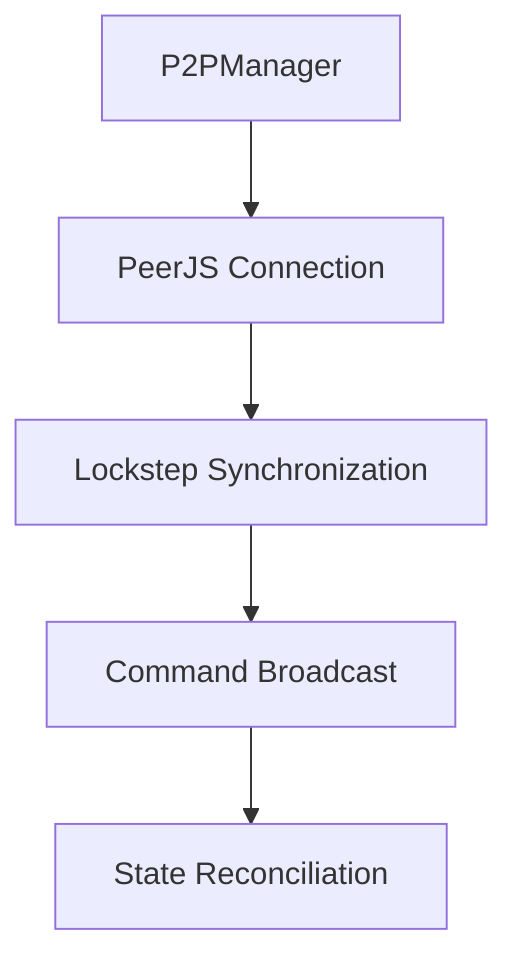
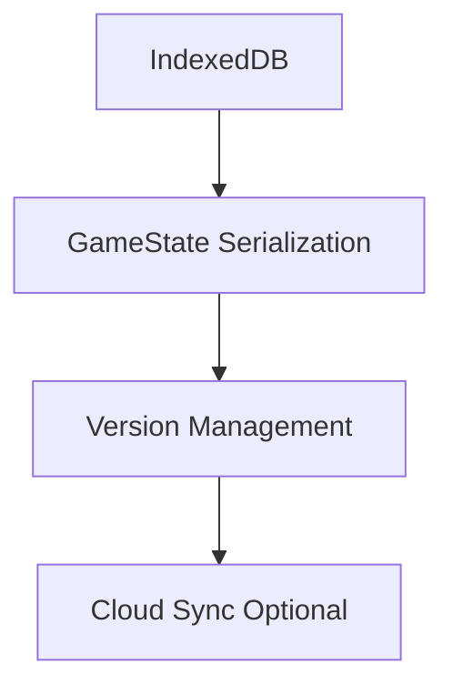

# Audit Global PEEJS - Janvier 2026

## Sommaire
- [Audit Global PEEJS - Janvier 2026](#audit-global-peejs---janvier-2026)
  - [Sommaire](#sommaire)
  - [Analyse de l'état actuel](#analyse-de-létat-actuel)
    - [Architecture globale](#architecture-globale)
    - [Modules implémentés](#modules-implémentés)
  - [Points forts identifiés](#points-forts-identifiés)
  - [Points à améliorer](#points-à-améliorer)
  - [Validation de la direction](#validation-de-la-direction)
  - [Recommandations d'architecture](#recommandations-darchitecture)
    - [1. Finalisation de l'intégration](#1-finalisation-de-lintégration)
    - [2. Architecture réseau P2P](#2-architecture-réseau-p2p)
    - [3. Système de persistance](#3-système-de-persistance)
  - [Plan détaillé des prochaines étapes](#plan-détaillé-des-prochaines-étapes)
    - [Priorité 1 : Finalisation technique](#priorité-1--finalisation-technique)
    - [Priorité 2 : Tests et validation](#priorité-2--tests-et-validation)
    - [Priorité 3 : Documentation](#priorité-3--documentation)
    - [Priorité 4 : Optimisations](#priorité-4--optimisations)
  - [Conclusion](#conclusion)

## Analyse de l'état actuel

### Architecture globale
Le projet PEEJS est un prototype de MMO RTS spatial avec navigation multi-échelle (GALAXY → SYSTEM → PLANET) implémenté en TypeScript/Three.js. L'architecture suit les principes KISS/YAGNI avec une séparation claire des responsabilités.

### Modules implémentés
- **Navigation** : Système complet avec transitions fluides
- **Gameplay** : Unités, économie, combat, IA
- **Réseau** : P2P via PeerJS avec synchronisation lockstep
- **Rendu** : Instancié pour 500+ unités
- **Simulation** : Hors main thread via Web Workers

## Points forts identifiés

1. **Architecture modulaire claire**
   - Séparation nette des responsabilités
   - Pattern Singleton pour GameManager bien implémenté
   - Utilisation efficace de TypeScript pour la sécurité des types

2. **Navigation multi-échelle fonctionnelle**
   - Système GALAXY → SYSTEM → PLANET avec transitions fluides
   - Gestion d'état centralisée via NavigationState
   - Transitions caméra sans écrans de chargement

3. **Performance et scalabilité**
   - Simulation hors main thread avec Web Workers
   - Rendu instancié pour 500+ unités
   - Mémoire partagée SoA pour la simulation

4. **Gameplay RTS complet**
   - 8 types de vaisseaux avec stats complètes
   - Économie avec ressources et production
   - Combat spatial 3D avec différents types d'armes
   - IA tactique et formations

## Points à améliorer

1. **Intégration finale incomplète**
   - GameIntegration.ts non câblé dans main.ts
   - Corrections de types restantes dans GameLoop et UnitController

2. **Documentation à consolider**
   - Plusieurs fichiers d'architecture à fusionner
   - Mise à jour nécessaire des diagrammes

3. **Tests manquants**
   - Pas de tests unitaires visibles
   - Validation P2P non testée

## Validation de la direction

✅ **Approche KISS/YAGNI** : Architecture minimaliste et lisible
✅ **Navigation fluide** : Transitions sans chargement implémentées
✅ **Performance** : Simulation asynchrone et rendu optimisé
✅ **Gameplay complet** : Tous les systèmes RTS de base présents

## Recommandations d'architecture

### 1. Finalisation de l'intégration

```mermaid
flowchart TD
    A[main.ts] --> B[GameManager.getInstance()]
    B --> C[setRenderContext(scene, camera)]
    C --> D[SceneManager.animate()]
    D --> E[GameManager.update(deltaTime)]
```

### 2. Architecture réseau P2P



### 3. Système de persistance



## Plan détaillé des prochaines étapes

### Priorité 1 : Finalisation technique

| Tâche | Fichiers concernés | Statut |
|-------|-------------------|--------|
| Corriger GameIntegration.ts | [`src/game/GameIntegration.ts`](src/game/GameIntegration.ts:1) | ⏳ |
| Corriger GameLoop.ts | [`src/game/GameLoop.ts`](src/game/GameLoop.ts:1) | ⏳ |
| Corriger UnitController.ts | [`src/game/units/UnitController.ts`](src/game/units/UnitController.ts:1) | ⏳ |
| Câbler GameManager dans main.ts | [`src/main.ts`](src/main.ts:1) | ⏳ |

### Priorité 2 : Tests et validation

| Tâche | Méthode | Statut |
|-------|---------|--------|
| Tests unitaires | Vitest | 🚫 |
| Validation P2P | Tests multi-onglets | 🚫 |
| Tests de performance | 500+ unités | 🚫 |

### Priorité 3 : Documentation

| Tâche | Fichiers concernés | Statut |
|-------|-------------------|--------|
| Fusionner fichiers d'architecture | ARCHITECTURE_*.md | ⏳ |
| Mettre à jour diagrammes | Mermaid | ⏳ |
| Documenter API GameManager | Docstrings | ⏳ |

### Priorité 4 : Optimisations

| Optimisation | Zone concernée | Impact |
|-------------|---------------|--------|
| Frustum Culling | Rendu | ⬆️ FPS |
| Delta Compression | Réseau | ⬇️ Bandwidth |
| Object Pooling | Mémoire | ⬇️ GC |

## Conclusion

Le projet PEEJS est sur la bonne voie avec une architecture solide et des systèmes de gameplay complets. Les prochaines étapes se concentrent sur la finalisation technique, l'ajout de tests, et l'optimisation des performances. La direction globale est validée et les recommandations proposées permettent d'atteindre les objectifs MVP définis.